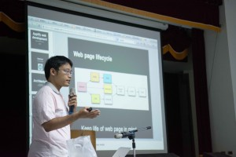
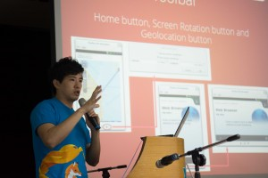
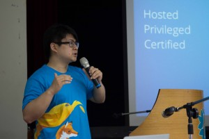
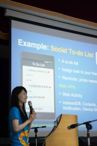
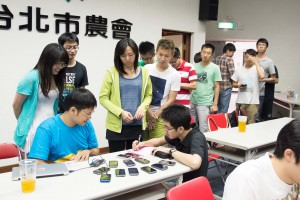

Mozilla Taiwan 與 COSCUP 合辦的兩場 Hands-on 預熱活動已經於 7/20 順利結束，當天現場聚集了對撰寫 Web Apps 以及 Firefox OS 開發有興趣的學生、開發者熱情參與，接下來就讓精彩的圖文帶你現場直擊囉！

時間：7/20 (週六)／地點：資策會 15 樓禮堂

時間：上午 9 點，由最帥氣的講師 Gasolin 帶來『一小時網頁 App 離線儲存就上手』

聚精會神的聆聽，為接下來的實作準備呀～

有問題？講師從旁協助指導，讓你開發 Web App 更順手！

為下午場暖身，現場提供最新上市搭載 Firefox OS 之 ZTE Open 手機 15 支供大家使用測試！

時間：下午 2:00~5:00 『一小時 Firefox OS App 就上手』由 Mozilla Taiwan 工程師團隊帶來精彩介紹

工程師團隊用心解說，帶來最精彩的內容

從多元化的課程中參加者受益良多，相信對 Firefox OS 的了解也更上一層！

現場氣氛十分熱烈！

很開心 7/20 和大家面對面交流，接下來，在 8/4、8/5 的COSCUP  更將有多場與 Firefox OS 開發、Mozilla 專案相關的議程，詳細時間歡迎參考 [COSCUP 議程表](https://coscup.org/2013/zh-tw/program/)，也歡迎到現場 Mozilla 攤位找我們玩，現場活動保證很精彩！
