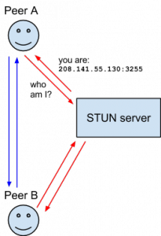
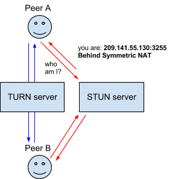
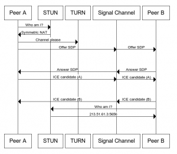

從我開始鑽研 WebRTC 以來，已經收錄了一堆專有名詞的縮寫，讓我想乾脆寫篇文章來說明別人向我提出的問題。我常開玩笑：如果你遇到任何你不知道意思的縮寫，可能只要先查網路通訊協定就找到答案了！

### ICE 是什麼？

[互動式連結建立 (Interactive Connectivity Establishment，ICE)](https://en.wikipedia.org/wiki/Interactive_Connectivity_Establishment) 是可讓網路瀏覽器連上端點的框架。有很多原因會導致無法建立Peer A 與 Peer B 的直接連線。若連線遭遇到阻擋開放連線的防火牆，可透過 ICE 越過防火牆。在大多數情況下，你的裝置都沒有公用的 IP 位址，也能讓 ICE 提供專屬位址。如果你的路由器無法直接連上端點，同樣能藉由 ICE 讓中介伺服器轉發資料。ICE 會使用下列某些技術而達到相關功能：

### STUN 是什麼？

[NAT 會話傳輸應用程序 (Session Traversal Utilities for NAT，STUN)](https://en.wikipedia.org/wiki/STUN) (縮寫之內還有縮寫) 屬於一種通訊協定，可找到你的公用位址，並判斷你的路由器是否會限制直接連上端點。

用戶端將送出請求到 STUN 伺服器，而 STUN 伺服器會回傳用戶端的公用位址，並藉以得知路由器 NAT 背後的用戶端是否連上公用網路。

### NAT 是什麼？

[網路位址轉換 (Network Address Translation，NAT)](https://en.wikipedia.org/wiki/NAT) 可為你的裝置提供公用 IP 位址。路由器具備公用 IP 位址，而連上路由器的所有裝置則具備私有 IP 位址。接著針對請求，從裝置的私有 IP 對應到路由器的公用 IP 與專屬的通訊埠。如此一來，各個裝置不需佔用專屬的公用 IP，亦可在網路上被清楚識別。

即使透過 STUN 伺服器取得公用 IP 位址，也不一定能建立連線。某些路由器會限制我們連接這些裝置。這種情況就必須使用 TURN。

### TURN 是什麼？

某些路由器會透過 NAT 佈署所謂的「Symmetric NAT」限制。也就是說，路由器只會接受你之前曾連線過的端點所建立的連線。

[Traversal Using Relays around NAT (TURN)](https://en.wikipedia.org/wiki/TURN) 就是透過 TURN 伺服器開啟連線並轉送所有資訊，進而繞過 Symmetric NAT 的限制。你可透過 TURN 伺服器建立連線，再告知所有端點傳送封包至該伺服器，最後讓伺服器轉送封包給你。這個方法更耗時且更佔頻寬，因此在沒有其他替代方案時才會使用這個方法。

### SDP 是什麼？

[會話描述協定 (Session Description Protocol，SDP)](https://en.wikipedia.org/wiki/Session_Description_Protocol) 屬於一種標準，用以描述連線所傳遞的多媒體內容 (如編碼、格式、加密、解析度等)。在傳輸資料前，可讓兩邊端點了解彼此的內容格式。因此 SDP 的內容為後設資料 (Metadata)，而非媒體內容。

### Offer/Answer 與 Signal Channel 是什麼？

WebRTC 必須透過某種中介伺服器才能建立連線，而我們稱這種媒介為「訊號通道 (Signal Channel)」。也就是說，在建立連線之前，會先透過訊號通道交換建立連線所需的資訊。

我們所要交換的資訊就是「Offer」與「Answer」，而其內容就是上述的 SDP。

當 Peer A 設立連線時，就會建立 Offer。接著會透過選定的訊號通道將此 Offer 傳送給 Peer B。在 Peer B 收到訊號通道傳來的 Offer 之後，就會建立 Answer，並透過同樣的訊號通道將 Answer 回傳給 Peer A。

### ICE Candidate 是什麼？

如上所述，Offer/Answer 與 SDP 用以交換多媒體的格式內容；ICE candidate 則用以交換網路連線的建立方式，並可說明端點溝通的方法 (直接通訊，或透過 TURN 伺服器通訊)。

### 圖解完整的交換作業

###

原文鏈結：[https://hacks.mozilla.org/2013/07/webrtc-and-the-ocean-of-acronyms/](https://hacks.mozilla.org/2013/07/webrtc-and-the-ocean-of-acronyms/)
