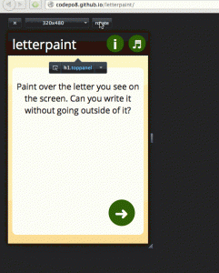
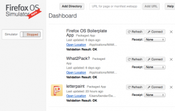
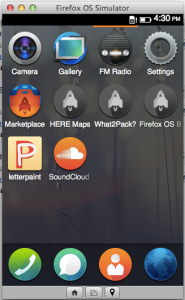
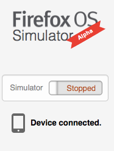

此為「Firefox OS – 讓 [HTML5](https://developer.mozilla.org/en/html/html5) 得以完全發揮的平台」系列的第三支影片 (可在這裡回顧[第一支](https://hacks.mozilla.org/2013/06/firefox-os-for-developers-the-platform-html5-deserves/)與[第二支](https://blog.mozilla.com.tw/posts/3179/)影片)，將討論用以撰寫 Firefox OS App 的工具。

本影片是由 Mozilla 的 Chris Heilmann ([@codepo8](https://twitter.com/codepo8))，與 [Telefónica Digital](https://blog.digital.telefonica.com/)/ W3C 的 Daniel Appelquist ([@torgo](https://twitter.com/torgo)) 所錄製，將帶領大家著手開發自己的第一款 HTML5 App。[可到這裡觀看影片](https://www.youtube.com/watch?v=8dvQe2orzvo&feature=youtu.be)。

首先你一定要了解：其實你不是在撰寫 Firefox OS 所用的 App，而是撰寫在 Web 上執行的 HTML5 App。Firefox OS 可讓開發者透過 [Web API](https://wiki.mozilla.org/WebAPI) 而存取行動電話的硬體。[Web API](https://wiki.mozilla.org/WebAPI) 本身就是標準化 JavaScript API，可輕鬆且安全的存取硬體。

也就是說，Web 開發者必須先入為主一個概念：Firefox OS 的 App 跟原本 Web 的開發方式並無任何差異。Web 沒有特定的軟體開發套件 (Software Development Kit，SDK) 需要你下載或安裝。你可隨意使用自己所熟悉的工具或編輯器，可能簡單如命令列上的 VI，或用來設計 Web 與其他程式語言的 Eclipse 亦可。Firefox OS 也跟 Web 一樣完全不需任何特定環境。即使如此，現在仍有人正嘗試建構 HTML5 的工具，而 Mozilla 當然也將持續注意相關消息，並積極洽談合作事宜。

如果要著手建立 Firefox OS App，你只需開始在瀏覽器中撰寫 HTML5 App 即可。首波推出的 Firefox OS 裝置可達 320 x 480 像素，但你不需針對這個解析度修正自己的 App。歸功於 Web 本身的特性，只要透過適應性設計 (Responsive design) 的方式即可滿足解析度方面的考量。Mozilla 已經在 [Firefox OS 開發者交流中心(Developer hub](https://marketplace.firefox.com/developers/)) 上蒐集了許多資訊，讓你能設計出絕佳的 HTML5 App。

Firefox 開發者工具的重要功能之一，就是「適應性設計檢視模式 (Responsive Design View)」。只要啟動開發者工具並點選  圖示，即可使用此功能。瀏覽器會將目前顯示頁面轉為可調整尺寸的頁面，同時保留開發者工具，也不需重新設定視窗的尺寸：

Firefox 並非唯一內建好用開發工具的瀏覽器。像是 Chrome 也能在非觸控裝置上模擬觸控事件。若要啟動 Chrome 的模擬觸控功能，只要在 Chrome 中找到「開發人員工具」→「Settings」，再進入「Overrides」分頁勾選「Emulate touch events」方塊即可。

如果你要測試 Firefox OS 本身或 App 的執行情況 (包含安裝程序)，則可下載 [Firefox OS 模擬器 (Firefox OS Simulator)](https://addons.mozilla.org/en-US/firefox/addon/firefox-os-simulator/)。此為 Firefox 附加元件，安裝之後亦不需重新啟動 Firefox 瀏覽器。

一旦模擬器安裝完畢，就能透過 Dashboard 管理自己電腦上的 App，並啟動/關閉模擬器：

在啟動模擬器時，會先看到電腦執行簡潔的 Firefox OS 初始環境，視窗尺寸跟 Firefox OS 一樣。接著你就能試用 Firefox OS、安裝自己的 App，並體驗使用情形。

若要進一步測試 App 的效能，就需要實體的 Firefox OS 裝置了。在以 USB 連接電腦與任何 Firefox OS 手機之後，即可透過模擬器直接將 App 送入手機中。

HTML5 App 的開發現已成為 Web 市場上最夯的話題之一。Mozilla 相信再過不久，就會出現更多更好的新工具，除了能輕鬆開發 HTML5 App 之外，也能讓開發者確實了解自己的需要。而目前只要使用瀏覽器的開發者工具並搭配 Firefox OS 模擬器，就能滿足約 90% 的開發需求。

原文連結：[https://hacks.mozilla.org/2013/07/getting-started-with-apps-firefox-os-for-developers-the-platform-html5-deserves/](https://hacks.mozilla.org/2013/07/getting-started-with-apps-firefox-os-for-developers-the-platform-html5-deserves/)
