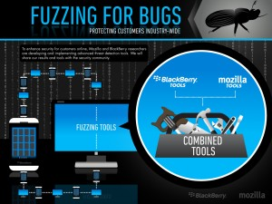

Mozilla 秉持網路平等、自由、開放的宗旨，持續打造更安全的 Web 平台。由 Mozilla 與黑莓 (BlackBerry) 攜手合作的高階自動化安全測試技術 ─ 模糊測試，將再次強化 Web 平台的安全。另外讓 Mozilla 正式介紹 Minion ─ 適合開發者與網路安全專家的開放源碼安全測試平台。在 Mozilla 專為 Web 與 Firefox 使用者設計的諸多安全機制裡，這只是其中 2 項研究成果而已。

### Mozilla 與黑莓合作模糊測試

Mozilla 與黑莓合作的安全技術屬於錯誤植入 (Fault injection) 領域。錯誤植入亦即所謂的「模糊測試 (Fuzzing 或 Fuzz Testing)」，屬於自動化的安全測試方法，可在使用者暴露於風險之前，搶先找出潛在的安全疑慮。錯誤植入目前仍屬於測試中的技術，主要針對特定應用程式或部分的程式碼，以特別設計的軟體植入多種惡意或非預期的資料，藉此找出軟體未能正確處理惡意資料的缺失，並發現潛在的安全漏洞，以期能在使用者遭遇安全威脅之前，搶先解決該漏洞。

[Peach 開放源碼模糊測試框架](https://peachfuzzer.com/)是本合作研究中的特定領域，未來亦將搭配其他模糊測試軟體。Mozilla 正與黑莓一同強化 Peach 軟體而測試 Web 瀏覽器，另亦合作相關技術而提升使用者的安全保護功能。

Mozilla 現已透過 Peach 完成 HTML5 多項功能的模糊測試，包含字型、圖像格式、音訊與視訊格式、如 WebGL 與 WebAudio 的多媒體 API，以及 WebRTC 最常用的多項通訊協定。我們可在測試之後主動找出問題並修復，避免使用者背負安全風險。此高效率的測試作業，將進一步保護 Firefox 與 Firefox OS 使用者。

黑莓長期以來均依賴大規模的自動化測試機制，以找出其平台中的安全問題。在與 Mozilla 合作之後，更直接強化了現有的安全程序與架構。目前黑莓均定期使用第三方模糊測試工具，再加上自己的專利模糊測試工具、統計分析、漏洞研究等機制，藉以發現產品與服務組合中的潛在安全問題。

黑莓安全應變與威脅分析總監 Adrian Stone，對 Mozilla 合作事宜給予極高的評價，也期待能帶給消費者更高的效益。他表示：「我們不可能嘴上說說就憑空解決整個產業都必須面對的安全性挑戰。也因此促成黑莓與 Mozilla 的安全研究人員攜手開發全新工具，要搶先找出瀏覽器的安全威脅，進而保護桌機與行動裝置的消費者。透過此一合作，黑莓與 Mozilla 除了能達到消費者安全的共同目標之外，更將提升整體的網路環境。」

為了保護使用者在 Open Web 上的安全，Mozilla 與黑莓早已合作開發模糊測試，亦共識到自動化安全測試技術的重要性。

### Mozilla 發表 Minion 平台

Mozilla 另發表了 Minion 安全測試平台，以因應開發者與網路安全專家的需求。開放源碼的 Minion 完全免費使用，且未來仍將持續加入多項新功能。

許多安全工具會產生大量的資料，其中包含因識別錯誤而產生的問題。這類問題又需要安全專家再花數個小時特別驗證。Minion 測試平台則提供正確的結果與解決方案，不需安全專家再耗時驗證，為自動化 Web 安全測試機制提供全然不同的方式。Minion 除了更精確、更簡單易用，亦針對眾多開發者而特別設計。即使不是網路安全專家，也能透過此平台而提升自己應用程式的安全性。

Mozilla 將不斷提供方便好用的工具，只為打造更簡便、更安全的 Web 平台。

原文鏈結：[https://blog.mozilla.org/blog/2013/07/30/mozilla-continues-to-build-the-web-as-a-platform-for-security/](https://blog.mozilla.org/blog/2013/07/30/mozilla-continues-to-build-the-web-as-a-platform-for-security/)
