第二屆 Firefox 校園大使的訓練營活動順利在 7/27 (六) 熱鬧結束啦！當天共有 53 位來自各校的大使們出席，遠從花蓮台東、南至台南高雄，大使們起了大早參加 9 點開始的訓練營。在訓練營中，從 Firefox 校園大使的使命、Mozilla 為何與眾不同、Mozilla 社群、Firefox & Firefox for Android 產品介紹、Firefox OS… 內容與大使們做互動與介紹，中間再搭配超 High 互動時間、第一、二屆交流、分組討論、逛逛辦公室等有趣橋段，更特別的是在近尾聲時進行第一屆證書顉發、一／二屆交接、宣誓儀式的熱血活動，到底現場有多少豐富好玩的內容？快跟著特派小編的花絮腳步看下去。

[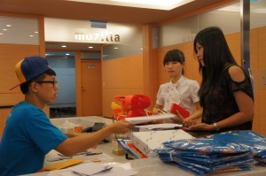](https://blog.mozilla.com.tw/wp-content/uploads/DSC09501.jpg)

起個好早之上午 8: 30 – 9:00 報到時間

[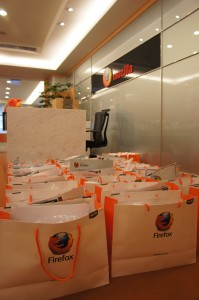](https://blog.mozilla.com.tw/wp-content/uploads/DSC09476-e1375256294624.jpg)

活力滿百的校園大使好禮包，拿到有開心！

[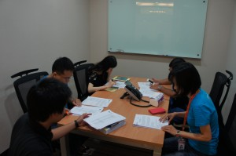](https://blog.mozilla.com.tw/wp-content/uploads/DSC09499.jpg)

好認真！菁英大使們提早開會瞭解一天的活動流程！

[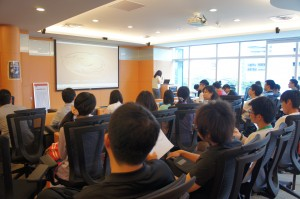](https://blog.mozilla.com.tw/wp-content/uploads/DSC09511.jpg)

上午 9:00 活動準備開始，大家都很準時抵達呦！

[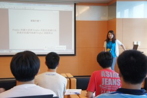](https://blog.mozilla.com.tw/wp-content/uploads/DSC09576.jpg)

搶先了解身為 Firefox 校園大使的使命！

[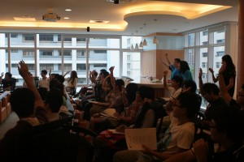](https://blog.mozilla.com.tw/wp-content/uploads/IMG_4945.jpg)

調查一下：使用 Firefox 瀏覽器的人請舉手！(很多人耶…:D )

[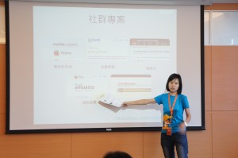](https://blog.mozilla.com.tw/wp-content/uploads/DSC09615.jpg)

Mozilla 為何與眾不同 & Mozilla 社群

[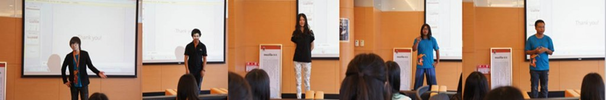](https://blog.mozilla.com.tw/wp-content/uploads/11111.jpg)

上台啦！菁英大使自我介紹 (依序 2 北 – 中 – 東 – 南)

[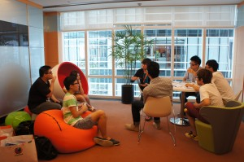](https://blog.mozilla.com.tw/wp-content/uploads/DSC09735.jpg)

分組互動，認識新朋友時間到啦！

校園大使們各各內外兼具，聚在一起總有無限創意！

[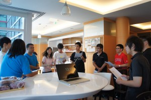](https://blog.mozilla.com.tw/wp-content/uploads/DSC09661.jpg)

請多多指教，以後我們就是同一區的組員囉！

[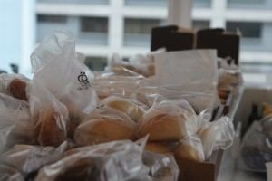](https://blog.mozilla.com.tw/wp-content/uploads/IMG_4980.jpg)

當然肚子填飽也很重要，小點心來囉！

[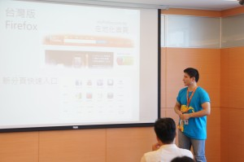](https://blog.mozilla.com.tw/wp-content/uploads/DSC09754.jpg)

Firefox、Firefox for Android 產品介紹，聽完功力大增呀！

[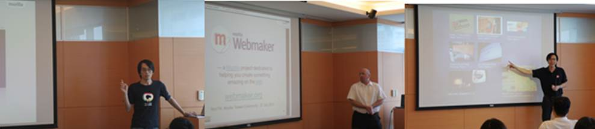](https://blog.mozilla.com.tw/wp-content/uploads/44666.jpg)

接下來是社群 MozTW 的詳盡介紹

[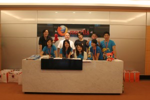](https://blog.mozilla.com.tw/wp-content/uploads/IMG_5187.jpg)

感謝社群 MozTW 共同參與這個活動

聽了一上午的課程，現在快來享用美味午餐唄！

 

享用美食的同時不忘與其他 Firefox 校園大使交流

[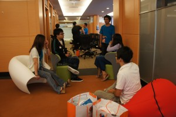](https://blog.mozilla.com.tw/wp-content/uploads/DSC09848.jpg)

圍成了圈，討論好認真！

大使們各各把握難得的機會，與來自各校的菁英互動！

To be continue~
