超 High 的第二屆 Firefox 校園大使訓練營來到下午的時段。首先，就讓 2013 年最火紅的全新行動作業系統 – Firefox OS 做為下午的開場課程，本次特別邀請到開發團隊之一的 Evan 為我們帶來最精彩的介紹！

[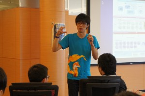](https://blog.mozilla.com.tw/wp-content/uploads/DSC09930.jpg)

你不能不知道的 Firefox OS

接下來，來到超級精彩的第一 v.s 第二屆交流，就讓優秀的第一屆學長姐和大家分享當校園大使可以做哪些事吧！

[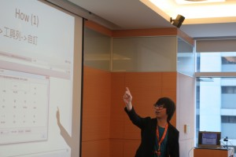](https://blog.mozilla.com.tw/wp-content/uploads/IMG_5272.jpg)

你可以非常熟悉 Firefox，然後…盡可能的發揮在所有專長上（作詞、創作…)

[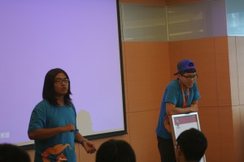](https://blog.mozilla.com.tw/wp-content/uploads/IMG_5288.jpg)

當然，你也可以當大家最有力的電腦幫手！

[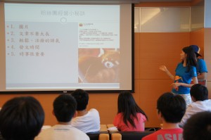](https://blog.mozilla.com.tw/wp-content/uploads/DSC09990.jpg)

也可以當最美麗的粉絲團小編！

[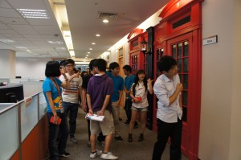](https://blog.mozilla.com.tw/wp-content/uploads/DSC00005.jpg)

等等，走哪去？原來是逛辦公室時間到了！

[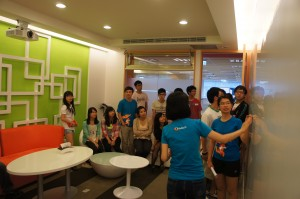](https://blog.mozilla.com.tw/wp-content/uploads/DSC00018.jpg)

在這樣的環境動腦開會，會不會更有 Fu？

[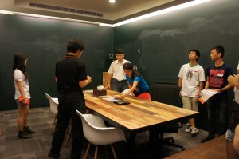](https://blog.mozilla.com.tw/wp-content/uploads/DSC00021.jpg)

這間會議室到處是黑板，想到什麼就寫什麼！

今天的重頭戲：分組討論時間到了，在這關鍵的時間內，大家以區為單位，動腦規劃出可執行的企劃案！

北區這一組用看的就知道很團結！

[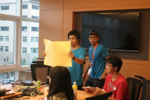](https://blog.mozilla.com.tw/wp-content/uploads/IMG_5373.jpg)

來來來，大夥開始出點子吧！

[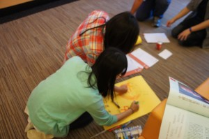](https://blog.mozilla.com.tw/wp-content/uploads/DSC00082.jpg)

動手實作比較快！

[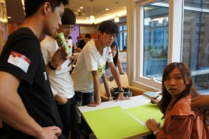](https://blog.mozilla.com.tw/wp-content/uploads/DSC00091.jpg)

東區、南區力量大

[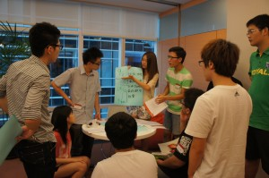](https://blog.mozilla.com.tw/wp-content/uploads/DSC00097.jpg)

倒數 3 分鐘，成果驗收／分享就快開始了

[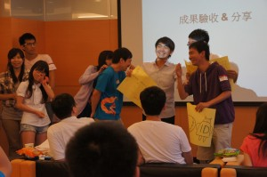](https://blog.mozilla.com.tw/wp-content/uploads/DSC00143.jpg)

大使們一起上台，分享不忘搞笑 XD

[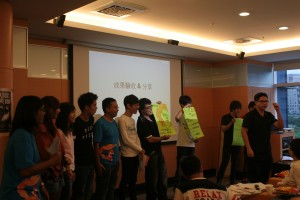](https://blog.mozilla.com.tw/wp-content/uploads/IMG_5475.jpg)

厚厚，東區／南區聲勢浩大

[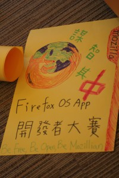](https://blog.mozilla.com.tw/wp-content/uploads/IMG_5442.jpg)

中區－這麼美麗的海報創作！

[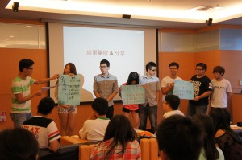](https://blog.mozilla.com.tw/wp-content/uploads/DSC00114.jpg)

上台仍舊很團結，拿海報的、介紹的、看密密麻麻的字就知道好認真！

[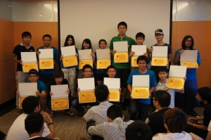](https://blog.mozilla.com.tw/wp-content/uploads/DSC00170.jpg)

光榮時刻！第一屆 Firefox 校園大使證書頒發，謝謝你們所做的努力！

[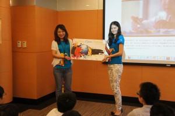](https://blog.mozilla.com.tw/wp-content/uploads/DSC00182.jpg)

表揚優秀的第一屆 Firefox 校園大使！

[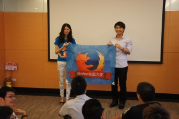](https://blog.mozilla.com.tw/wp-content/uploads/DSC00188.jpg)

不免俗的來個交接儀式

[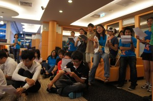](https://blog.mozilla.com.tw/wp-content/uploads/DSC00205.jpg)

一起歡唱：Firefox 校園大使榮譽歌，特別感謝 Dayo 改詞／賈彬主唱

[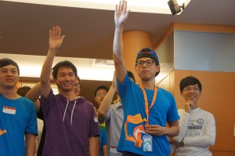](https://blog.mozilla.com.tw/wp-content/uploads/DSC00224.jpg)

緊接著來到熱血滿百的宣誓儀式！

從今天起我就是 Mozilla 的一份子，將為網路的平等、自由、開放努力！

跨越這條線，恭喜你！第二屆 Firefox 校園大使，任期正式生效

[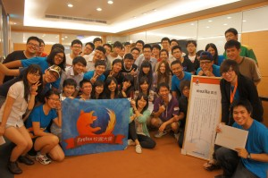](https://blog.mozilla.com.tw/wp-content/uploads/DSC00291.jpg)

期待第二屆 Firefox 校園大使接下來的發光發熱囉！

感謝 Firefox 校園大使參與本次的活動，以下附上當天投影片的連結：

- [Firefox 校園大使：你的使命是什麼？](https://docs.google.com/file/d/0BzaLPTuMfY-LZlZrRkxpSmxnbDQ/edit?usp=sharing)

- [Mozilla 為何與眾不同 & Mozilla 社群](https://www.dropbox.com/s/d8ugterg90u9va8/What%20is%20Mozilla%20%26%20Mozilla%20Community.pdf)

- [Firefox、Firefox for Android 產品介紹](https://docs.google.com/file/d/0BzaLPTuMfY-LRnRaOEt0bjN3cGc/edit?usp=sharing)

- 社群 MozTW 介紹 [Mozilla & community project](https://www.slideshare.net/irvinfly/mozilla-community-projects) [Webmaker MozTW about: SUMO about: ReMo](https://www.slideshare.net/dwchiang/introduction-to-sumo-and-remo)

- 第一 v.s 第二屆交流 [大使可以做什麼？](https://www.slideshare.net/dayochoul/ss-24791279) [校園大使粉絲團介紹](https://www.dropbox.com/s/9w00f8j4li03tit/%E6%A0%A1%E5%9C%92%E5%A4%A7%E4%BD%BF%E7%B2%89%E7%B5%B2%E5%9C%98%E4%BB%8B%E7%B4%B9.pdf)

Flickr 更多照片：[第二屆 Firefox 校園大使訓練營](https://www.flickr.com/photos/mozillataiwan/sets/72157634843564052/)
