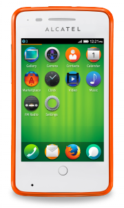
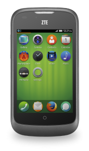

#### 哥倫比亞與委內瑞拉境內的 Movistar 今天起推出 Firefox OS 智慧型手機 ─ ALCATEL ONE TOUCH Fire 與 ZTE Open

Telefonica 今天宣佈在哥倫比亞和委內瑞拉推出 ALCATEL ONE TOUCH Fire 與 ZTE Open 裝置。現已可從 Movistar 的店面與銷售管道取得此 2 款行動電話。同時 Telefonica 亦宣佈今年第四季將於巴西境內推出 Firefox OS 裝置。

Firefox OS 促成首次全以 Open Web 標準所打造的裝置，樹立了 Web 的重要里程碑。首款 Firefox OS 手機已經在 1 個月前搶先在西班牙上市，緊接著在波蘭也推出。

「首款完全植基於 Web 技術的智慧型手機，即由 Firefox OS 支援相關技術，且勢必再度激起 Web 的創新浪潮。」Mozilla 首席營運長 Jay Sullivan 表示：「我們很高興能和 Telefonica 還有多家營運商合作，也代表其他夥伴都看準 Firefox OS 有潛力為使用者提供真正的快樂體驗，並能確實將 Web 的力量交付給所有人。」

Telefónica Digital 的 Open Web 裝置總監 Yotam Ben-Ami 也在發表會上表示：「Firefox OS 背後正形成一股強烈的動力，驅使我們在更多市場上推出更多裝置。這個平台才正要起步，接著將擴及多款裝置而壯大整個生態系統。目前的智慧型手機市場極度失衡，而我們相信 Firefox OS 就是重新找回市場平衡的最佳機會，並將為消費者提供更開放的使用經驗。」

若需進一步資訊：

- [Telefonica 新聞稿](https://blog.digital.telefonica.com/?press-release=Firefox-os-Latin-America-launch) (2013 年 8 月 1 日)

- [Mozilla 新聞稿：Mozilla 與合作夥伴即將發佈首款 Firefox OS 智慧型手機！](https://blog.mozilla.com.tw/posts/2978/)(2013 年 7 月 1 日)

- [Firefox OS 首頁](https://mozilla.com.tw/firefox/os/)

- [Firefox OS Demo](https://www.youtube.com/watch?feature=player_embedded&v=Iu8q-oISbas)

原文鏈結：[https://blog.mozilla.org/blog/2013/08/01/telefonica-announces-launches-of-first-firefox-os-devices-in-latin-america/](https://blog.mozilla.org/blog/2013/08/01/telefonica-announces-launches-of-first-firefox-os-devices-in-latin-america/)
