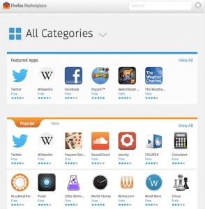

「Firefox OS ─ 讓 [HTML5](https://developer.mozilla.org/en/html/html5) 得以完全發揮的平台」系列影片的第四集 (另可回顧[第一集](https://hacks.mozilla.org/2013/06/firefox-os-for-developers-the-platform-html5-deserves/)、[第二集](https://blog.mozilla.com.tw/posts/3179/)、[第三集](https://blog.mozilla.com.tw/posts/3277/)) 中，我們將說明 App 提交至 Firefox Marketplace 的方法，以及其他發佈 App 的方式。

本影片是由 Mozilla 首席技術傳教士 Chris Heilmann [@codepo8](https://twitter.com/codepo8)，以及 Firefox OS 業務開發團隊的 Desigan Chinniah[@cyberdees](https://twitter.com/cyberdees) 共同錄製。將讓你輕鬆在 Firefox OS 上發佈自己的 App。你也可到 YouTube 觀看此影片。

Firefox OS 與其他行動平台一樣擁有自己的 [Marketplace](https://marketplace.firefox.com/)，可讓你依照名稱或分類找到自己想要的 App。

開發者若要將自己的 App 提交至 Marketplace，只需要建立一個 [manifest 檔案](https://developer.mozilla.org/en-US/docs/Web/Apps/Manifest)並將之存放於你的 App 伺服器上 (需設定正確的 MIME 類型「application/x-web-app-manifest+json」) 即可。你必須在 manifest 檔案中定義 App 的名稱、提供 App 的圖示，並要求權限以存取 [Web Activities](https://wiki.mozilla.org/WebAPI/WebActivities) 與其他功能。當然亦可[線上檢驗自己的 manifest 檔案](https://marketplace.firefox.com/developers/validator)，避免後續的提交作業出錯。

一旦放置好 manifest 檔案之後，即可[提交自己的 App](https://developer.mozilla.org/en-US/docs/Web/Apps/Publishing/Submitting_an_app) 到 Marketplace。開發者可於 Marketplace 中提供 App 的截圖、影片，或更完整的說明。

假設 App 是存放於開發者自己的伺服器上，基本上就可執行完整的 HTML5 功能，但是卻無法存取行動裝置的相機或聯絡人資訊。如果想存取相機或聯絡人資訊等功能，則必須將自己的 App 封裝並置放於 Marketplace。如需更多相關資訊，請[至 Wiki 參閱不同的 App 權限](https://developer.mozilla.org/en-US/docs/Mozilla/Firefox_OS/Security/Security_model#Trusted_and_Untrusted_Apps)。

如果你的 App 是純粹的 HTML5 App，則不需透過 Marketplace 下載而可直接從 Web 安裝，此亦代表在安裝過程你不需離開目前瀏覽中的網站。若裝置 (需搭載 Firefox OS，或已安裝 Firefox 的 Android 裝置) 支援[現處於標準化審核程序的 Open WebApp](https://developer.mozilla.org/en-US/docs/Web/Apps/JAVASCRIPT-BLOCKED-BLOCKED-BLOCKED_API)，且鏈結可於裝置上觸發 App 安裝作業，則只要傳送鏈結予他人即可開始安裝 App。

此標準化審核程序亦屬於 [WebAPI 標準化提案](https://wiki.mozilla.org/WebAPI)的一部分。只要幾行程式碼即可建構「Install this App」的按鈕：

if (navigator.mozApps) {
  function install() {
    var installapp = navigator.mozApps.install(manifestURL);
    installapp.onsuccess = function(data) {
      // App is installed
    };
    installapp.onerror = function() {
      // Something went wrong,
      // information is in: installapp.error.name
    };
  }
  var button = document.createElement('button');
  button.innerHTML = 'Install this app';
  button.addEventListener('click', install, false);
  document.body.appendChild('button');
}

					12345678910111213141516

						if (navigator.mozApps) {  function install() {    var installapp = navigator.mozApps.install(manifestURL);    installapp.onsuccess = function(data) {      // App is installed    };    installapp.onerror = function() {                // Something went wrong,      // information is in: installapp.error.name             };         	  }  var button = document.createElement('button');  button.innerHTML = 'Install this app';  button.addEventListener('click', install, false);  document.body.appendChild('button');}

如此一來，你以搜尋引擎最佳化 (SEO) 所累積的多年成果，亦可繼續用以推廣自己的 App。

原文連結：[https://hacks.mozilla.org/2013/08/firefox-marketplace-and-alternatives-firefox-os-for-developers-the-platform-html5-deserves/](https://hacks.mozilla.org/2013/08/firefox-marketplace-and-alternatives-firefox-os-for-developers-the-platform-html5-deserves/)
