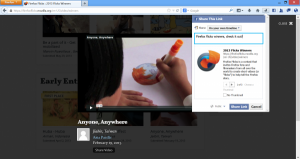

社交網站與相關服務已成為網路生活的重要一環，而我們即針對 Web 目前的使用形態而開發 Firefox。過去一年裡，Mozilla 努力將社交網站與服務直接整合至 Firefox 之中，讓你能迅速與家人和好友聯絡。

Facebook 在去年成為 Firefox 的第一個社交整合夥伴，不久之後更加入了 Cliqz、Mixi、msnNOW。Mozilla 將持續融合更多 Apps、服務、社交網站，要讓使用者享有更多社交、個人、客製化的瀏覽經驗。

為了擴充社交功能而提供更好的體驗，Firefox 進一步能輕鬆分享多樣內容。透過 Firefox 工具列上的「分享 (Share)」按鈕，輕點滑鼠即可從 Firefox 分享自己最愛的內容給親朋好友。你不用退出瀏覽中的網頁，就能直接於個人塗鴉牆貼出有趣文章、向朋友分享食譜、以私人訊息或電子郵件傳達送禮的點子等等。現在快用 Firefox 的 Facebook Messenger 或 Cliqz 體驗相關功能。

Firefox 當然還有更多讓你聯繫感情的方法。你可在側邊欄中直接留言或觀看私人訊息、直接在 Firefox 工具列中檢查現有通知、同時瀏覽網頁並和朋友聊天，現在更能用 Firefox 對外分享有趣內容。

只要整合金融、音樂、運動、新聞、社交網路、電子郵件、代辦事項或更多應用程式，Firefox 將提供無限潛能與嶄新體驗。

你可在此欣賞分享功能範例：

若需更多資訊：

- 下載最新 [Windows、Mac 或 Linux 版 Firefox](https://mozilla.com.tw/firefox/download/)

- [Firefox for Windows、Mac、Linux 版本說明](https://www.mozilla.org/en-US/firefox/23.0/releasenotes/)

- [Firefox 社交新功能影片](https://blog.mozilla.org/files/2013/08/screencast_firefox.mp4)

- [封鎖混合內容 (Mixed Content Blocker)](https://blog.mozilla.org/security/2013/06/27/mixed-content-blocker-hits-firefox-beta/)

- Firefox [全新 Logo](https://blog.mozilla.org/creative/2013/06/27/a-new-firefox-logo-for-a-new-firefox-era/)

原文鏈結：[https://blog.mozilla.org/blog/2013/08/06/firefox-makes-it-easy-to-share-your-favorite-content-with-friends-family/](https://blog.mozilla.org/blog/2013/08/06/firefox-makes-it-easy-to-share-your-favorite-content-with-friends-family/)
