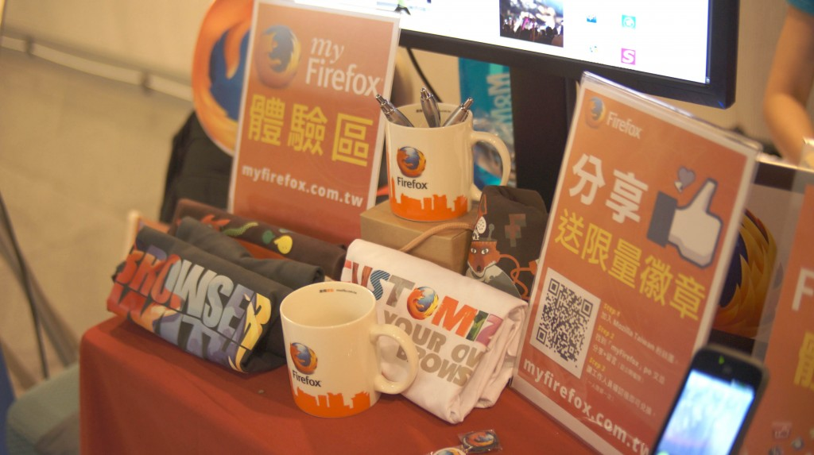
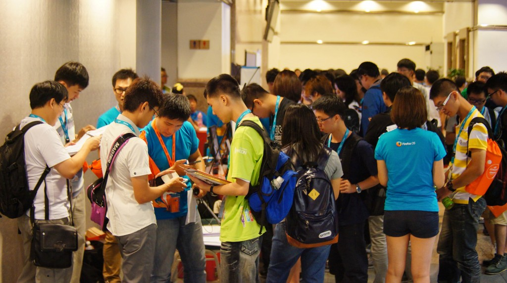
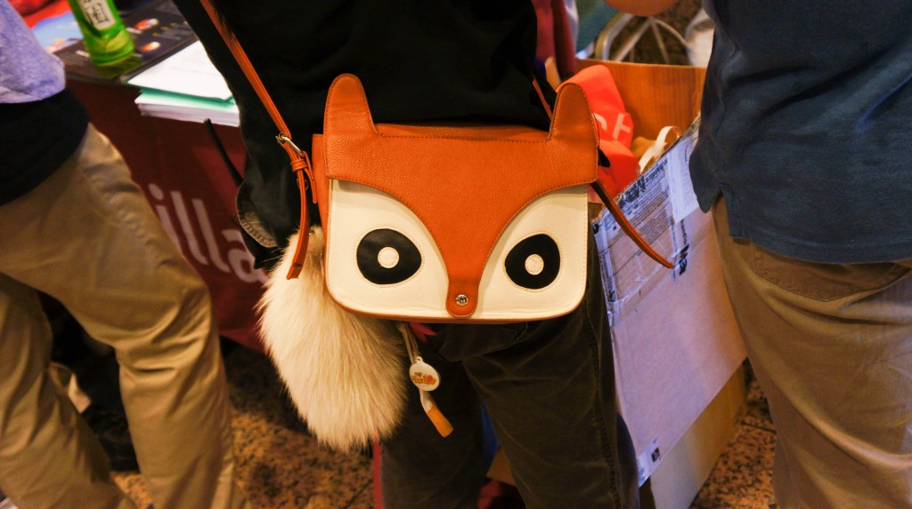

開源人年會 COSCUP 2013 已經順利在上週末 8/3、8/4 完滿結束！Mozilla Taiwan 很高興這次大力參與 COSCUP 2013 活動，除了之前與 COSCUP 在 7/20 合辦的 Hands-on Web Apps 預熱活動，8/3、8/4 兩天的活動也是精彩萬分，有多位 Firefox OS 研發工程師參與議程並上台分享，同時，Mozilla Taiwan 攤位也是熱鬧的不得了，在現場與社群合力經營攤位，展示內容包括火紅的 Firefox OS 手機、WebRTC、Marketplace 以及 myFirefox 的體驗、志工及公司職缺招募與問卷填寫等等。邀你透過花絮搶先直擊 Mozilla Taiwan 攤位實況，以及豐富的產品展示和現場活動！

攤位佈置，時間：COSCUP 2013 開展前的 8/3 起個大早

準備超火紅的 Firefox OS 手機展示！

人潮湧現！來吧，填個問卷！

太好了，現場有 Firefox OS 開發團隊工程師，我想多了解 Firefox OS 開放行動作業系統

豐富的攤位內容吸引了滿滿的人潮！

“打卡送悠遊卡” 活動更是在活動開始半小時前即聚集了排隊的人龍。

豐富的攤位內容，全部走一趟真開心！

myFirefox 的分享文章送徽章活動亦吸引超過百人參與

驚見狐狸包，酷斃了！

問卷的部分也吸引了數百人填寫！

而 8/3 晚間於 Mozilla Space 舉辦的 BoF 社群小聚也吸引了 50 位的社群朋友前來共襄盛舉。兩天的活動在熱絡的氣氛中圓滿結束！希望大家對 Mozilla 相關產品都有更深入的認識與了解！下一次 Mozilla Taiwan 會出現在哪裡？敬請密切期待 XD
