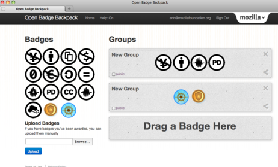

Mozilla 開放徽章專案最早起於 2010 年底，透過大膽而創意的構想，期待帶給網民「以線上徽章做為學習證明，展示你的真本事！」的全新概念！現在，夢想即將隨著「開放徽章網站 Beta 版本」的釋出而成真！

Mozilla 很榮幸集結最優秀的合作夥伴，包括麥克阿瑟基金會、NASA、Intel、Disney-Pixar、4H 等眾多一流機構及企業，一同參與見證開放徽章網站 Beta 版本的推出。現在馬上邀請你來見證網上學習與認證的威力！

Beta 版本新功能：

- 更便利的徽章發送者新 API

- 徽章使用者的全新管理介面

- 可分享至個人頁面與社群網絡的徽章展示功能

- 全新隱私設定功能

想知道更多：

- 請上 [Mozilla Open Badges](https://openbadges.org/) 獲取你的第一枚徽章

- 徽章發送者與展示者請上 [badge issuer](https://wiki.mozilla.org/Badges/Onboarding-Issuer) 或 [displayer](https://wiki.mozilla.org/Badges/Onboarding-Displayer) 了解詳情

- Mozilla 資深教育總監 Erin Knight 文章分享[Read more about the Beta release](https://erinknight.com/post/20842609358/obi-public-beta)

- 開發者請上[access the source code and technical documentation](https://github.com/mozilla/openbadges)

- 加入 Mozilla Open Badges 專案 [community calls](https://openbadges.etherpad.mozilla.org/openbadges-community)
