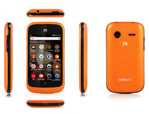

Mozilla 是全球性的非營利組織，以推動網路的平等、自由、開放為宗旨，旗下的 Firefox 瀏覽器、Firefox for Android 行動瀏覽器、Firefox OS 開放行動作業系統廣受市場喜愛與期待。緊接在今日 (8 月 12 日) 中興通訊 (ZTE) 的宣佈，Mozilla 很高興見到全球消費者即將首度在英國和美國的 eBay，購買到 Firefox OS 手機 – ZTE Open。此款 ZTE Open 主要針對全球開發者與智慧型手機首購族而推出，而 Firefox OS 手機在 1 個月前於特定市場正式上市。

Firefox OS 智慧型手機主要針對智慧型手機的首購族，同時也是全球第一款完全以 Web 技術打造的裝置，帶給你美觀、簡潔、直覺、簡單易用的絕妙體驗，並同時兼顧效能、價格、個人化等所有考量。

Firefox OS 智慧型手機就是要跟著你轉變而隨時滿足你的需求。搜尋你最愛的音樂歌手之後，即可透過 Apps 搜尋結果而購買歌曲、即時聆聽、訂購演唱會門票，還有更多內容。你也能選擇一次性使用或永久下載的 Apps；讓你隨時擁有所需的內容，並完全客製化自己的使用經驗。

Firefox OS 具備智慧型手機的基本功能 ─ 照相、打電話、收發簡訊與電子郵件……等等。此外亦內建 Facebook 與 Twitter 社交功能，提供地理位置服務的 Nokia HERE 地圖另可查詢在地交通資訊，當然也少不了高人氣的 Firefox 瀏覽器、Firefox Marketplace，還有更多特色，定可滿足消費者的多樣期待。

Mozilla 的願景就是建立更強大、更開放的 Web。只要有更多瀏覽器採用 Firefox、Firefox OS、Firefox for Android 引以為傲的 Open Web 技術，你就能在其他平台與裝置上續用自己購買的 Apps。Firefox OS 亦提供絕佳的安全性、隱私性、客製化、使用者控制等功能，與你喜愛的 Firefox 瀏覽器完全相同。

現於 eBay US 與 eBay UK 的 ZTE 商城中，可分別以 79.99 美金與 59.99 歐元 購買 Firefox OS 智慧型手機 ZTE Open。由於該款手機是針對全球開發者與智慧型手機的首購族所推出，因此不會提供當地特色的 Apps 或功能。

Mozilla 行動裝置資深副總裁宮力博士表示：「Mozilla 致力於推動 Web 技術的發展，目的在於使 Web 成為一個創新的平台，在 Web 上設計出更多人們喜愛的產品。很高興 Mozilla 現在能夠將 Web 的力量交到更多人手上。Web 上擁有最多的使用者，我們相信越來越多的開發者將採用新的 APIs 來打造 Apps，進而刺激並帶動新一波的創新。」

中興副總裁戴文紅也說：「我們很榮幸能與 Mozilla 合作，於全球市場推出 Firefox OS 智慧型手機 ─ ZTE Open。中興通訊身為知名的行動裝置製造商，更致力以高階技術為全球消費者提供更多選擇與更高的便利性。我們都深切相信這款手機將帶來全新的使用經驗，並吸引更多開發者投入 Firefox OS 與 Web Apps。」

這款手機將搭載英文版 Firefox OS，主要針對全球的開發者和智慧型手機首購族。

若需更多資訊：

- [ZTE announcement](https://www.ztedevices.com/news/company_news/bb874d58-5a32-4e65-b075-32f5f0959d16.html)

- [Firefox OS 功能指南](https://blog.mozilla.org/press/files/2012/04/FIREFOX_OS_FEATURES_GUIDE_2013_EN_FINAL.pdf)

- [Apps 開發者可參閱 MDN](https://developer.mozilla.org/en-US/docs/Mozilla/Firefox_OS)

- [Firefox OS 首頁](https://mozilla.com.tw/firefox/os/)

- [Firefox OS Demo](https://youtu.be/Iu8q-oISbas)

- [ZTE eBay US store](https://stores.ebay.com/ztemobileus)

- [ZTE eBay UK store](https://stores.ebay.com/ztemobileuk)

原文鏈結：https://blog.mozilla.org/blog/2013/08/12/zte-will-soon-start-sales-of-firefox-os-phones-on-ebay/
