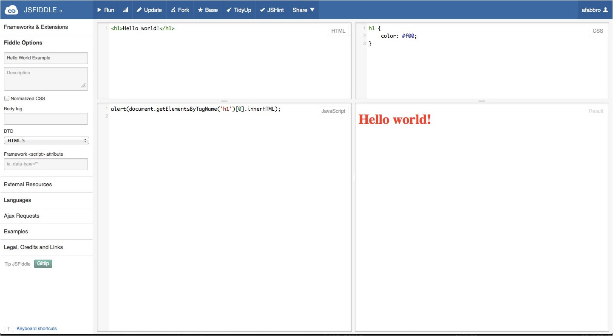
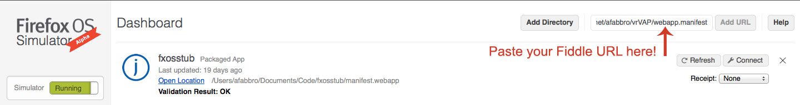
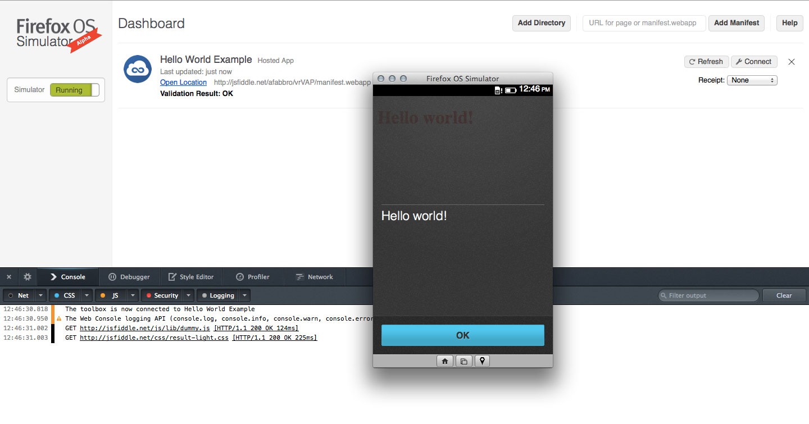
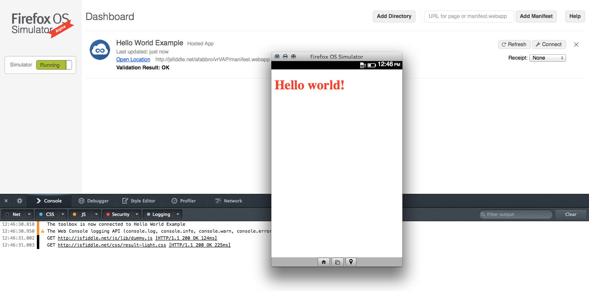

### 隨著 Fiddle 的輕鬆節拍起舞

JSFiddle 是撰寫並檢驗程式碼雛形的絕佳工具，不需動用你現有的工具與編輯器，即可迅速進行單元測試並執行概念性的程式碼。此外，你也可貼上有問題的程式碼，讓其他人協助你檢視並找出問題根源。

除了程式碼片段之外，你更可製作 Firefox OS Apps 的雛形。我們不斷為開發者灌輸一個概念：建立 Firefox OS Apps 就如同建立 Web Apps。只要在瀏覽器中以 JSFiddle 測試不同的程式碼，你就能了解 Firefox OS Apps 的開發有多麼簡單。

### 輕鬆建構 Firefox OS Apps：摘要

要以 JSFiddle 測試 Firefox OS Apps 需經下列步驟：

- 在 JSFiddle 環境中，以自己熟悉的方式撰寫程式碼

- 於 Fiddle URL 後方加上「/manifest.webapp」，接著將此鏈結貼入 Firefox OS 模擬器 (Firefox OS Simulator)，即可安裝此 App

- 或同樣可於 Fiddle URL 後方加上「/fxos.html」，即取得典型 Firefox OS 托管式 (Hosted) Apps 的安裝頁面

我在[這裡設定了一組 JSFiddle Demo](https://jsfiddle.net/afabbro/vrVAP/)，接著說明相關細節。

### 輕鬆建構 Firefox OS Apps：細節

隨手撰寫程式碼

先來試試基本的「Hello World!」吧。在你的 Fiddle 中建構下列程式碼：

HTML:

		
		

<h1>Hello world!</h1>
			
				
					
				
					1
				
						<h1>Hello world!</h1>
					
				
			
		

CSS:

		
		

h1 {
    color: #f00;
}
			
				
					
				
					123
				
						h1 {    color: #f00;}
					
				
			
		

JavaScript:

		
		

alert(document.getElementsByTagName('h1')[0].innerHTML);
			
				
					
				
					1
				
						alert(document.getElementsByTagName('h1')[0].innerHTML);
					
				
			
		

則 Fiddle 應該顯示如下：

接著於 Fiddle URL 後方加上「/manifest.webapp」。以我設計的 Demo 為例，就會是 [http://jsfiddle.net/afabbro/vrVAP/manifest.webapp](https://jsfiddle.net/afabbro/vrVAP/manifest.webapp)

將此 URL 複製到「剪貼簿」中。根據瀏覽器的不同，則不一定會複製完整的「http://」。請注意，若 URLs 並未明確指定協定，則模擬器一律不會接受。因此需自行補為完整的 URLs。模擬器將以紅色輸入對話框表示 URLs 無效。

如果從瀏覽器的位址列存取 manifest.webapp，就會自動產生 manifest 檔案的副本，以供你下載並仔細檢視。同樣以 Demo 為例，其 manifest 檔案如下：

		
		

{
  "version": "0",
  "name": "Hello World Example",
  "description": "jsFiddle example",
  "launch_path": "/afabbro/vrVAP/app.html",
  "icons": {
    "16": "/favicon.png",
    "128": "/img/jsf-circle.png"
  },
  "developer": {
    "name": "afabbro"
  },
  "installs_allowed_from": ["*"],
  "appcache_path": "http://fiddle.jshell.net/afabbro/vrVAP/cache.manifest",
  "default_locale": "en"
}
			
				
					
				
					12345678910111213141516
				
						{  "version": "0",  "name": "Hello World Example",  "description": "jsFiddle example",  "launch_path": "/afabbro/vrVAP/app.html",  "icons": {    "16": "/favicon.png",    "128": "/img/jsf-circle.png"  },  "developer": {    "name": "afabbro"  },  "installs_allowed_from": ["*"],  "appcache_path": "http://fiddle.jshell.net/afabbro/vrVAP/cache.manifest",  "default_locale": "en"}
					
				
			
		

如果你之前從未寫過 Firefox OS Apps 的 manifest 檔案，則可透過此自動產生的 manifest 檔案而初步了解 Apps 基本建構資訊。

在模擬器中安裝 Apps

將 URL 貼入下圖所示的欄位中。如前述，只要 URL 有任何問題，該欄位就會顯示紅色邊框。

在輸入完整的 URL 之後，模擬器隨即啟動你的 Apps。

這裡可以看到，在我們關閉 alert() 之後，就能看到預期中的 (本範例為基本的 HTML 頁面) 單一紅色 h1 標籤。

從 Firefox OS 裝置安裝 Apps

不論是 Firefox OS 裝置或模擬器上的瀏覽器，可於 Fiddle URL 後方加上「/fxos.html」並瀏覽之。同樣以我的 Demo 為例就會是：[http://jsfiddle.net/afabbro/vrVAP/fxos.html](https://jsfiddle.net/afabbro/vrVAP/fxos.html)

點選「Install」，就能在自己的主畫面上找到該 App。

### 小缺點

上述均是 JSFiddle 工具的新用法。我們會持續修改錯誤並提供更多功能。撰寫本篇文章時仍有下列小問題：

- 模擬器一次僅限安裝 1 組 JSFiddle App

- 尚未支援離線功能

### 感謝

本篇 JSFiddle 文章要獻給 Piotr Zalewa。他本人目前正開發可支援 Firefox OS 的 PhoneGap 版本。如果你有任何寶貴意見，請立刻讓我們知道；如果你已有某些酷炫東西而苦無炫耀的對象，也非常歡迎提供 Fiddle 的 manifest 檔案給我們。

原文鏈結：[https://hacks.mozilla.org/2013/08/using-jsfiddle-to-prototype-firefox-os-apps/](https://hacks.mozilla.org/2013/08/using-jsfiddle-to-prototype-firefox-os-apps/)
