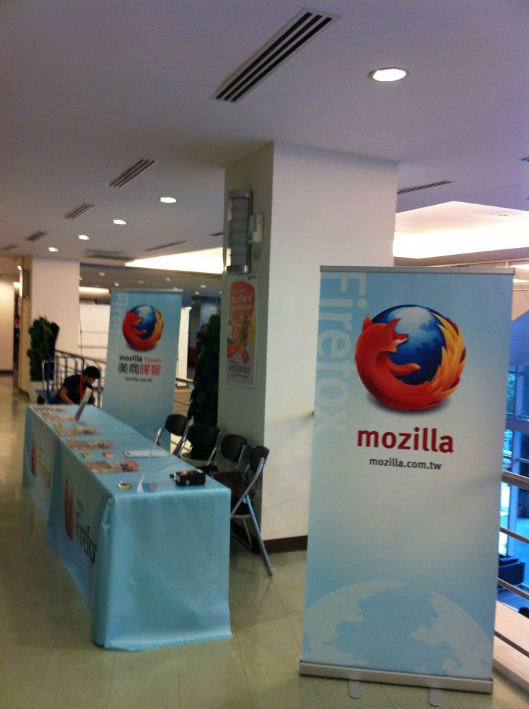
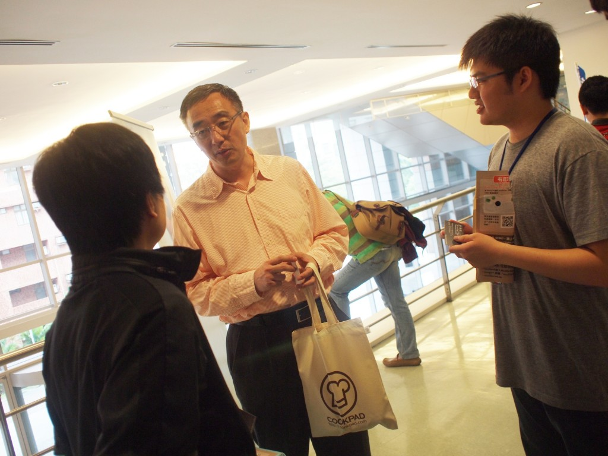
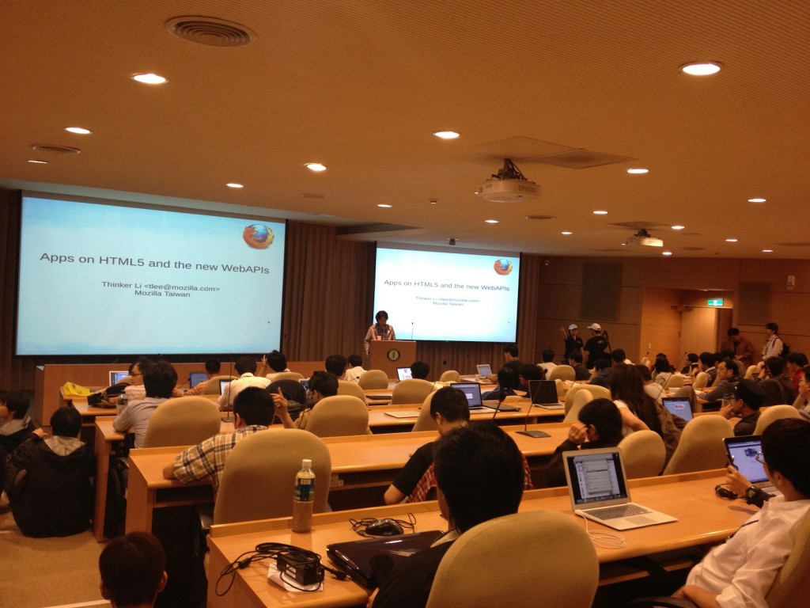
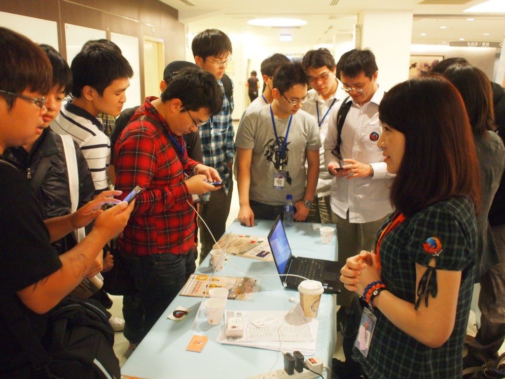
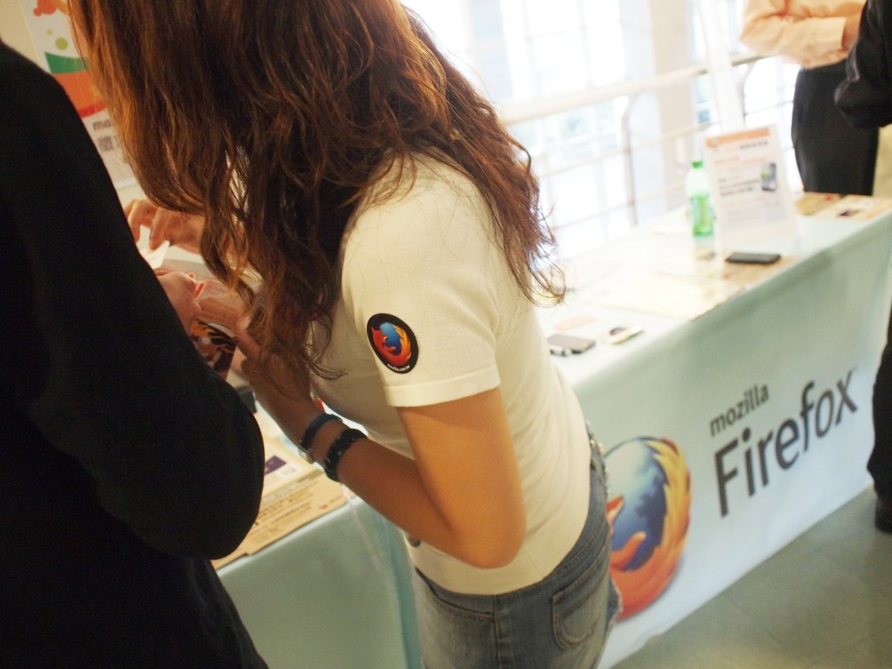
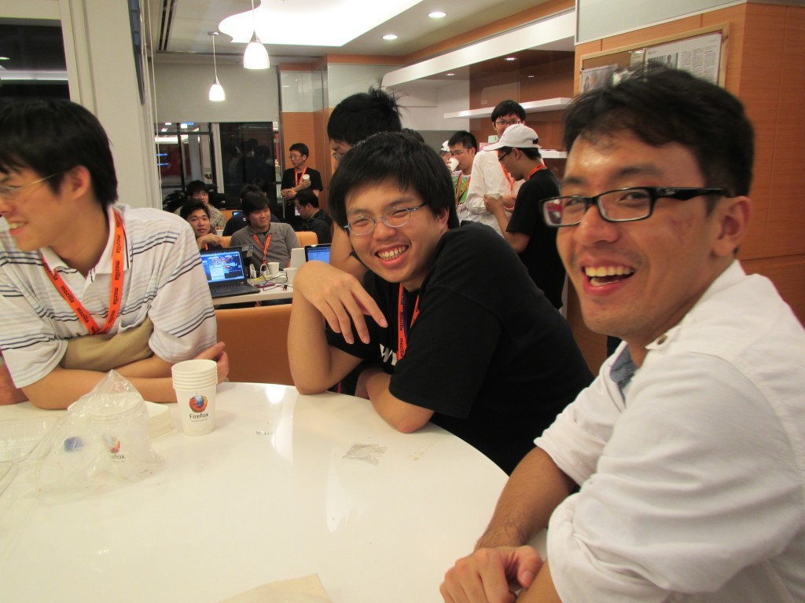

Mozilla Taiwan 很高興上週末 (4/14、4/15) 在中研院，與同樣喜愛 OSDC 的好朋友見面敘舊呦！這次 Mozilla Taiwan 大力參與此活動，特別邀請 CEO 宮力博士帶來精彩的 B2G 演講，當天下午則是由 Mozilla 工程師 Thinker 和大家分享 Apps 在 HTML5 與 WebAPIs 的心得，最熱烈的討論一路延伸到攤位，現在話不多說，就讓大家跟著精彩圖說還原現場盛況吧！

上午9:00，Mozilla Taiwan 攤位設置完成！這是台灣分公司成立以來第一次在研討會露臉，我們跟大家一樣興奮！

我們的 CEO 宮力博士主講第一場「Mozilla B2G: Breaking Mobile Monopolies」，宮博士從 Mozilla 的歷史說起，進而闡述現在行動市場的封閉現象比以往更嚴重， 而Mozilla 將如何透過 B2G 的開發打破行動市場的壟斷。在演講結束後宮博士，也在攤位與會眾熱烈地討論！

而 Thinker 主講的 WebAPI 介紹也塞爆了會議室，會眾笑道「救命啊救命啊，做 Web 的都衝進來啦！」大家對 Web 技術發展真是非常有興趣呢！

Mozilla 攤位人潮滿滿，大家迫不及待親手把玩 B2G 手機。對技術的熱愛，對新知的好奇，全部寫在臉上。

Mozilla 攤位，除了徵才、開發資訊介紹外，當然還有親切的工作人員在旁協助。

而當天晚上舉辦、現場報名的第一次「謀智台客 MozillaTech」開發者聚會，更是以迅雷不及掩耳的速度秒殺名額，我們的 Mozilla Space 裡塞進了近五十個人！這裡從來沒有塞這麼多人過啊啊啊！

 

與這次機會失之交臂的朋友們，下次請早呀！

更多照片請見 Flickr：[MozillaTaiwan](https://www.flickr.com/photos/mozillataiwan/sets/72157629837171139/)，Mozilla 在 OSDC.tw 的活動資訊及宮博士、Thinker 的演講投影片則請見[活動頁面](https://blog.mozilla.com.tw/events/mozilla-taiwan-at-osdc-tw-2012)。

Mozilla 相關資訊都會透過 Mozilla Taiwan 訊息中心、[FB 粉絲頁](https://fb.me/MozillaTaiwan)和 [G+ 專頁](https://plus.google.com/u/0/114653167240123163859/posts)第一手傳達給 Mozilla 的好朋友們，大力歡迎大家加入並關注訊息！
