Firebug 團隊發表新版 [Firebug 1.12](https://blog.getfirebug.com/2013/08/21/firebug-1-12-0/)。下列是該版本的其中幾項新功能。

Firebug 1.12 可相容於 Firefox 23 – 26

Firebug 為開放源碼專案，是由全世界的開發者共同維護。我當然要藉此機會介紹 Firebug 1.12 的所有貢獻者：

- Jan Odvarko

- Sebastian Zartner

- Simon Lindholm

- Farshid Beheshti

- Steven Roussey

- Florent Fayolle

- Awad Mackie

- Belakhdar Abdeldjalil

- Thomas Andersen

- Hisateru Tanaka

- 複製 CSS 屬性

現在可輕鬆將 CSS 屬性複製到剪貼簿中。不論是個別的 CSS 屬性、規則，或完整風格，只要對你想複製的部份按下滑鼠右鍵，即可將之複製到剪貼簿中。參閱此功能的[詳細說明](https://getfirebug.com/wiki/index.php/Style_Side_Panel#Context_Menu)。

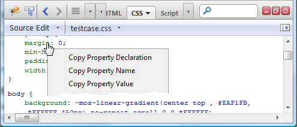

- 「網路 (Net)」面板的新篩選器

舊的「Flash」篩選器已重新命名為「外掛程式 (Plugins)」，可擴及 Flash 與 Silverlight HTTP 的請求。現另有「字型 (Fonts)」篩選器，僅針對客製化字型 (font/ttf 或 font/woff mime-types) 而觀看 HTTP 請求。

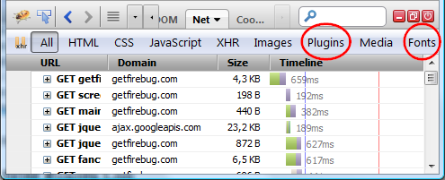

透過篩選器按鈕的提示文字，可了解經篩選檔案的詳細資訊。

- 「DOM」記錄事件篩選器

針對特定元素而設定的 DOM 事件記錄，則可透過此功能而進一步篩選。下圖即為「記錄事件 (Log Events)」功能的使用者介面。其內提供新的子選單，可針對已選定元素而挑出所要記錄的事件。

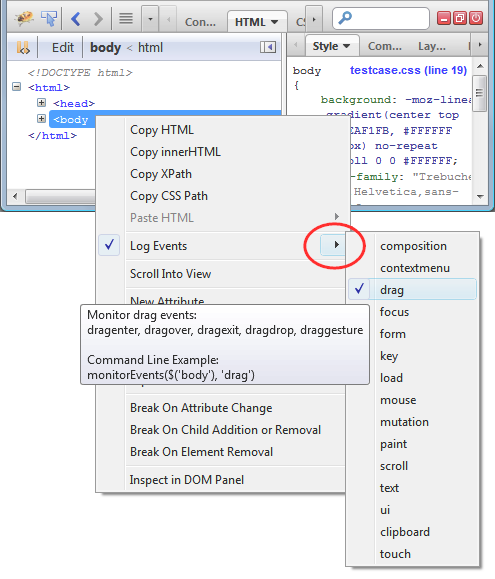

你也能[協助我們改善此功能的使用者介面/經驗](https://www.softwareishard.com/blog/firebug/how-to-properly-filter-dom-event-logs/)。

- 強化的自動完成對話框

自動完成 (Autocompletion) 對話框，位於「主控台 (Console)」內的命令列 (Command line) 上。除了改善其設計之外，現亦內建了 Command Line API。

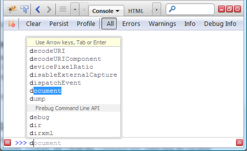

請注意：彈出型視窗的底部可找到「Firebug Command Line API」。

- 在命令列中使用 (Use in Command Line)

此功能可透過新的「$p」變數，透過命令列指向不同的頁面物件 (cookies、HTML 元素、JS 物件、網路請求等)。「$p」變數亦可用於命令列表達式之中。

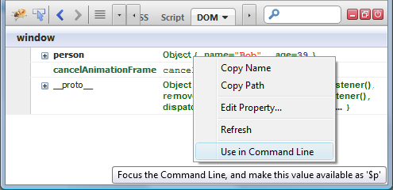

可參閱此功能的[詳細說明](https://www.softwareishard.com/blog/firebug/new-firebug-feature-use-in-command-line/)。

- 以群組呈現主控台的訊息

若「主控台 (Console)」中的訊息連續出現多次，則能以群組顯示訊息。此功能可大幅減少記錄數量，呈現更簡潔的記錄作業！

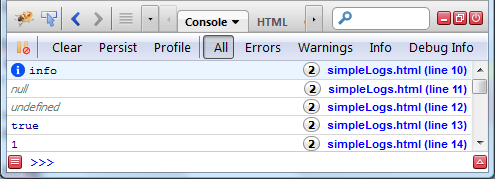

- 更清楚顯示 HTTP 請求的階段

進一步改善各個 HTTP 請求的提示文字 (顯示於「網路 (Net)」面板中)。現將透過小型流程圖，顯示目前請求的所有階段。是不是看起來更清楚了呢？

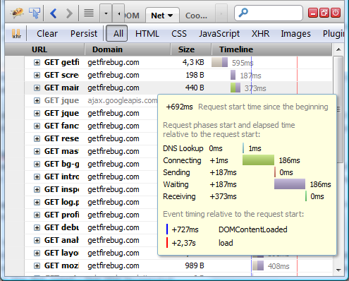

- 「主控台」與「網路」面板上的多組篩選器

「主控台 (Console)」與「網路 (Net)」面板可同時選擇多組篩選器。只要按住「Ctrl」時點選篩選器按鈕，就可看到主控台面板中的「錯誤 (Errors)」與「警告 (Warnings)」；或是網路面板中的「HTML」、「CSS」、「JS」檔案。如下圖所示：

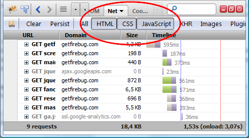

- 切換側邊面板的顯示狀態

現在可切換側邊面板的顯示狀態。即使重新啟動 Firefox 仍會保持目前狀態。如下圖所示：

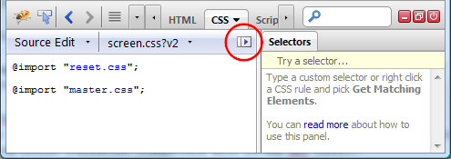

如果不想看到「選擇器 (Selectors)」側邊面板，亦可將之隱藏。

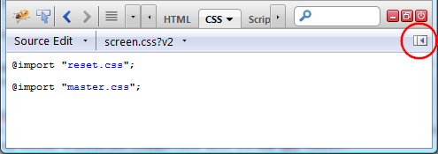

- 於 $_ 中儲存最近一次命令列執行的結果

Firebug 現於命令列中提供了新的變數「$_」。此變數可儲存前次表達式執行 (相容於 Chrome 開發工具) 的結果。

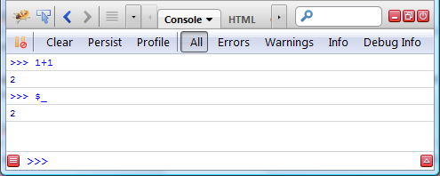

- 新命令：getEventListeners()

Firebug 命令列現提供新命令：「getEventListeners()」。已於指定物件上註冊的事件監聽器 (Event listener)，均可透過此命令而回傳之。此處所謂的物件一般均屬於元素，亦可能為 window 物件。

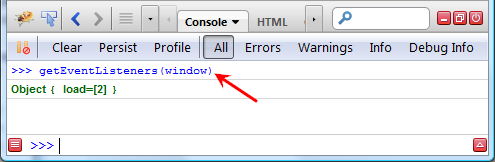

在命令列上執行命令之後，即可進一步檢視「DOM」面板中的回傳物件。如下圖所示：

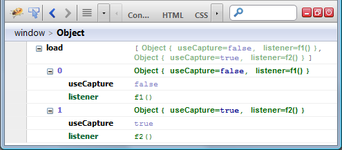

- 複製為 cURL (Copy as cURL)

現在可根據網路請求而建立 cURL 命令，藉以測試終端視窗所傳來的請求。對「網路 (Net)」面板中的請求按下滑鼠右鍵，並點選「複製為 cURL (暫譯，即下圖所示的 Copy as cURL)」即可。

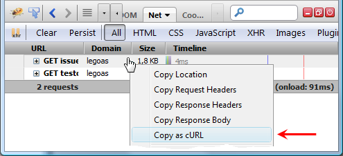

- console.log() 可透過「%f」指定浮點數的精度

現在浮點數透過「console.log()」第一個參數所指定的「%.xf」樣式，即可捨去指定的小數位數。這裡的「x」代表小數點後面所應捨去的位數。如果輸入：

console.log("amount: %.2f", 4.3852)

就會輸出：

amount: 4.39

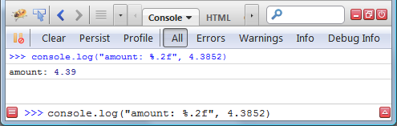

你也可進一步了解 [Console API](https://getfirebug.com/wiki/index.php/Console_API#console.log.28object.5B.2C_object.2C_....5D.29) 中可用的其他樣式。

- 顯示/隱藏堆疊參數

「堆疊 (Stack)」面板中顯示的堆疊架構，有時會因為參數清單太長而無法使用。Firebug 因此提供新的「顯示參數 (Show Arguments)」選項，可顯示/隱藏這些參數。

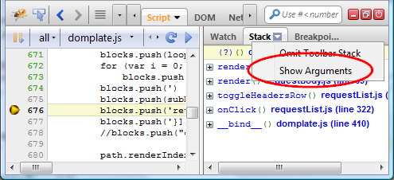

- 強化「CSS」面板

Firebug 對「CSS」面板進行多項強化。現在可顯示更多的 CSS 資訊。

- 顯示 @page 規則

- 顯示包含 @media 元素的檔案

- 顯示 @keyframes 規則

- 顯示 @-moz-document 規則

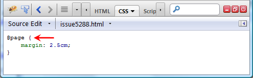

若要進一步了解完整的 Firebug 強化功能，可參閱[版本說明](https://getfirebug.com/wiki/index.php/Firebug_Release_Notes#Firebug_1.12)。亦可到[getfirebug.com](https://blog.getfirebug.com/2013/08/21/firebug-1-12-0/) 觀看官方聲明。

另可透過 [Twitter](https://twitter.com/firebugnews/) 隨時獲得最新資訊！

原文鏈結：[https://hacks.mozilla.org/2013/08/firebug-1-12-new-features/](https://hacks.mozilla.org/2013/08/firebug-1-12-new-features/)
