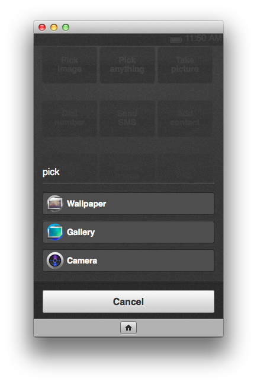
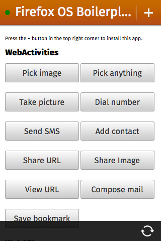

此為「Firefox OS ─ 讓 [HTML5](https://developer.mozilla.org/en/html/html5) 得以完全發揮的平台」系列的第六支影片 (於此回顧[第一支](https://hacks.mozilla.org/2013/06/firefox-os-for-developers-the-platform-html5-deserves/)、[第二支](https://blog.mozilla.com.tw/posts/3179/)、[第三支](https://blog.mozilla.com.tw/posts/3277/)、[第四支](https://blog.mozilla.com.tw/posts/3419/)、[第五支](https://blog.mozilla.com.tw/posts/3593)影片)，讓開發者不需封裝自己的 App，即可透過 [Web Activities](https://wiki.mozilla.org/WebAPI/WebActivities)存取硬體。

本影片是由 Mozilla 的 Chris Heilmann ([@codepo8](https://twitter.com/codepo8))，與 [Telefónica Digital](https://blog.digital.telefonica.com/)/ W3C 的 Daniel Appelquist ([@torgo](https://twitter.com/torgo)) 所錄製，為大家解說 Web Activities 的相關概念。[可於此觀看影片](https://youtu.be/DNVbxY70cIc)。

[Web Activities](https://wiki.mozilla.org/WebAPI/WebActivities) 可擴充 HTML5 App 的功能，不需詢問使用者的授權亦能存取硬體。換句話說，App 不會要求使用者允許存取相機或電話功能，而是由 App 直接要求圖片或撥打電話，再挑選最適合的 App 執行該作業。以尋找相片為例，使用者可從圖庫或桌布中挑選相片，甚至透過相機 App 拍攝新的相片。接著你就能取得 BLOB 格式的相片。而這組程式碼實在很簡單：

var pick = new MozActivity({
   name: "pick",
   data: {
       type: ["image/png", "image/jpg", "image/jpeg"]
   
}
});

					123456

						var pick = new MozActivity({   name: "pick",   data: {       type: ["image/png", "image/jpg", "image/jpeg"]   
}});

此程式碼可觸發「pick」Activity，列出所有必要的 MIME 類型以要求圖檔。在 Firefox OS 或執行 Firefox 的 Android 裝置中，這個程式碼將顯示下列對話框：

所有的 Activities 均擁有成功/失敗處理器 (Handler)。在本範例中，若使用者成功取得來源圖檔，則可建立新的圖像；若使用者不允許拍照或圖檔為錯誤格式，則可顯示警示：

pick.onsuccess = function () {

    // Create image and set the returned blob as the src
    var img = document.createElement("img");
    img.src = window.URL.createObjectURL(this.result.blob);

    // Present that image in your app
    var imagePresenter = document.querySelector("#image-presenter");
    imagePresenter.appendChild(img);
};

pick.onerror = function () {

    // If an error occurred or the user canceled the activity
    alert("Can't view the image!");
};

					1234567891011121314

						pick.onsuccess = function () {
    // Create image and set the returned blob as the src    var img = document.createElement("img");    img.src = window.URL.createObjectURL(this.result.blob);     // Present that image in your app    var imagePresenter = document.querySelector("#image-presenter");    imagePresenter.appendChild(img);}; pick.onerror = function () {
    // If an error occurred or the user canceled the activity    alert("Can't view the image!");};

其他的 Web Activities 也都是以類似的方式運作。再舉個例子，下列指令碼可要求使用者撥號：

var call = new MozActivity({
    name: "dial",
    data: {
        number: "+46777888999"
    }
});

					123456

						var call = new MozActivity({    name: "dial",    data: {        number: "+46777888999"    }});

此程式碼將啟動使用者已定義的撥打電話 App，接著要求撥打號碼。一旦使用者掛斷電話，系統隨即回傳成功處理器的物件。

Web Activities 還有多項優點：

- 可安全存取硬體 ─ 不會請求使用者再允許其他 App 使用相機，而是讓使用者相信的 Apps 直接使用相機。

- 讓你的 App 成為使用者經驗的一部分 ─ 不需再建構相機介面，而是讓使用者透過熟悉的介面拍照

- 讓 Apps 成為裝置上的生態系統 ─ 不用讓多個 App 做相同的事，而是讓各個 App 專精做好一件事

- 讓使用者自行掌握 ─ 可隨時隨地提供使用者所需的相片，並根據 Apps 的功能而決定儲存位置；而不會儲存於裝置的其他資料庫中

另可參閱之前的《[Introducing Web Activities](https://hacks.mozilla.org/2013/01/introducing-web-activities/)》文章以進一步了解。

若想於 Firefox OS 裝置 (或模擬器)，或執行 Firefox 的 Android 手機上開始著手 Web Activities，最簡單的方式就是下載 [Firefox OS Boilerplate App](https://github.com/robnyman/Firefox-OS-Boilerplate-App) 即可把玩 Activities 與程式碼：

如果想把 App 托管於自己的伺服器上，而且不需詢問使用者的授權即存取硬體，那麼 Web Activities 就是最快、最簡單的方式。針對 App 所需的資訊，你可讓使用者決定資訊的取得方式，並專心處理所獲得的資料。

原文連結：[https://hacks.mozilla.org/2013/08/web-activities-firefox-os-the-platform-html5-deserves/](https://hacks.mozilla.org/2013/08/web-activities-firefox-os-the-platform-html5-deserves/)
