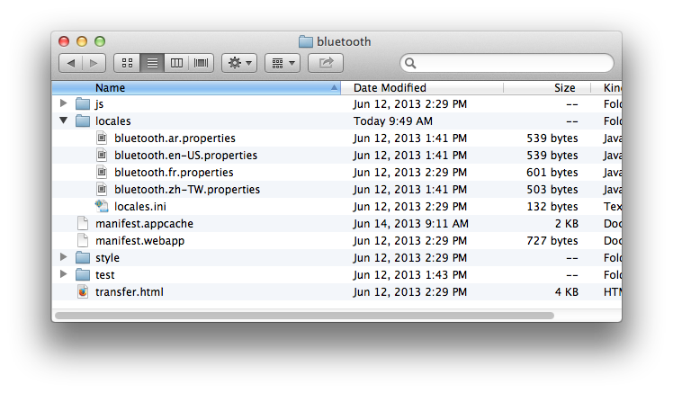

Firefox OS Apps 現正於全世界刮起旋風 ─ 西班牙、波蘭、哥倫比亞、委內瑞拉，還有更多國家會跟進。所以你也該讓自己的 Apps 擁有不同語言了。本著Open Web 的開放特性，同樣有許多框架與技術可翻譯 Apps。像 [Jed](https://slexaxton.github.io/Jed/) 提供的 Gettext-style 函式庫就是常見工具。而許多開發中的新翻譯平台亦可擴充現有函式庫的功能。Mozilla 現正執行 [Localization 專案](https://wiki.mozilla.org/L20n)，將透過多樣的新編譯功能而延伸 L10n 的範圍。你可加入[「Tools 群組」](https://groups.google.com/forum/#%21forum/mozilla.tools.l10n)進一步了解。

本篇將透過目前已佈署於 [Gaia](https://github.com/mozilla-b2g/gaia) 階段的函式庫，完成 Firefox OS Apps 的多語翻譯程序。由於 Gaia 已包含 Firefox OS 內建的所有 Web Apps，當然也包含電話撥號 (Dialer) 與聯絡人資訊管理 (Contacts Manager) 功能，因此 Gaia 就是絕佳的模擬模型。若要使用 Gaia 進行模擬，就必須先知道函式庫的某些功能並無法相容跨瀏覽器的環境 (例如 l10n_date.js 即使用非標準的 toLocaleFormat 函式)。當然，未來 Gaia 亦將朝 L20n 邁進。

### L10n.js

目前 Firefox OS Gaia 則使用 Fabien Cazenave 提供的 [L10n.js](https://github.com/fabi1cazenave/webL10n) 函式庫修改版本，可翻譯 Firefox OS 中的預設 Apps。另可於 Gaia 的[原始碼](https://github.com/mozilla-b2g/gaia/blob/master/shared/js/l10n.js)中找到此函式庫。此函式庫是以屬性格式的鍵 (Key)/值 (Value) 為基礎。L10n.js 剖析器 (Parser) 亦可支援匯入規則，以利於用戶端選擇語言。預設 Gaia Apps 將以 ini 檔案指定翻譯檔案，並以鏈結標籤的方式載入 ini 檔案。

這裡以檔案傳輸用的 Bluetooth App 為例，其語系檔 (Properties file) 的結構則如下圖所示：

此 App 包含 4 種語言 (ar、en-US、fr、zh-TW) 的語系檔。而部分的 en-US 語系檔另列於下：

bluetooth = Bluetooth
confirmation = Confirmation
bluetooth-status-description = Bluetooth is disabled
turn-bluetooth-on = Do you want to turn Bluetooth on?
cancel = Cancel
turn-on = Turn On

					123456

						bluetooth = Bluetoothconfirmation = Confirmationbluetooth-status-description = Bluetooth is disabledturn-bluetooth-on = Do you want to turn Bluetooth on?cancel = Cancelturn-on = Turn On

如你所見，這些都是簡單的鍵/值語系檔，並包含可翻譯的字串。所有檔案均儲存於 Bluetooth App 的「locales」目錄中。此外，該資料夾亦具備 locales.ini 檔案，內容如下：

@import url(bluetooth.en-US.properties)

[ar]
@import url(bluetooth.ar.properties)

[fr]
@import url(bluetooth.fr.properties)

[zh-TW]
@import url(bluetooth.zh-TW.properties)

					12345678910

						@import url(bluetooth.en-US.properties) [ar]@import url(bluetooth.ar.properties) [fr]@import url(bluetooth.fr.properties) [zh-TW]@import url(bluetooth.zh-TW.properties)

此 ini 檔案即根據 Apps 使用者的語言，指定所應載入的語系檔；且該 ini 檔案亦列出所有可支援的多國語言。且在此範例中，如果未提供使用者所屬的語言，則 en-US 語系檔將為預設語言。透過下列鏈結標籤的語法，即可載入此 ini 檔案。

<link rel="resource" type="application/l10n" href="locales/locales.ini" />

					1

						<link rel="resource" type="application/l10n" href="locales/locales.ini" />

若「rel」屬性設為「prefetch」，即可預先載入 ini 檔案而提升效能。

### L10n 元素屬性

接著新增 1 組 data-l10n-id 屬性 (語系檔中所定義的鍵值)，藉以定義需翻譯的元素。若以需要翻譯的標頭為例，應如下列：

<h2 data-l10n-id="label1">Label One</h2>

					1

						<h2 data-l10n-id="label1">Label One</h2>

屬性「label1」的值，即作為語系檔中的鍵值。而透過參數替換 (Argument substitution) 與複數巨集 (Plural macro)，即可於語系檔中建立複雜字串。

### 參數替換

用雙大括弧包住參數 ─ 如 {{arg}} ─ 即完成參數替換。另透過如下的類似語法，亦可針對特定使用者而自訂訊息：

loginmessage = Hello {{user}}, glad you decided to visit

					1

						loginmessage = Hello {{user}}, glad you decided to visit

而透過 data-l10n-args 屬性，亦可設定參數的預設值。此屬性本為 JSON 格式的預設數值。在上述範例中，另可使用下列 HTML 設定使用者參數的預設值：

<h2 data-l10n-id="label1" data-l10n-args='{ "user": "Guest" }'>Label One</h2>

					1

						<h2 data-l10n-id="label1" data-l10n-args='{ "user": "Guest" }'>Label One</h2>

### 複數巨集

根據參數值，可透過複數巨集來自訂訊息。此巨集將使用 1 組數字數值並回傳 zero、one、two、few、many、other 等值。根據傳入的數值與目前 [Unicode Plural Rules](https://unicode.org/repos/cldr-tmp/trunk/diff/supplemental/language_plural_rules.html) 的不同，其回傳值亦將有所差異。舉例來說，針對 en-US 所自訂的郵件訊息可能如下：

mailMessage = {[ plural(n) ]}
mailMessage[zero]  = you have no messages
mailMessage[one]   = you have one message
mailMessage[two]   = you have two messages
mailMessage[other] = you have {{n}} messages

					12345

						mailMessage = {[ plural(n) ]}mailMessage[zero]  = you have no messagesmailMessage[one]   = you have one message mailMessage[two]   = you have two messages mailMessage[other] = you have {{n}} messages

<h3 data-l10n-id="mailMessage" data-l10n-args='{ "n": "1" }'>Mail Message</h3>

					1

						<h3 data-l10n-id="mailMessage" data-l10n-args='{ "n": "1" }'>Mail Message</h3>

《未完待續》

原文鏈結：[https://hacks.mozilla.org/2013/08/localizing-firefox-os-apps/](https://hacks.mozilla.org/2013/08/localizing-firefox-os-apps/)
