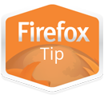
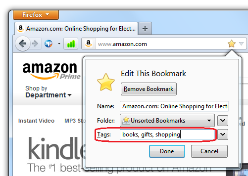

你超愛用書籤功能嗎？曾經書籤多到自己都找不到喜歡的網頁嗎？

這裡跟你說個秘技！

為書籤設定「標籤 (Tag)」之後，就能更快找到網頁了。方法如下：

在[建立書籤](https://support.mozilla.org/zh-TW/kb/use-bookmarks-to-save-and-organize-websites) (可參閱 SUMO 文章) 之後，只要對星號連點滑鼠 2 次就會開啟編輯視窗，其內有「標籤」欄位。除了可輸入標籤之外，如果點選標籤欄位旁的向下箭頭，即可選擇之前輸入的標籤。

舉例來說，你將 [Amazon.com](https://amazon.com/) 上的某項商品設為書籤之後，可進一步設定該網頁的標籤為「shopping/購物」(中英文皆可唷)。

這樣就為書籤設定了標籤。接著可在智慧位址列 (Awesome Bar) 中鍵入「shopping」或「購物」，只要是你設定了「購物」標籤的網站，還有相同關鍵字的其他網站都會一起出現。很方便吧？

[參閱此頁面以進一步了解為書籤設定標籤的方法](https://support.mozilla.org/kb/categorizing-bookmarks-make-them-easy-to-find) (並可編輯書籤的標籤)。

原文鏈結：[https://blog.mozilla.org/theden/2013/08/26/firefox-tip-find-bookmarks-faster-with-tags/](https://blog.mozilla.org/theden/2013/08/26/firefox-tip-find-bookmarks-faster-with-tags/)
