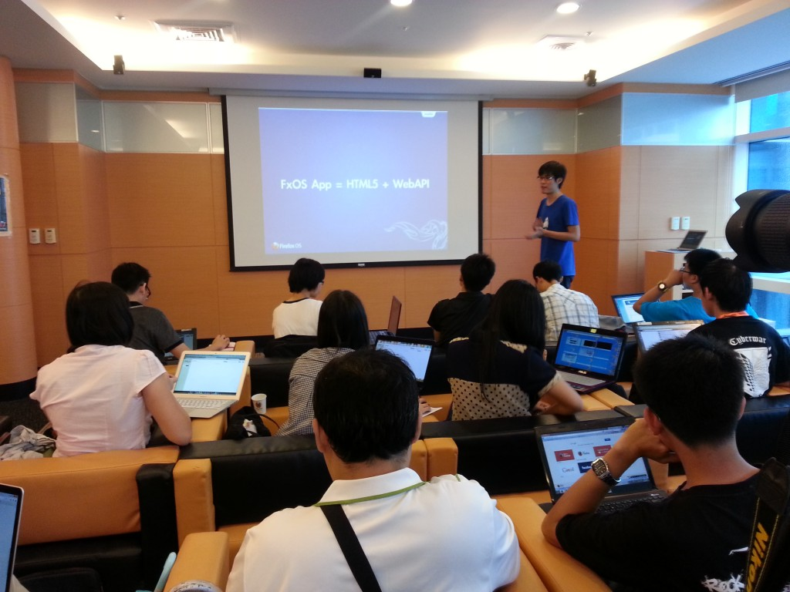

時間：8/31 (六) 下午 2:00 – 4:00

地點：Mozilla Space

記得上週末的台灣好似泡在雨中嗎？在毫不停歇的暴雨中，有一群對 Firefox OS 充滿熱情的 Firefox 校園大使，專誠來到 Mozilla Taiwan 辦公室，準備進行為時二小時的「狐狐工作坊 – Firefox OS 簡介」，如果你以為來參加的人全是資工／資管背景出生，那你一定會驚訝其中佔了約一半的非本科系出生的校園大使一起共襄盛舉！

今天工作坊邀請到 Firefox OS 軟體工程師 – Evan 帶大家進入 Firefox OS 的世界中。課程從三部分著手：Firefox 模擬器、發佈 App 的方式，以及親手做一個拼圖遊戲。帶領大家認識 Firefox OS 、了解 Web 可以做什麼、什麼是 Web App，以及最有成就感的實作體驗。現場同學們各各跟著解說，專心操作，課程尾聲的 QA 時間更是熱烈發問，求知慾破表啊！

[歡迎點此觀看投影片－Firefox OS 簡介](https://docs.google.com/presentation/d/1zBYXcw8Q3KlhN6gNac-jsIzr-55YDN4_WrEfdf3x_jY/edit#slide=id.p43)

看大家全神貫注的專心模樣，研究的就是 2013 年最火紅的 Firefox OS 開放行動作業系統！

「狐狐工作坊」由 Mozilla Taiwan 規劃，每月推出各式不同主題，內容涵蓋行銷推廣、演講技巧、程式開發、網頁製作、活動執行…. 等，教學與互動相長，提供給歷屆曾任 Firefox 校園大使的學生參與，也歡迎青年學子一同加入，在互動中與我們一同成長。
