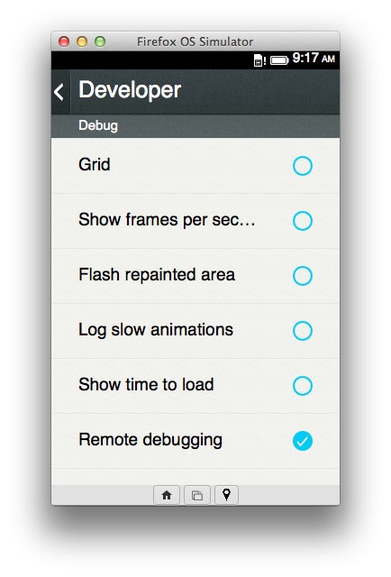
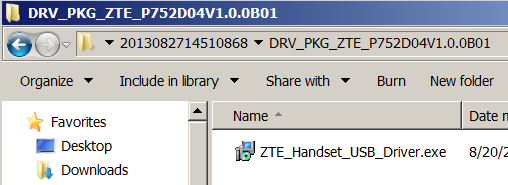
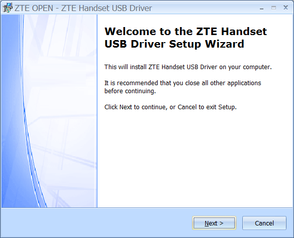
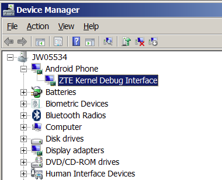
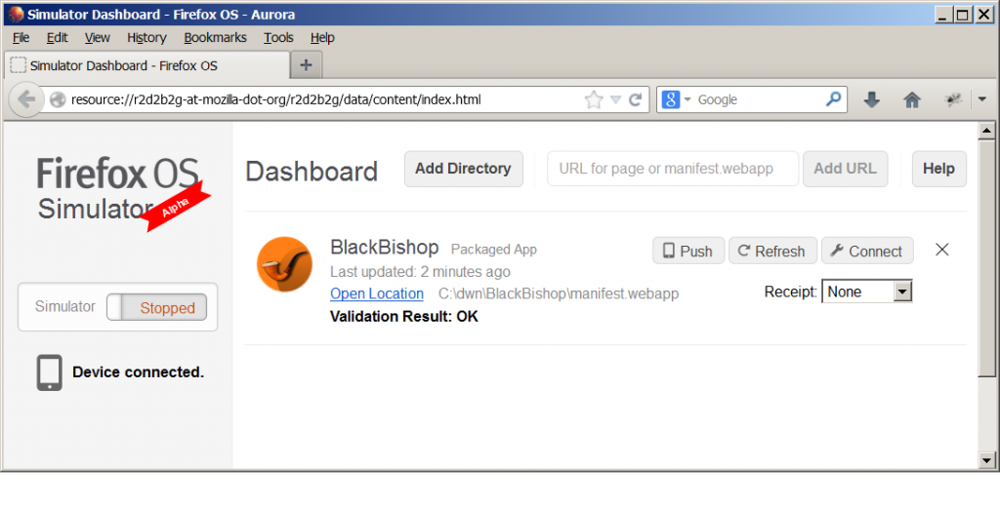

中興通訊 (ZTE) 針對開發者與初期使用者，發表了 Firefox OS 行動電話 ─ [ZTE Open](https://fxosphone.mozilla.com.tw/zteopen/)。本篇文章將說明應如何設定桌面環境並連接手機，再透過 Firefox OS 模擬器 (Firefox OS Simulator) 將 Apps 送進 ZTE Open。

### 設定 ZTE Open

在將 Apps 送進 ZTE Open，或對 ZTE Open 內的 Apps 進行除錯之前，都必須先啟動手機上的遠端除錯 (Remote debugging) 功能。請進入手機的「Settings」App 再點選 Device information -> More Information -> Developer -> Remote debugging 即可。

### Windows 系統

若要在 Windows 系統中銜接模擬器與 ZTE Open，則需要特定的 USB 驅動程式。ZTE Open 手機已內建了執行檔，可安裝正確的驅動程式。另可透過[中興通訊的鏈結](https://devicedownload.zte.com.cn/cn/UpLoadFiles/product/270/soft/2013082714510868.zip)下載此執行檔。

先將 Zip 壓縮檔下載至自己熟悉的路徑之後並解壓縮，接著以隨附的 USB 纜線銜接手機與電腦，最後執行資料夾中的「ZTE_Handset_USB_Driver.exe」可執行檔。

依照設定精靈的步驟安裝驅動程式即可。

驅動程式安裝完畢，就能將 Apps 送進手機了。你亦可透過 Windows 的「裝置管理員」確認是否安裝妥善。列於「Android Phone」之下的「ZTE Kernel Debug Interface」就是 ZTE 手機。

啟動 Firefox OS 模擬器，可看到 Dashboard 顯示「Push」按鈕與「Device connected」的訊息。

現在即可將自己的 Firefox OS Apps 添增至模擬器中，並以「Push」按鈕將 Apps 送進手機之中。

### Linux 系統

若你是在 Linux 平台上開發 Apps，則必須新增 udev 規則才能銜接 ZTE Open 手機。請參閱 Android 開發文件《[Setting up a Device for Development](https://developer.android.com/tools/device.html)》並完成其中的 3.a 與 3.b 步驟。ZTE Open 會將「19d2」作為 idVendor 屬性。該項規則如下所示：

SUBSYSTEM==”usb”, ATTR{idVendor}==”19d2”, MODE=”0666”, GROUP=”plugdev”

					1

						SUBSYSTEM==”usb”, ATTR{idVendor}==”19d2”, MODE=”0666”, GROUP=”plugdev”

完成上述變更之後，請重新啟動系統或 udev 服務：

sudo service udev restart

					1

						sudo service udev restart

如果模擬器的 Dashboard 並未出現「Push」按鈕，則請參閱此篇[問題回報](https://github.com/mozilla/r2d2b2g/issues/515)。

### Mac 系統

如果你是在 Mac 上執行模擬器，則不需額外設定即可啟動「Push」按鈕。

### 參考資料

若要透過模擬器將 Apps 送進裝置或除錯，可先參閱[《 Firefox OS 模擬器》](https://developer.mozilla.org/zh-TW/docs/Tools/Firefox_OS_Simulator)內的相關資訊。

原文鏈結：[https://hacks.mozilla.org/2013/08/pushing-a-firefox-os-web-app-to-zte-open-phone/](https://hacks.mozilla.org/2013/08/pushing-a-firefox-os-web-app-to-zte-open-phone/)
