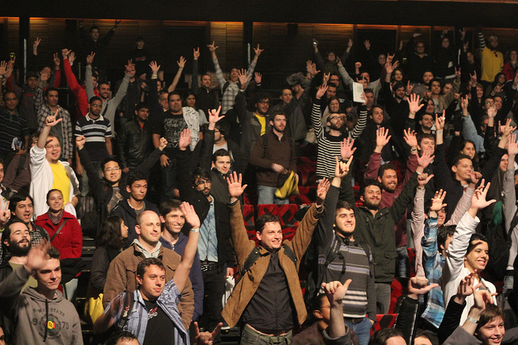
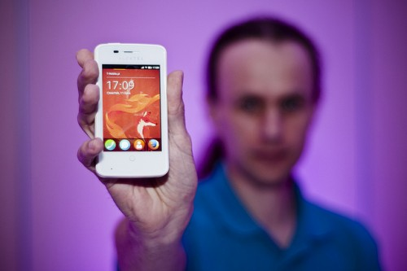

時間拉回今年 5 月，Mozilla 才針對 Apps 開發者推出了「[Phones for Apps for Firefox OS](https://blog.mozilla.com.tw/posts/2653)」送手機企劃，而且在全世界引起熱烈的討論與回應。我們由衷感謝大家對 Firefox OS Apps 的支持。

Mozilla 不僅送出多支 Firefox OS 開發者預覽手機 ─ Geeksphone Keons，而且有更多新的 Apps 湧入 [Firefox Marketplace](https://marketplace.firefox.com/)。例如遊戲類的 [Rooftops](https://marketplace.firefox.com/app/rooftops) 與 [Yatzy](https://marketplace.firefox.com/app/yatzy)，還有法文版的 [L’Arrosoir](https://marketplace.firefox.com/app/larrosoir/) 可愛園藝 App。如果你也撰寫並提交了自己的 Apps，讓我們致上最誠摯的謝意！同時希望其他人的 Apps 開發過程一切順利。

### 第二階段開始

Mozilla 現在啟動第二階段的「Phones for Apps for Firefox OS」企劃。針對那些正著手移植 Apps 的開發者，我們要再送出 Geeksphone 手機 (可保留無須歸還)，讓你能輕鬆移植現有的 [HTML5](https://developer.mozilla.org/en/html/html5) Apps。只要你已經撰寫並提交 HTML5 Web Apps，[移植 Apps](https://www.techopedia.com/definition/24719/port-an-application) 到新 Firefox OS 平台就趁現在！

快來協助 Mozilla 將 Open Web 帶入行動裝置的世界，你更能藉此在 Firefox Marketplace 中搶得先機。

第一步：[申請](https://mozhacks.wufoo.com/forms/phones-for-app-ports/)。

### 相關說明

- 請務必提交網站的 URL、程式碼 Repo，或 Apps 平台 (如 Amazon Web Apps、Blackberry WebWorks、Chrome Web Store、webOS、PhoneGap 商城) 的 URL 位址。如果你是包裝 HTML5 Apps 之後再發佈到 iTunes、Google Play，或其他 Apps 商城上，則請說明你所使用的工具 (如 Appcelerator、PhoneGap、Sencha)。

- 加快腳步！我們期望在 9、10 月就能看到你完成 Apps 的移植。

- 貼心小提醒：請務必提供 HTML5 Apps，才符合本次企劃的資格。

### 

### 申請

Mozilla 將儘快審閱你的 Apps。在你填寫表格完畢後，就會立刻收到確認郵件。我們會精挑細選並進一步通知幸運兒相關的手機寄送事宜。而其他人將不會收到任何後續的聯繫動作。懇請見諒此不周之處。

等不及看到移植過來的絕妙 Apps 了。[快來申請吧！](https://mozhacks.wufoo.com/forms/phones-for-app-ports/)

照片出處：感謝 [Josh Holmes](https://www.flickr.com/photos/joshholmes/9597800088/in/set-72157635230000033) 在 BrazilJS 會議，與 [MozillaEU](https://www.flickr.com/photos/mozillaeu/9263835250/) 所舉辦 Firefox OS 波蘭發表會上拍攝的相片。

原文鏈結：[https://hacks.mozilla.org/2013/09/calling-all-app-ports/](https://hacks.mozilla.org/2013/09/calling-all-app-ports/)
