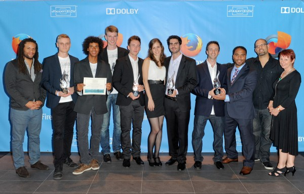
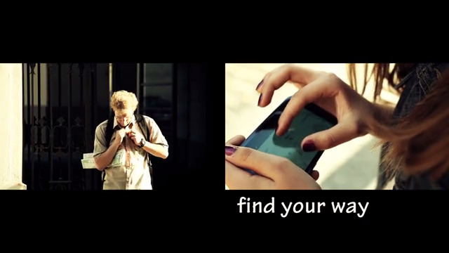

在欣賞超過 400 支投稿影片之後，Mozilla 很榮幸在多倫多國際電影節 (Toronto International Film Festival) 上，宣佈 2013 Firefox Flicks 微影片競賽的優勝、區域獎、人氣大賞等贏家。獲獎影片除了早鳥獎贏家之外，也有新進影片透過風趣、創新、生動等方式，確實捕捉到「Get mobilized」的精髓。這些影片展現出 Web 在行動電話上的無窮力量，讓人能隨時發掘、欣賞、分享許多有趣內容，以期改變大家的日常生活。

此競賽自 2 月 13 日開跑以來，我們看到許多絕佳的作品並頒佈了多個獎項！各組早鳥獎贏家均能獲頒 $1,000 獎金；人氣大賞贏家可獲頒 Flicks 獨家大福袋；各區域冠軍可獲頒 $5,000 獎金；各區域亞軍可獲頒最高 $2,500 獎金。而最後的優勝贏家 (或團隊) 將獲邀飛往洛杉磯，與製作人(同時也是本競賽評審) Franklin Leonard 及 Couper Samuelson 相見歡，並能和 Panavision 公司的代表一同以專業器材重新錄製得獎影片。如果時間許可，優勝團隊亦能參加洛杉磯 Dolby Institute 的一日訓練課程，接著還有 Dolby Theater 的電影首映會與慶祝派對。最重要的是，獲獎影片將上傳至 Mozilla 的所有頻道，讓全球都能欣賞這些傑作！

為了祝賀這些傑出的獲獎人，Mozilla 另特別在多倫多國際電影節期間舉辦「微電影首映派對 (Flicks Premiere Party)」，精挑細選出 6 部得獎影片讓本屆評審、前屆得獎人、電影從業人員一同觀賞。立刻欣賞下列得獎的微電影，並和我們一起為贏家喝采！

Firefox Flicks 2013 贏家與評審

Mozilla 要對今年參與微電影競賽的所有人表達感謝之意。如果沒有這些熱情的評審、贊助商，還有參與競賽並積極投票的各位，我們絕對無法完成這次活動。

若要觀看各個分組的冠、亞軍名單，可至：[firefoxflicks.mozilla.org/en-US/](https://firefoxflicks.mozilla.org/en-US/)

優勝

[Spot the difference (波蘭)](https://firefoxflicks.mozilla.org/video/2013/600/)Leopold Abai, Jean-Pierre Labarre, Miłosz Kosicki

或到 [Vimeo](https://vimeo.com/) 的 [firefoxflicks](https://vimeo.com/firefoxflicks) 上欣賞 [Spot the difference](https://vimeo.com/71322691)。

北美區

冠軍：[Whole is Greater (美國)](https://firefoxflicks.mozilla.org/video/2013/441/)David Pestka, Aaron McFarlane, Stan Pestka

亞軍：[Scooter (美國)](https://vimeo.com/63297510)Samuel Thomas, United States

南美區

冠軍：[Tortillas-On-the-Go (墨西哥)](https://firefoxflicks.mozilla.org/video/2013/377/)

Alberto García Ballesteros, Eszter Szigethy, César Rafael Rodríguez Ángeles, Ignacio Alberto Vega Bahena

亞軍：[Beyond the Limit (墨西哥)](https://firefoxflicks.mozilla.org/video/2013/446/)Fabián Eduardo Ramírez Barreto

歐洲、中東、非洲區

冠軍：[Get Mobilized – Be Part of It (德國)](https://firefoxflicks.mozilla.org/en-US/video/2013/345/)Marvin Nuecklaus

亞軍：[Be Part of It (英國)](https://firefoxflicks.mozilla.org/en-US/video/2013/443/)

Andrei Stan

亞洲區

冠軍：[The Anniversary (新加坡)](https://firefoxflicks.mozilla.org/video/2013/436/)Kevin Kristian, Made Surya Adhiwirawan

亞軍：[Stand by You Always (日本)](https://firefoxflicks.mozilla.org/video/2013/548/)

Kei Shimoda

人氣大賞

[Anyone, Anywhere (台灣)](https://vimeo.com/59994222)

Cheng-pin Chia 賈承彬

[The Right Way (義大利)](https://firefoxflicks.mozilla.org/video/2013/478/)

Giuseppe Gallo and Angela Catalano

[Spot the Difference (波蘭)](https://firefoxflicks.mozilla.org/video/2013/600/)

Leopold Abai, Jean-Pierre Labarre, Miłosz Kosicki

原文鏈結：[https://blog.mozilla.org/blog/2013/09/12/the-firefox-flicks-global-film-competition-winners-are-in/](https://blog.mozilla.org/blog/2013/09/12/the-firefox-flicks-global-film-competition-winners-are-in/)
