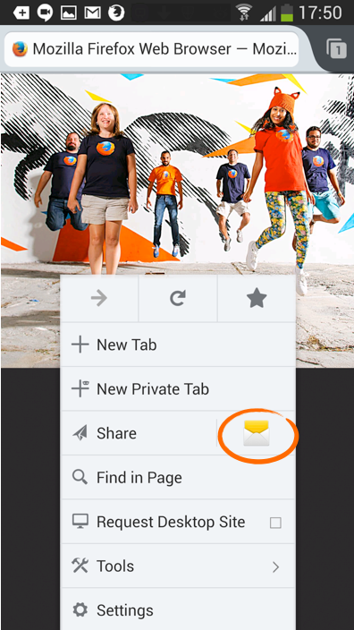
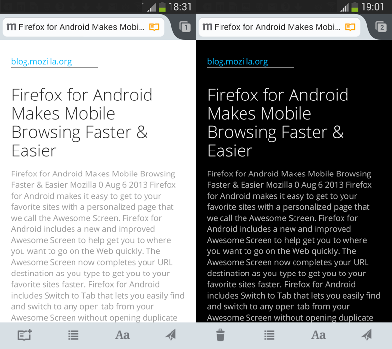

【美商謀智訊息】Mozilla 是全球性的非營利組織，以推動網路的平等、自由、開放為宗旨，旗下的 Firefox 瀏覽器、Firefox for Android 行動瀏覽器、Firefox OS 開放行動作業系統廣受全球市場喜愛。於美西時間 9 月 17 日正式釋出行動版瀏覽器 Firefox for Android，強化快速分享功能與提供與更舒適的閱讀模式，完全符合小螢幕網頁瀏覽的使用習慣。

### 快速分享 無縫連接

Firefox for Android 再度新添更多功能，讓你能輕鬆和親友分享你喜愛的網頁、文章、影片。全新「快享」功能強化廣受使用者歡迎的分享服務，在 Firefox 的「分享 (Share)」選單內添增可愛的彩色圖示，只要輕點一下即可完成分享。快享功能支援使用者最常用的 Facebook、Twitter、簡訊，和電子郵件分享，且 Firefox for Android 會自動把你最常用的分享服務加進選單按鈕中！

Firefox for Android 的快享功能

新版 Firefox for Android 支援近場通訊 (NFC) 的輕觸分享功能，讓使用者能快速分享內容。不論是食譜、地圖、有趣的文章、已開啟的分頁，現在只要將自己與朋友的 Android 手機「碰一下」，就能透過 Firefox for Android 立刻分享你最喜愛的網站。

### 自訂清單 輕鬆閱讀

Mozilla 站在使用者角度而不斷改進 Firefox，當然考量到小螢幕也要能提供舒適又輕鬆的閱讀經驗。新的閱讀器 (Reader) 功能，讓使用者能依照自己的喜好而切換 serif 或 sans serif 字型。在閱讀器模式下，Firefox for Android 亦能根據環境的亮度，自動切換「暗色調 (Dark mode，淺色背景搭配深色文字)」或「亮色調(Light mode，深色背景搭配淺色文字)」；使用者同樣能自行手動切換此 2 種閱讀模式。如果你想待會兒再閱讀某篇文章，不需切換回閱讀器模式，只要按著網址列中的閱讀器圖示，即可將此文章加入自己的閱讀清單中。即使在離線狀態亦可開啟閱讀器中的文章，讓你在通勤或其他無法上網 (如搭乘飛機或地鐵) 的時候同樣能繼續閱讀網路文章。

暗色調與亮色調下的 Firefox for Android 閱讀器模式

Firefox for Android 另新支援了瑞典文、英式英文、加泰羅尼亞文。現已有超過 20 種語言帶給你絕佳的 Web 經驗。

若需更多資訊：

- 下載 [Firefox for Android](https://mozilla.com.tw/firefox/#mobile)

- Firefox for Android [版本說明](https://www.mozilla.org/en-US/mobile/24.0/releasenotes/)

- [Firefox for Android 現亦提供 WebRTC 功能](https://blog.mozilla.com.tw/posts/3800/)

- 下載 [Windows、Mac、Linux 版的 Firefox](https://mozilla.com.tw/firefox/#desktop)

- Windows、Mac、Linux 版 Firefox 的[版本說明](https://www.mozilla.org/firefox/24.0/releasenotes/)

- Window、Mac、Linux 版 Firefox 的[開發主控台](https://hacks.mozilla.org/2013/08/the-browser-console/)

原文鏈結：[https://blog.mozilla.org/blog/2013/09/17/its-easier-to-share-your-favorite-web-content-with-firefox-for-android/](https://blog.mozilla.org/blog/2013/09/17/its-easier-to-share-your-favorite-web-content-with-firefox-for-android/)
