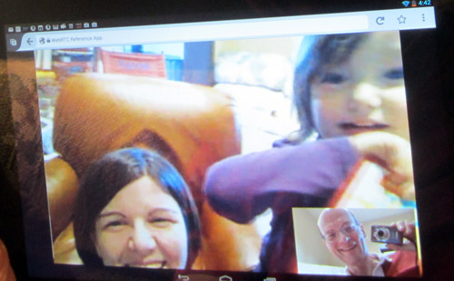
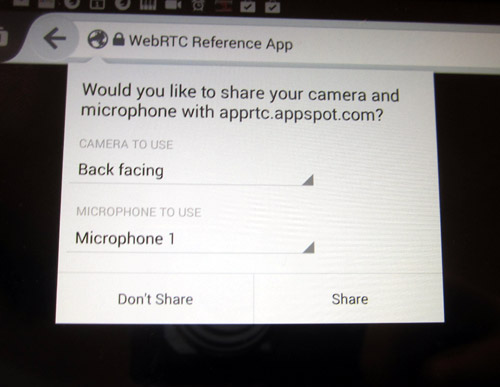
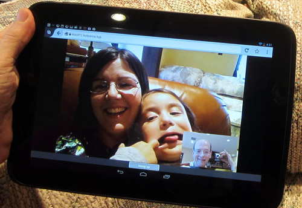

WebRTC 現跨足於 [Firefox for Android (行動版)](https://play.google.com/store/apps/details?id=org.mozilla.firefox) 與 Firefox 桌面版！Firefox 24 已預設支援mozGetUserMedia、mozRTCPeerConnection、DataChannels。桌面版 Firefox 20 即具備 mozGetUserMedia；桌面版 Firefox 22 接著納入mozPeerConnection 與 DataChannels。現在我們很興奮的宣佈 Firefox 行動版正式加入桌面版的行列，同樣支援這些酷炫的新功能！

### 可用功能

啟動 WebRTC 之後，開發者即可：

- 只需透過 JavaScript，就能直接從 Firefox for Android 擷取相機或麥克風串流 (我們知道開發者期待此功能已久！)

- 直接在瀏覽器之間進行通訊 (音訊或視訊電話均可)；請到 [appspot.apprtc.com](https://appspot.apprtc.com/) 網站進行測試

- 不需經過伺服器即可分享資料，進而啟動點對點 (Peer-to-peer) Apps；像是在通訊期間照樣玩遊戲、打字聊天、分享圖片

我們期待開發者提出更多創新概念！

### 初期使用者與相關回饋意見

Mozilla 目前主要支援開發者與早期使用者，以期能獲得重要的回饋意見。工作團隊尚未完備規格，且仍待我們建構更多功能並提升品質。Mozilla 將先讓一對一的單方通話更臻完善，接著再專注提升多方通話作業。我們也歡迎你加入測試與實驗的行列。針對這些功能，請隨時回饋意見、回報錯誤，甚至動手建構新的 Apps。

如果你還不知道從何下手，可參閱[已發佈的 WebRTC 相關文章](https://hacks.mozilla.org/category/webrtc/)。特別一提，你可先從《[WebRTC and the Early API](https://hacks.mozilla.org/2013/07/webrtc-and-the-early-api/)》、《[The Making of Face to GIF](https://hacks.mozilla.org/2013/07/the-making-of-face-to-gif/)》、《[PeerSquared](https://hacks.mozilla.org/2013/07/peersquared-one-on-one-online-teaching-with-webrtc/)》、《[An AR Game](https://developer.mozilla.org/demos/detail/an-ar-game)》(此遊戲贏得我們的 getUserMedia Dev Derby 開發競賽)、《[WebRTC Experiments & Demos](https://www.webrtc-experiment.com/)》等文開始。

以下為簡單的視訊幀像擷取範例 (將擷取約 15fps 的圖像)：

		
		

navigator.getUserMedia({video: true, audio: false}, yes, no);
video.src = URL.createObjectURL(stream);

setInterval(function () {
  context.drawImage(video, 0,0, width,height);
  frames.push(context.getImageData(0,0, width,height));
}, 67);
			
				
					
				
					1234567
				
						navigator.getUserMedia({video: true, audio: false}, yes, no);video.src = URL.createObjectURL(stream); setInterval(function () {  context.drawImage(video, 0,0, width,height);  frames.push(context.getImageData(0,0, width,height));}, 67);
					
				
			
		

此程式碼片段取自於 nightly-gupshup 中的「Multi-person video chat」。你也可至 [WebRTC 測試首頁](https://mozilla.github.io/webrtc-landing/)體驗；另可至 [GitHub](https://github.com/jesup/nightly-gupshup.git) 取得完整程式碼。

		
		

function acceptCall(offer) {
    log("Incoming call with offer " + offer);

    navigator.mozGetUserMedia({video:true, audio:true}, function(stream) {
    document.getElementById("localvideo").mozSrcObject = stream;
    document.getElementById("localvideo").play();
    document.getElementById("localvideo").muted = true;

    var pc = new mozRTCPeerConnection();
    pc.addStream(stream);

    pc.onaddstream = function(obj) {
      document.getElementById("remotevideo").mozSrcObject = obj.stream;
      document.getElementById("remotevideo").play();
    };

    pc.setRemoteDescription(new mozRTCSessionDescription(JSON.parse(offer.offer)), function() {
      log("setRemoteDescription, creating answer");
      pc.createAnswer(function(answer) {
        pc.setLocalDescription(answer, function() {
          // Send answer to remote end.
          log("created Answer and setLocalDescription " + JSON.stringify(answer));
          peerc = pc;
          jQuery.post(
            "answer", {
              to: offer.from,
              from: offer.to,
              answer: JSON.stringify(answer)
            },
            function() { console.log("Answer sent!"); }
          ).error(error);
        }, error);
      }, error);
    }, error);
  }, error);
}

function initiateCall(user) {
    navigator.mozGetUserMedia({video:true, audio:true}, function(stream) {
    document.getElementById("localvideo").mozSrcObject = stream;
    document.getElementById("localvideo").play();
    document.getElementById("localvideo").muted = true;

    var pc = new mozRTCPeerConnection();
    pc.addStream(stream);

    pc.onaddstream = function(obj) {
      log("Got onaddstream of type " + obj.type);
      document.getElementById("remotevideo").mozSrcObject = obj.stream;
      document.getElementById("remotevideo").play();
    };

    pc.createOffer(function(offer) {
      log("Created offer" + JSON.stringify(offer));
      pc.setLocalDescription(offer, function() {
        // Send offer to remote end.
        log("setLocalDescription, sending to remote");
        peerc = pc;
        jQuery.post(
          "offer", {
            to: user,
            from: document.getElementById("user").innerHTML,
            offer: JSON.stringify(offer)
          },
          function() { console.log("Offer sent!"); }
        ).error(error);
      }, error);
    }, error);
  }, error);
}
			
				
					
				
					12345678910111213141516171819202122232425262728293031323334353637383940414243444546474849505152535455565758596061626364656667686970
				
						function acceptCall(offer) {    log("Incoming call with offer " + offer);     navigator.mozGetUserMedia({video:true, audio:true}, function(stream) {    document.getElementById("localvideo").mozSrcObject = stream;    document.getElementById("localvideo").play();    document.getElementById("localvideo").muted = true;     var pc = new mozRTCPeerConnection();    pc.addStream(stream);     pc.onaddstream = function(obj) {      document.getElementById("remotevideo").mozSrcObject = obj.stream;      document.getElementById("remotevideo").play();    };     pc.setRemoteDescription(new mozRTCSessionDescription(JSON.parse(offer.offer)), function() {      log("setRemoteDescription, creating answer");      pc.createAnswer(function(answer) {        pc.setLocalDescription(answer, function() {          // Send answer to remote end.          log("created Answer and setLocalDescription " + JSON.stringify(answer));          peerc = pc;          jQuery.post(            "answer", {              to: offer.from,              from: offer.to,              answer: JSON.stringify(answer)            },            function() { console.log("Answer sent!"); }          ).error(error);        }, error);      }, error);    }, error);  }, error);} function initiateCall(user) {    navigator.mozGetUserMedia({video:true, audio:true}, function(stream) {    document.getElementById("localvideo").mozSrcObject = stream;    document.getElementById("localvideo").play();    document.getElementById("localvideo").muted = true;     var pc = new mozRTCPeerConnection();    pc.addStream(stream);     pc.onaddstream = function(obj) {      log("Got onaddstream of type " + obj.type);      document.getElementById("remotevideo").mozSrcObject = obj.stream;      document.getElementById("remotevideo").play();    };     pc.createOffer(function(offer) {      log("Created offer" + JSON.stringify(offer));      pc.setLocalDescription(offer, function() {        // Send offer to remote end.        log("setLocalDescription, sending to remote");        peerc = pc;        jQuery.post(          "offer", {            to: user,            from: document.getElementById("user").innerHTML,            offer: JSON.stringify(offer)          },          function() { console.log("Offer sent!"); }        ).error(error);      }, error);    }, error);  }, error);}
					
				
			
		

程式碼只要能在 Firefox 桌面版執行，也就同樣能在 Firefox for Android 執行，這也就是 [HTML5](https://developer.mozilla.org/en/html/html5) 美妙之處！但在讓 Firefox for Android 運作更完善的同時，你必須額外考量到裝置的螢幕尺寸與旋轉方向等問題。

目前[仍有許多問題尚待克服](https://hacks.mozilla.org/2013/04/webrtc-update-our-first-implementation-will-be-in-release-soon-welcome-to-the-party-but-please-watch-your-head/)，對行動裝置尤為如此。我們已經透過多個主要的 WebRTC 網站 (包含[talky.io](https://talky.io/)、[apprtc.appspot.com](https://apprtc.appspot.com/)、[codeshare.io](https://codeshare.io/))，來測試 Firefox for Android 對單方通話的支援程度。

### 目前已知問題

- 需強化回音消除的功能。目前建議使用耳麥通話 ([Bug 916331](https://bugzilla.mozilla.org/show_bug.cgi?id=916331))

- 偶爾會出現音訊/視訊無法同步，或是音訊發生嚴重延遲的問題。我們將於 Firefox 25 中修復問題並改善延遲 ([Bug 884365](https://bugzilla.mozilla.org/show_bug.cgi?id=884365))

- 某些裝置在擷取視訊時，可能產生偶發性的當機情形。我們正積極找出問題所在 ([Bug 902431](https://bugzilla.mozilla.org/show_bug.cgi?id=902431))

- 若使用較低階或連線品質較差的裝置，則在較高解析度視訊在達到高幀率時，可能產生解碼或傳送的問題

將即時通訊功能帶入 Web 吧！你可建構自己的 Apps、提供你的意見、回報相關錯誤，甚至一同加入測試與開發。只要你能提供任何協助、想法、熱忱，都有助於讓 Web 更上層樓。

原文鏈結：[https://hacks.mozilla.org/2013/09/firefox-24-for-android-gets-webrtc-support-by-default/](https://hacks.mozilla.org/2013/09/firefox-24-for-android-gets-webrtc-support-by-default/)
