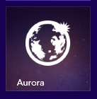

現有的 Firefox Aurora 曙光版每六週更新一次版本，主要提供給全球的廣大Mozillians 社群 (特別是測試與本地化社群) 所用，進階使用者可搶先體驗即將導入 Firefox 正式版的新功能。下載最新版 Firefox Aurora 你可搶先看到這位 Firefox 家族最新成員的初期外觀，同時發現它就是針對 Windows 8 Modern UI 所設計並建構完成。[立刻體驗](https://www.mozilla.org/en-US/firefox/aurora/?utm_source=pr&utm_medium=blog&utm_campaign=aurorahttp://)並[分享你的意見](https://input.mozilla.org/feedback)。

此版 Firefox Aurora 對觸控介面更友善，要讓使用者能在 Windows 8 平板電腦上獲得更好的瀏覽經驗所設計。除了同樣以「動態磚」的概念啟動 Firefox 之外，亦支援 Firefox 的 Sync 同步功能、Windows 8 的觸控與撥動手勢、全螢幕與子母畫面、視窗分享等功能；全部集合在流暢、新穎、漂亮的介面中。

由於此版 Firefox Aurora 使用與 Firefox 桌面版完全相同的強大 Gecko 引擎，因此同樣支援 WebGL 而達到更佳的 3D 圖形效果，並以 asm.js 強化瀏覽器中的 JavaScript 效能，讓開發者將高效能的 C++ 遊戲移植到 Web 上。另同樣支援硬體加速的全 HTML5 影片，包含開放的 (如 WebM) 與專利的視訊格式 (如 H.264)。

若要開始測試，請先將 Firefox Aurora 設為 Windows 8 的預設瀏覽器。接著在Windows 8 的「開始」畫面中找到 Firefox Aurora 動態磚。若使用 Windows 8.1，則可到「應用程式」畫面中找到 Firefox Aurora 動態磚，再將之釘選到 Windows 的「開始」畫面中。[可在這裡找到更多資訊](https://support.mozilla.org/kb/good-news-firefox-now-touch-friendly)。

在接下來的幾個星期之內，Mozilla 會專心提升 Firefox 的效能與反應速度。

目前此版本仍屬於預覽狀態，而大部分的功能已接近完成。我們知道仍有許多錯誤需要修正，所以請協助我們測試並[提出你的回饋意見](https://input.mozilla.org/feedback)，或[提交你發現的錯誤](https://bugzilla.mozilla.org/enter_bug.cgi?product=Firefox%20for%20Metro)。

原文鏈結：[https://blog.mozilla.org/futurereleases/2013/09/21/help-test-a-preview-of-firefox-optimized-for-windows-8-tablets/](https://blog.mozilla.org/futurereleases/2013/09/21/help-test-a-preview-of-firefox-optimized-for-windows-8-tablets/)
