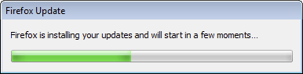
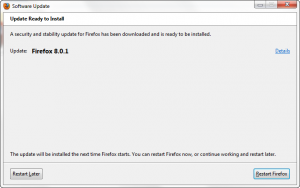
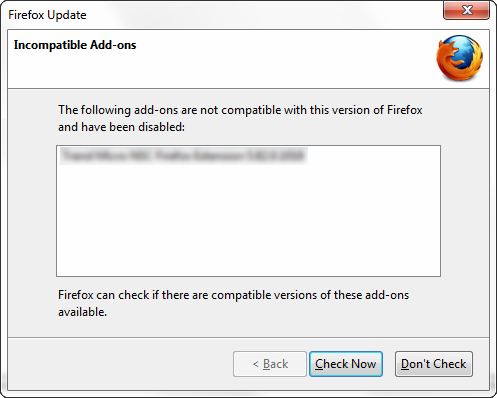
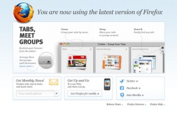

過去幾個月裡，我們為了要改善升級 Firefox 時的使用體驗下了不少功夫，讓大家能更順利、更不受打擾地升級 Firefox。接下來，這篇文章將大致描述五項相關改良之處。

## 背景更新

目前 Firefox 會自動固定檢查是否有更新版本，並且在有新版時自動下載。由於 Firefox  執行時會鎖定部分檔案防止變動，所以真正的更新動作必須於重新啟動時進行。在軟體更新的狀況下，啟動 Firefox 時會感覺到一些延遲，這時便是  Firefox 正在自動更新，而你也會看到一條進度列顯示更新進度，如下圖：

新機制將讓您可以邊使用 Firefox 邊更新軟體，那麼軟體就能在更新檔下載完後直接安裝。更新後，Firefox 仍須重新啟動以便使用新功能，不過將不會再感受到任何延遲。

當這部份的程式完成後，重新啟動 Firefox 就不會再看到進度列了。相關資訊可以參考 [Ehsan Akhgari 的文章](https://ehsanakhgari.org/blog/2011-11-11/updating-firefox-background)。

## 提示更新介面

Firefox 的更新項目中通常都包含安全性的修正。為了讓您的系統更安全，下載更新檔後應盡快安裝更新。也因此，如果需要更新、並同時超過 12 小時沒有重新啟動 Firefox，有個視窗就會跳出來提醒你是否要重新啟動：

我們的研究發現超過 99% 的 Firefox 使用者不會把瀏覽器持續開著超過 24 小時，所以在去年 11 月，這個「固定檢查時間」就延長為 24 小時，減少使用者看到這個視窗的機會，讓更新過程更為流暢。

## Windows 的 UAC 服務

在微軟 Windows Vista 及 Windows 7 上，更新 Firefox 時你會看見一個[使用者帳戶控制（UAC，User Access Control ）](https://windows.microsoft.com/zh-TW/windows-vista/What-is-User-Account-Control)的對話方塊蹦出來。這跟 Windows 的安全機制相關，確保不會有程式亂裝東西，但每次更新都出現也稍稍有點煩人。

為了讓使用者更新時更不受打擾，Firefox 將在電腦裡安裝一個更新用的常駐服務，會在升級時自動完成更新的步驟。只要您允許此常駐服務幫你安裝更新，以後這個 UAC 視窗就不會再出現了。

對相關機制有興趣的人，可以參考 [Brain Bondy 的網誌](https://www.brianbondy.com/blog/id/125/mozilla-firefox-and-silent-updates)說明。此外，我們也正努力改善 Mac 及 Linux 的更新流程。

## 附加元件預設相容

Firefox 的一大優勢便是為數眾多的附加元件，使用者也仰賴這些附加元件完成工作。過去 Firefox 更新時，對於附加元件的相容性檢查採取比較嚴格的策略，只有作者已經明確聲明與新版相容的附加元件，才能被啟用。

不過，由於有許多附加元件其實不需要修改就能相容新版本，且採用 Add-ons SDK 製作的附加元件也都能直接保持更新，所以你現在手上的新版 Firefox，已經將所有附加元件預設定為「相容」。這意思是，使用者不會再因為更新版本而被迫停用自己所愛的附加元件了！

但有些附加元件，包括內含 binary 組件的附加元件、本來就沒有指定相容於 Firefox 4 的附加元件、以及明確被指出不相容的附加元件等，還是會被停用，以確保程式上的正確無誤。

對相關資訊有興趣的朋友，可以參考  [Blair McBride 寫的文章](https://theunfocused.net/2011/11/19/solving-firefoxs-add-on-compatibility-problem/)。

## 新鮮事網頁

Firefox 新鮮事網頁會在瀏覽器更新後出現，上面說明更新已經完成、且順道提醒您相關的更新內容。以往這個網頁每次更新都會出現，但現在我們已經可以隨需求決定要顯示新鮮事頁面，或者在沒有需求的時候不顯示這一頁。

這五項更新最後將讓 Firefox 的更新體驗更加流暢，保持電腦瀏覽器的安全，並且方便您利用最新的 Web 科技。
