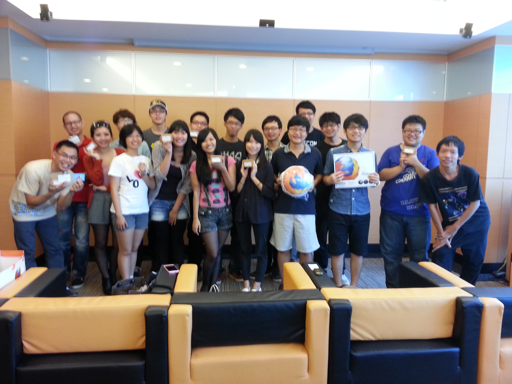

時間：9/29 (日) 下午 2:00 – 4:00

地點：Mozilla Space

秋高氣爽的週日，Mozilla Taiwan 邀請到 11 位 Firefox 校園大使為我們帶來每人 5 分鐘的自訂主題快閃演講分享。演講內容從國內服務到國外打工、由民生旅遊到科技新知、自語言學習至行銷創作，各個大使們無不展開渾身解數，將自己最擅長的知識、最寶貝的經驗分享給在座的所有同學。

豐富的內容、精美的簡報、準確的時間控制以及幽默風趣的演講台風，兩個小時的活動就在現場不時傳出滿足的歡笑聲中圓滿結束，期待下次的狐狐工作坊再次相見！

活動後同學們拿著 Firefox 校園大使名片與活動紀念品一同入鏡，記錄下這知性與歡樂的一刻。

「狐狐工作坊」由 Mozilla Taiwan 規劃，每月推出各式不同主題，內容涵蓋行銷推廣、演講技巧、程式開發、網頁製作、活動執行…. 等，教學與互動相長，提供給歷屆曾任 Firefox 校園大使的學生參與，也歡迎青年學子一同加入，在互動中與我們一同成長。
