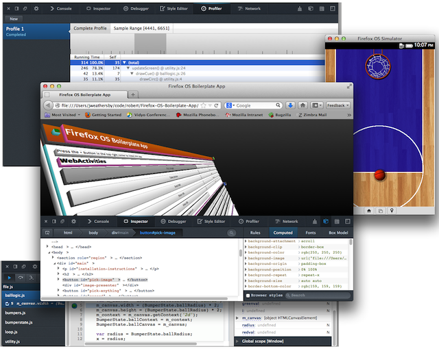
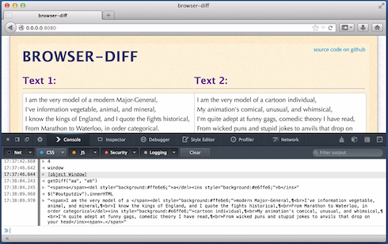
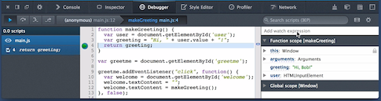

### 網頁主控台 (Web Console) 與 JavaScript 除錯器 (JavaScript Debugger)

此為 Firefox 內建的開發者工具系列文章第一篇，將討論工具的功能與應用時機，以及其使用過程與目的。

自 Firefox 4 起即加入網頁主控台 (Web Console) 功能，同時也是 Firefox 內建的第一款開發者工具。我們仍陸續添增多項功能，不僅提供更豐富的開發者工具，並可於 Firefox、Firefox OS、Firefox for Android 上分析 Web Apps 並進行除錯。

此系列文章將重新介紹 Firefox 4 起即具備的開發者工具。我們透過短片簡單展示各項工具並說明使用流程，讓開發者能完全發揮工具的效能。另將涵蓋如行動 Apps 的開發，針對CSS 技術的 Apps 進行修改與除錯作業，還有更多內容。

接著就說明最新的網頁主控台 (Web Console) 與 JavaScript 除錯器 (JavaScript Debugger)。

### 網頁主控台 (Web Console)

網頁主控台主要顯示目前載入網頁的相關資訊，內含 HTML、CSS、JavaScript、安全性的警示與錯誤等。主控台除了顯示網路請求之外，另將指出這些請求的成功或失敗狀態。只要偵測到警示與錯誤訊息，主控台也會提供鏈結而前往那一行發生問題的程式碼。針對無法正確執行的 Web Apps，網頁主控台常是除錯作業的首選。

網頁主控台亦可於網頁內容中執行 JavaScript。也就是說，開發者能檢視網頁內所定義的物件、於網頁範圍內執行函式、透過 CSS 選擇器存取特定元素。下列短片將概述網頁主控台的功能：

另可參閱 [MDN 上的網頁主控台說明](https://developer.mozilla.org/en-US/docs/Tools/Web_Console)，以獲得進一步資訊。

### JavaScript 除錯器 (JavaScript Debugger)

JavaScript 除錯器，可針對 Web Apps 現正使用中的 JavaScript 進行除錯與微調。且只要是在Firefox、Firefox OS、Firefox for Android 中執行的程式碼，亦可透過此除錯器進行除錯。此全功能的除錯器具備 Watch expressions、Scoped variables、Breakpoints、Conditional expressions、Step-through、Step-over、Run to end 等功能。此外，在除錯器暫停 Apps 時，你也能在執行期間更動變數的值。

下列短片將概述 JavaScript 除錯器的數項功能：

另可參閱 [MDN 上的除錯器說明](https://developer.mozilla.org/zh-TW/docs/Tools/Debugger)，以獲得進一步資訊。

### 深入了解

短片僅是概述這些工具的主要功能。若要進一步了解所有的開發者工具，可參閱完整的[MDN 開發者工具文章](https://developer.mozilla.org/en-US/docs/tools)。

### 緊接著系列之二

系列的下一篇文章將說明樣式編輯器 (Style Editor) 與程式碼速記本 (Scratchpad) 功能。若你還有其他想深入了解的功能，都可以在下方意見欄中寫下你的需要。我們將參酌大家的意見而繼續豐富相關內容。

原文鏈結：[https://hacks.mozilla.org/2013/09/reintroducing-the-firefox-developer-tools-part-1-the-web-console-and-the-javascript-debugger/](https://hacks.mozilla.org/2013/09/reintroducing-the-firefox-developer-tools-part-1-the-web-console-and-the-javascript-debugger/)
