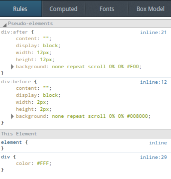
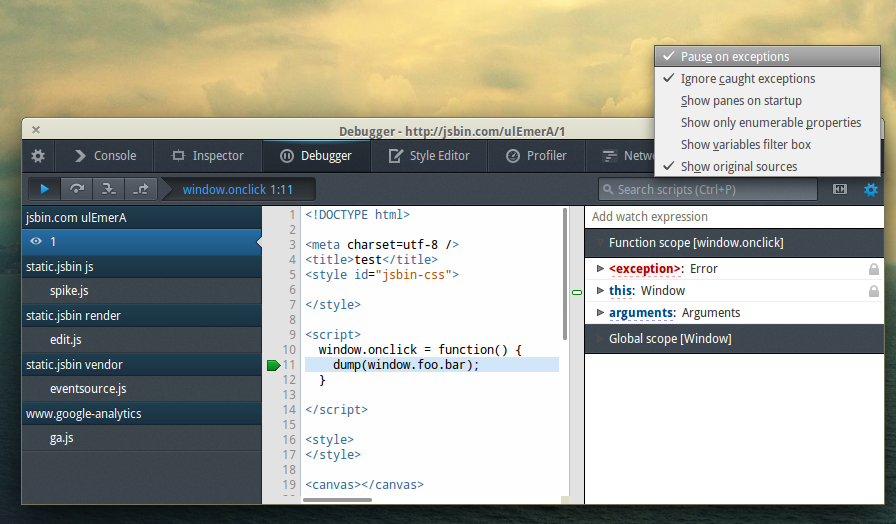

Firefox 26 已經進入曙光版 (Firefox Aurora) 釋出頻道，也就是說該是來談談 Firefox 開發者工具新功能的時候了。接著簡單介紹幾項新功能。

### 檢測器 (Inspector) ：支援 Pseudo element

如果想更有彈性的設計元素，卻又不使用額外節點，則最常見的方式就是使用 [CSS Pseudo elements](https://developer.mozilla.org/en-US/docs/Web/CSS/Pseudo-elements)，例如 (`:before/:after{content:””}`)。現在於檢測器中可看到 Pseudo elements 所套用的規則。

### 除錯器 (Debugger)：暫停於無法攔截的例外狀況

現在可針對無法攔截的例外狀況 (Uncaught exceptions) 而暫停除錯器，讓非預期錯誤的除錯作業更簡單。開發者不用宣告一連串的Try/Catch 區塊，就能處理非預期的例外狀況。

還有多項新增功能，敬請期待《Firefox 開發者工具的新功能 (下)》篇！

原文鏈結：[https://hacks.mozilla.org/2013/09/new-features-in-the-firefox-developer-tools-episode-26/](https://hacks.mozilla.org/2013/09/new-features-in-the-firefox-developer-tools-episode-26/)
