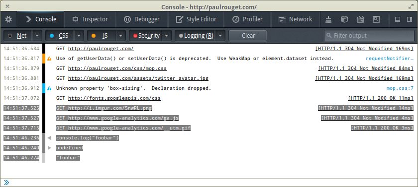

Firefox 26 已經進入曙光版 (Firefox Aurora) 釋出頻道，也就是說該是來談談 Firefox 開發者工具新功能的時候了。接著簡單介紹幾項新功能。

可別錯過《[Firefox 開發者工具的新功能 (上)](https://blog.mozilla.com.tw/posts/3898/)》篇的精采內容，先來複習一下！

### 網頁主控台 (Web Console) ：改善文字選擇功能

以往從網頁主控台只能選擇整段文字很不方便。要修正這個錯誤，必須將主控台輸出記錄的區域重新改寫。修正後的新功能可以輕鬆複製/貼上部分文字。後續即將加入的強化主控台輸出功能，也同樣是以此功能為基礎所設計。

### 改良常用 UI

現在所有開發者工具的 UI 都可以縮放了。你喜歡看大一點的字嗎？只要按下「Ctrl +」就可以；喜歡小一點的字也沒問題，按「Ctrl -」就能縮小。在 Mac OS X 環境中請改為 Cmd 鍵。

另外也改善了檢測器中的 DOM 檢視功能。除了選項更清晰之外，現在更可輕鬆展開節點，也能部分省略過長的屬性。

同時還強化了鍵盤快捷鍵。現在透過鍵盤就能輕鬆控制這些工具了。我們又添增了許多快捷鍵，而且將相容於其他瀏覽器。可到MDN 上參閱[開發者工具的鍵盤快捷鍵](https://developer.mozilla.org/en-US/docs/Tools/Keyboard_shortcuts)列表。

就當做對廣大 Firefox 使用者的額外服務，我們順道把 URL 預覽功能 (將滑鼠移到鏈結上時，就會跳出網址預覽列) 改到工具箱的上方。現在這個功能再也不會擋到網頁主控台的輸入或任何工具了。

### 適應性設計檢視模式 (Responsive Design View)

適應性設計檢視模式，共改良了 3 項功能：

- 模擬觸控事件 (Touch Event) ─ 滑鼠事件現轉為觸控事件

- 快速螢幕截圖

- 精確縮放。按著 Ctrl 並移動滑鼠，即可達到更精確的縮放效果

### 何時可使用這些功能？

現在只要安裝 [Firefox Aurora](https://www.mozilla.org/firefox/aurora/) 版即可體驗上述這些功能。而再過 12 週就會成為正式的 Firefox 26 版本。

對開發者工具有任何建議嗎？請到 Twitter 上隨時追蹤 [@FirefoxDevTools](https://twitter.com/FirefoxDevTools)，或到 [irc.mozilla.org](https://wiki.mozilla.org/IRC) 上了解 #devtools 的訊息。

原文鏈結：[https://hacks.mozilla.org/2013/09/new-features-in-the-firefox-developer-tools-episode-26/](https://hacks.mozilla.org/2013/09/new-features-in-the-firefox-developer-tools-episode-26/)
