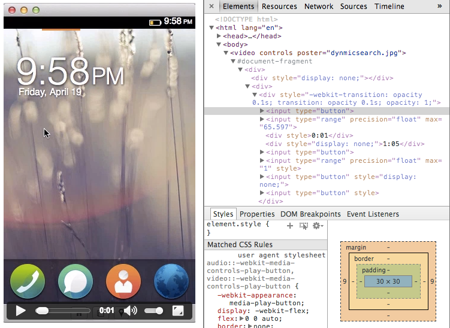

此為「Firefox OS ─ 讓 [HTML5](https://developer.mozilla.org/en/html/html5) 得以完全發揮的平台」系列的第七支影片 (於此回顧[第一](https://hacks.mozilla.org/2013/06/firefox-os-for-developers-the-platform-html5-deserves/)、[第二](https://blog.mozilla.com.tw/posts/3179/)、[第三](https://blog.mozilla.com.tw/posts/3277/)、[第四](https://blog.mozilla.com.tw/posts/3419/)、[第五](https://blog.mozilla.com.tw/posts/3593)、[第六](https://blog.mozilla.com.tw/posts/3680)支影片)。由 Mozilla 首席技術傳教士 Chris Heilmann ([@codepo8](https://twitter.com/codepo8)) 與 Mozilla 資深 HTML5 工程師 Matthew Claypotch ([@potch](https://twitter.com/potch)) 一同錄製，將為 Web App 開發者說明 Web Components 諸多可能。另將談到 Mozilla 的 Brick 函式庫。此函式庫蒐集了許多自訂元素，可用以開發 App 並協助建構更順暢的過場動畫。你也可[在 YouTube 上觀看本影片](https://www.youtube.com/watch?v=eS1O46O5saA)。

### 使用 Web Components 的理由

將 Web 作為 App 平台其實有點小麻煩：雖然可輕鬆建立 HTML 文件並賦予意義，但其實 HTML 本身並沒有足夠的元素可建構 App。而 HTML5 規格擁有許多新元素，其支援功能也只是湊合著跨瀏覽器所用；不像 Flex 或 iOS 的其他平台已能提供現成 Widgets 給開發者。因此，開發者必須使用非語意式 HTML (大多數為 DIV 元素)，以自行建構如行事曆、選單列、滑動桿控制項等的 Widgets，可透過 JavaScript 與之互動，並使用 CSS 建立主題式風格。

這個替代方案雖然看起來還算不錯，但問題也隨著產生。我們並非為瀏覽器擴充既有的功能，而是像疊磚頭一樣再往上加功能。換句話說，瀏覽器必須顯示 HTML 內容、達到至少 60 fps 的優秀效能、加上我們的 Widgets 功能，還要讓畫面達到動畫與變化的效果。我們不斷在瀏覽器效能和自己的程式碼上變出小把戲，但也導致介面延遲、高耗電量、畫面閃爍等缺點。

為了找到上述問題的替代方案，已有許多公司與標準訂定機構的成員在擬定 [Web Components](https://www.w3.org/TR/2013/WD-components-intro-20130606/) 規格，讓開發者能透過自訂元素，擴充瀏覽器所能辨識的 Markup。以前你必須撰寫一組滑動軸控制項，並在瀏覽器顯示文件之後才能使用。現在你可定義 1 組滑動桿元素，並使之在正常的顯示流程中即完成處理。這代表我們的 Widgets 效能更佳，不會受限於瀏覽器的「Render」流程，也達到更好的整體效能。讓較低規格的行動裝置也能擁有更多優勢。舉例來說，如果你將視訊元素添增至文件中，就會看到一組視訊控制器，包含滑動軸控制項、播放按鈕、音量控制項等等。這些介面全都是以HTML、CSS、JavaScript 所建構，也代表能在除錯工具中看到它們：

Firefox OS 本來就是針對低規格的裝置所設計，且這些 Widgets 本身即屬於「Render」流程的一部分，可為 Firefox OS 提供更多優勢。Mozilla 因此提供[Mozilla Brick](https://mozilla.github.io/brick/) 函式庫，其中具備開發 App 時所需的自訂元素。之前我們曾介紹過的 [XTags](https://www.x-tags.org/) 函式庫亦強化了 Brick。透過 Brick，只要使用下列 Markup 即可輕鬆建立[如發撲克牌般的動畫 App 配置](https://mozilla.github.io/brick/demos/deck/index.html)範例：

		
		

<x-deck selected-index="0">
  <x-card>
    0I'm the first card!
  </x-card>
  <x-card>
    1
    
      These cards can contain any markup! 
      
      
      
    
  </x-card>
  <x-card>
    2 
  </x-card>
</x-deck>
			
				
					
				
					1234567891011121314151617
				
						<x-deck selected-index="0">  <x-card>    0I'm the first card!  </x-card>  <x-card>    1          These cards can contain any markup!                         </x-card>  <x-card>    2   </x-card></x-deck>
					
				
			
		

所建構的 App 如同三張撲克牌。不需其他多餘的作業，只要呼叫 deck.shuffleNext(); 函式即可產生過場動畫。

Web Components 現已成為熱門話題，而且每個星期都產生許多新的框架與函式庫。Mozilla 希望開發者能透過 Brick，清晰且迅速建構 Firefox OS 的高適應性 App，不用再為了迎合特定 OS 而辛苦雕琢自己的 App。

原文連結：[https://hacks.mozilla.org/2013/09/firefox-os-development-web-components-and-mozilla-brick/](https://hacks.mozilla.org/2013/09/firefox-os-development-web-components-and-mozilla-brick/)
