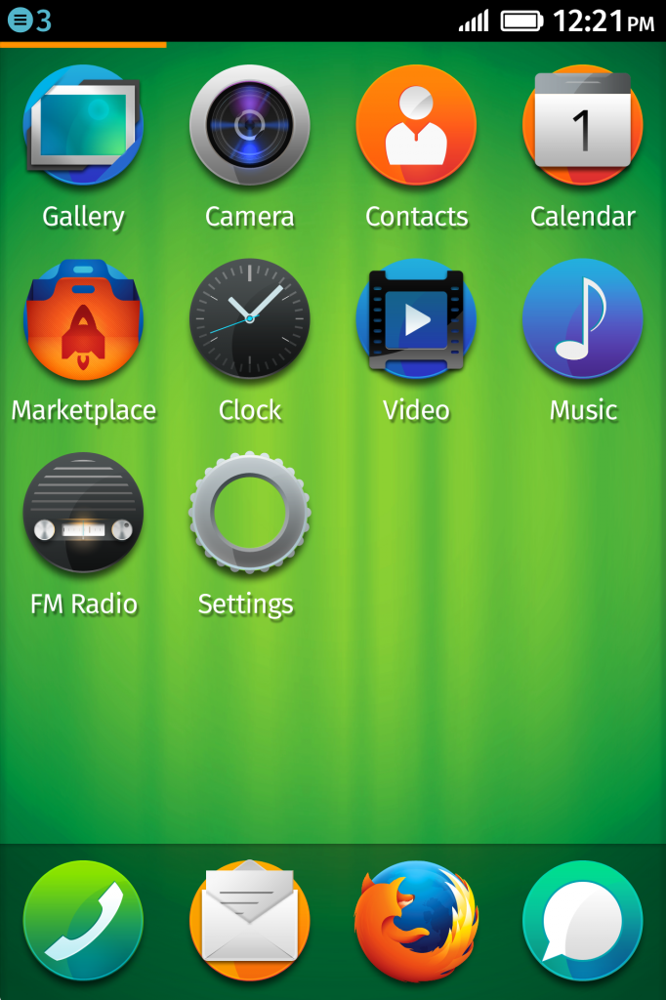

首波市場反應持續獲得正面肯定引發動能

【美商謀智新聞稿】Mozilla 是全球性的非營利組織，以推動網路的平等、自由、開放為宗旨，於今日(美西時間2013/10/9) 宣佈新一波的 Firefox OS 智慧型手機上市計畫即將啟動，將會有更多裝置在全球更多市場發表。在[成功發表首款 Firefox OS 智慧型手機](https://blog.mozilla.org/blog/2013/07/01/mozilla-and-partners-prepare-to-launch-first-firefox-os-smartphones/) ─ ALCATEL ONE TOUCH Fire 與 ZTE Open 之後沒有多久，第二波振奮人心的發表活動也即將展開。

Firefox OS 手機已由西班牙電信公司 Telefónica 在西班牙、哥倫比亞、委內瑞拉境內上市，以及德國電信公司 Deutsche Telekom 在波蘭境內上市。接著其他合作夥伴也將在各所屬市場中宣布後續的相關細節。

「首款 Firefox OS 智慧型手機在市場上的接受度極高，代表大家都能透過我們建構的 Firefox OS 體系，享受絕妙的開放性與使用經驗。」Mozilla 首席營運長 Jay Sullivan 表示：「我們將持續強化 Firefox OS，讓全世界購買自己第一支智慧型手機的人，都能獲得最佳的使用經驗。大家都期待 Firefox OS 第二輪發表之後的反應。」

Telefónica 營運商的 Open Web 裝置總監 Yotam Ben-Ami 也說：「在西班牙、哥倫比亞、委內瑞拉首次發佈 Firefox OS 裝置之後，我們發現消費者對開放式智慧型手機的期待，著實遠超出公司所預期的程度。在 2013 年第四季，我們會接著將 Firefox OS 引進巴西與其他三個南美洲國家。當然 2014 年也會透過更多 Telefónica 的營運據點，讓更多人都能接觸到 Firefox OS。」

Deutsche Telekom 產品與創新首席執行長 Thomas Kiessling 也接著表示：「Deutsche Telekom 在波蘭的首款 Firefox OS 智慧型手機發表活動十分成功。我們已經將 Firefox OS 手機擴及至波蘭境內的所有 T-Mobile 銷售據點，而且消費者真的樂於探索這個全新作業系統的無限可能。對於緊接著將於德國 Congstar 啟動的銷售計畫，我們也同樣感到興奮。同時我們也即將在希臘與匈牙利引進首款 Firefox OS 裝置。」

挪威電信公司 Telenor 同樣確認 2013 年底前，將在匈牙利、塞爾維亞、蒙特內哥羅進行 Firefox OS 手機發表計畫。

IDC 研究副總裁 John Jackson 說：「Firefox OS 目前積極拓展的新市場正在蓄積大量的消費動能，而這些動能將形成 Web 生態系統的優勢。這股成長力量將成為營運商對該平台的策略承諾基準線，也代表營運商對目前消費者的接受度頗為滿意。正當其它作為第三勢力的智慧型手機平台仍在尋求定位、規模、永續性的同時，Firefox OS 能夠在如此高度競爭的行動市場上，即將進入下一階段展開第二波市場擴展計畫。著實令人印象深刻。Firefox OS 持續打造適合其目標市場的新功能，並且在『為消費者提供價值』與『消費者可負擔的價值』之間取得顯著的平衡。更重要的是，Firefox OS 仍持續吸引新的 Apps 與內容服務商加入其合作陣營。如此一來，除了構成平台的運作基礎之外，也會進一步讓更多消費者參與 Firefox OS，並激發 Web 開發社群的創造力。」

新款 Firefox OS 手機將搭載最新版的 Firefox OS (1.1)，新版本不僅強化了多項效能，也同時新增了如 MMS 多媒體簡訊功能。現有的 Firefox OS 手機使用者同樣能升級到最新版本。

有關 Firefox OS

Firefox OS 智慧型手機，是首款完全以 Web 技術打造的智慧型手機，以漂亮、直覺、簡潔的使用經驗，達到使用者對智慧型手機所期待的效能、個人化、平實價格等特色；均是目前其他手機所無法比擬之處。

Firefox OS 具備智慧型手機的所有功能，當然也內建你日常生活不可或缺的 Facebook 與 Twitter 社交功能，支援離線功能的 HERE Maps，也少不了高人氣的 Firefox 瀏覽器、Firefox Marketplace，還有更多特色。

Firefox OS 為智慧型手機定義出全新概念 ─ 自訂性 App 搜尋功能，可隨時因應使用者的需求與興趣，確實轉換手機的相關功能。只要鍵入你感興趣的關鍵字，就能立刻獲得全新的客製化手機使用經驗。

你可一次性使用或下載保存這些 Apps，隨時都能取得符合自己所需的內容，達到真正且完整的自訂使用經驗。

Firefox OS 智慧型手機另亦搭配 Firefox Marketplace，提供全球均享有高人氣的 Apps，也有符合使用者需求的本地化 Apps。目前精選的新 Apps 包含Badoo、Box、Facebook、KAYAK、SoundCloud、The Weather Channel、TimeOut、TMZ、Tuenti、Twitter，以及美商藝電的《Poppit》遊戲。

Firefox OS 是 Firefox 桌面與行動瀏覽器在行動裝置上的延伸。Firefox 在全球擁有數億名愛好者，使用者將可在 Firefox OS 上獲得與 Firefox 瀏覽器相同的體驗：安全性、隱私性、自訂性，讓使用者擁有掌控權，如同 Firefox 一直以來對使用者的承諾。

Mozilla 現與超過 [20 位硬體與營運商夥伴](https://blog.mozilla.org/blog/2013/02/24/mozilla-unlocks-the-power-of-the-web-on-mobile-with-firefox-os/)積極合作 Firefox OS，要讓全球首次接觸智慧型手機的消費者，都能獲得更好、更方便的使用經驗。根據 Kleiner Perkins Caufield & Byers 調查機構的報告，目前全世界僅有 21% 的行動用戶擁有智慧型手機。

若需更多資訊：

- [Firefox OS 首頁](https://mozilla.com.tw/firefox/os/)

- [Firefox OS 新聞資料 ─ 內含 界面 截圖、特色指南、影片展示等](https://blog.mozilla.org/press/kits/firefox-os/)

- Firefox 1.1 更新
