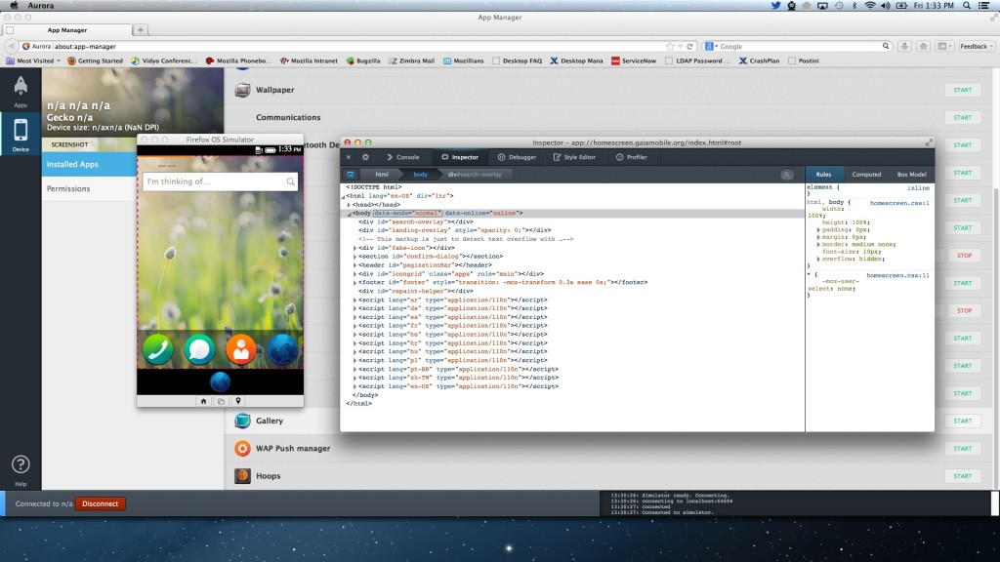
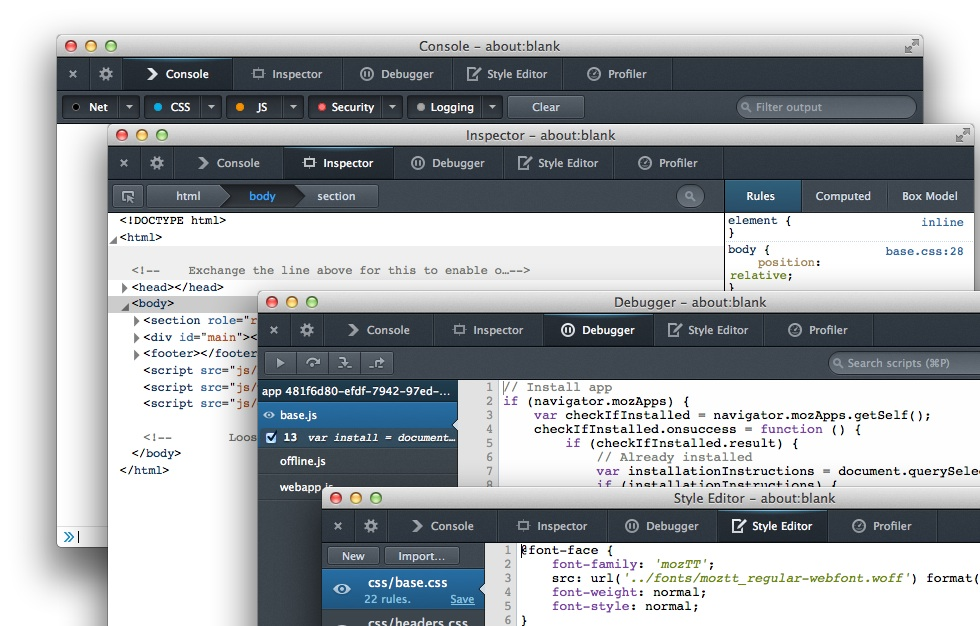

「應用程式管理員 (Firefox OS App Manager)」為 Firefox 26 新提供的開發者工具，不論是對 Firefox OS 模擬器 (Firefox OS Simulator) 或實際連線的裝置，均能大幅改善開發者在開發 Firefox OS App 或除錯 (debug) 的過程。App Manager 是以 Firefox OS 模擬器附加元件為基礎，可完備現有 Firefox OS 模擬器與 Firefox 開發者工具之間的不足，讓開發者能對自己的 Web App 輕鬆除錯並將之佈署至 Firefox OS 之中。

若要了解更多 Firefox 26 新增的功能，可參閱《[Firefox 開發者工具的新功能 (上)](https://blog.mozilla.com.tw/posts/3898/)》與《[Firefox 開發者工具的新功能 (下)](https://blog.mozilla.com.tw/posts/3905/)》文章。

### 實際操作「應用程式管理員」App Manager

App Manager 將取代模擬器中的 Dashboard，並搭配現有的 Firefox 開發者工具，為 Firefox OS App 提供整合的除錯與佈署環境。開發者可以輕鬆地透過「應用程式管理員」，在模擬器或連線裝置中，針對安裝托管式 (Hosted) 或封裝式 (Packaged) App 進行除錯。「應用程式管理員」亦可擷取目前畫面，並為開發者提供額外資訊，包含已連線裝置的 Firefox OS 版本、現已安裝 App 的清單、列出所有 API 與其所需的權限層級等。請[在此觀賞 App Manager 簡介影片](https://www.youtube.com/embed/z1Bxg1UJVf0)，其內展示了 Firefox OS 的數項開發功能。

「應用程式管理員」除了可對 App 除錯之外，亦能用於系統層級 App 的更新、啟動、停止、除錯等作業。在以開發者工具對 App 除錯時，就如同進行 Web App 的除錯。而在工具中發生的變動，亦將即時反應到模擬器或連線裝置中的 App。使用者可透過主控台 (Console) 查看 App 中的警示與錯誤、透過檢測器 (Inspector) 檢視並修改目前載入的 HTML 與 CSS，或可透過除錯器 (Debugger) 檢查自己的 JavaScript。

若要進一步了解開發者工具，可參閱《[重新介紹 Firefox 開發工具系列文章之一](https://blog.mozilla.com.tw/posts/3886/)》，或可參閱 MDN 上的[開發者工具](https://developer.mozilla.org/en-US/docs/tools)以取得最新資訊。

### 開始使用 App Manager

若要開始使用 App Manager，可先看過 MDN 上的《[使用 App Manager](https://developer.mozilla.org/en-US/docs/Mozilla/Firefox_OS/Using_the_App_Manager)》一文。若要能進行上述文中所提到的相關功能，請先準備好以下環境：

- Firefox 26 或更高版本

- Firefox OS 1.2 或更高版本

- Firefox OS 模擬器需為 1.2 版本或更高版本

- 需安裝 ADB SDK 或 ADB Helper 附加元件

該篇 MDN 文章《[使用 App Manager](https://developer.mozilla.org/en-US/docs/Mozilla/Firefox_OS/Using_the_App_Manager)》將提供更多相關細節。

Mozilla 高度重視開發者的反饋意見，也將作為工具開發時的重要參考。若有任何相關問題都歡迎透過 [Bugzilla](https://is.gd/ZPaPDN) 聯絡我們！

原文鏈結：[https://hacks.mozilla.org/2013/10/introducing-the-firefox-os-app-manager/](https://hacks.mozilla.org/2013/10/introducing-the-firefox-os-app-manager/)
