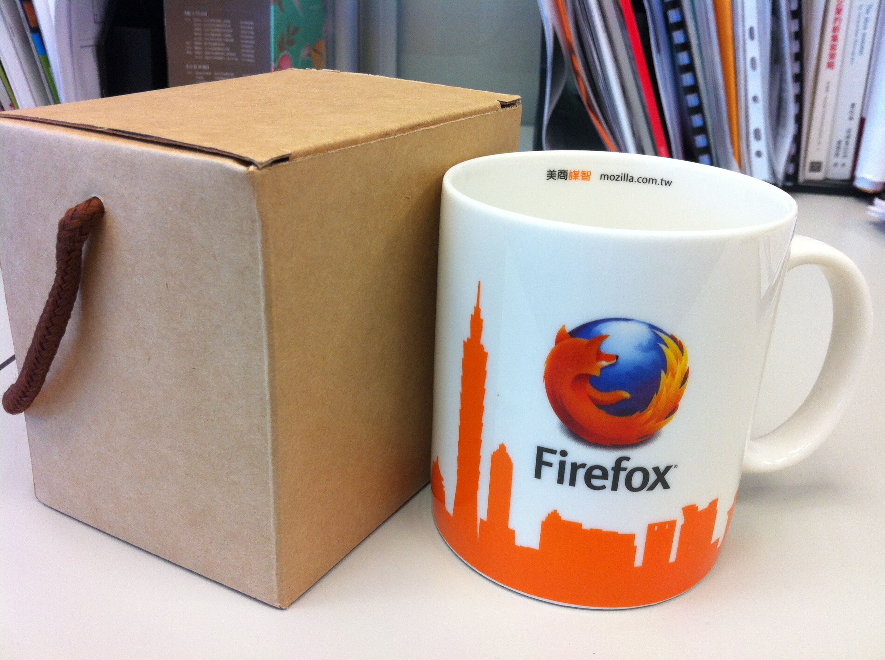

感謝大家熱情參與「9 月電子報有獎徵答」活動，共有 3 位幸運的中獎者，可以獲得獨家 Firefox 馬克杯，再次謝謝您對 Firefox 的支持！

本期電子報有獎徵答題目：

以下何者為 Firefox 提供的網路安全小技巧？

A. 使用高強度的密碼

B. 使用最新版的 Firefox

C. 以上皆是

正確答案為 C. 以上皆是

恭喜以下 3 位幸運的中獎者，可以獲得 Firefox 馬克杯一個，再次謝謝您對 Firefox 的支持！

derek***3@gmail.com

dusky***l@gmail.com

aas8613***3@gmail.com

主辦單位會在本週透過 Email 和您聯繫，並請在 10/20 (日) 前回覆您的真實姓名、地址和 Email 資訊，若沒有收到主辦單位的通知，請寫信至 tw-mktg@mozilla.com 主動聯繫，獎品會在 10/21 當週統一寄出，恭喜所有得獎的狐友們！

