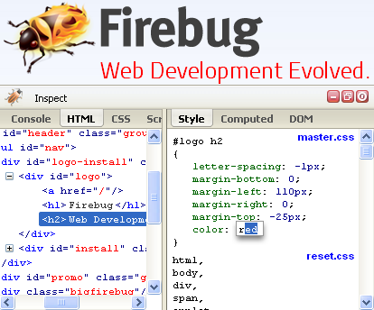

如果你最近 6 個月都沒碰過 [Firefox 開發者工具](https://developer.mozilla.org/en-US/docs/Tools)，那真的該重新認識一下許多新功能了。先下載最新版的 [Firefox 曙光版 (Aurora) 瀏覽器](https://www.mozilla.org/en-US/firefox/aurora/)，再從「網頁開發者」選單 (在某些平台可能是位於「工具」之下的子選單) 中啟動所需工具即可。

Mozilla 提升了多項功能：「黑盒子 (Black-boxing)」功能可將原始碼當做系統函式庫，不再干擾你的除錯流程。經轉譯 (Transpiled) 或壓縮 (Minimized)過的原始碼，則可透過原始碼對照 (Source maps) 功能進行除錯。檢測器 (Inspector) 現具備新的字型窗格 ─ 閃爍繪圖區 (Paint flashing)。大幅強化的樣式檢測器 (Style Inspector) 現具備 Pseudo-elements 與自動補齊 (Tab completion) 功能。網路監測器 (Network Monitor) 可協助網路活動的除錯作業。另可[參閱 Aurora 系列文章，以進一步了解最近開發的功能](https://hacks.mozilla.org/category/developer-tools/)。

看過這些工具之後，就可啟動「應用程式管理員 (App Manager)」。而安裝 Firefox OS 模擬器 (Firefox OS Simulator) 將能了解 App 在裝置上的運作情形。如果你手上的 Firefox OS 裝置正執行最新 1.2 版，更能直接讓工具與手機連線。

### 內建工具的理由

Web 多虧有 [Firebug](https://getfirebug.com/) 這個一直以來最好用的工具。Firebug 現具備 console API、DOM 視覺強化功能，並能即時編輯 (Inplace editing) 樣式。

Mozilla 在發表 Firefox 4 之前，就打定主意要讓 Firefox 內建一系列優質工具。這些工具讓我們能確實掌握現有的 Mozilla 社群並統合整個架構。在和 Gecko 與 Spidermonkey 開發者合作時，我們即透過 mozilla-central 骨幹而清楚劃分各個專案。Mozilla 早已規劃出積極的平台改善計畫：Firebug 賴以進行 Javascript 除錯的 JSD API 過於老舊，我們將藉由新的 Spidermonkey Debugger API 一併提升相關工具。

Mozilla 曾認真考慮要將 Firebug 整個內建於 Firefox 中。除了構思出許多整合方式之外，檢測器的早期原型也曾包含 Firebug 的主要部分。但最後發現整合過程困難重重，而且光是必須重寫的部份就等於要整個重頭來過。

### Firebug 目前的狀態

Firebug 目前尚未穩定，且工作團隊仍持續不斷提升整個系統。相關資訊可參閱[最新的 1.12 版](https://hacks.mozilla.org/2013/08/firebug-1-12-new-features/)。我們正努力將 Firebug 從 JSD 移植至新的 Debugger API，以期達到 Firefox 開發者工具的相同效能與穩定度。

在完成此階段之後呢？Firebug 專案負責人 Jan Odvarko 表示：

「雖然開發者工具均是使用標準程序的 Mozilla 內部專案，但 Firebug 一直被視為獨立於現有程序與 Firefox 環境之外的專案而進行開發。另外必須強調的是，Firebug 畢竟算是延伸功能，本來就是要讓 Firefox 的諸多功能更趨完備，而不是與既有功能相互競爭。因此我們將繼續打造 Firebug 成為特殊的獨立工具。」

針對 Firebug 的使用者、開發者、擴充套件作者等社群，所有人都想為他們找出最佳方向，以真正確立 Firefox 開發者工具的走向並使之更完善。Firebug 團隊正積極討論相關策略，但尚未決定最後的運作方式。

請隨時注意 [Firebug blog](https://blog.getfirebug.com/) 與 [@firebugnews](https://twitter.com/firebugnews) 以獲得相關資訊。

### Firefox 開發者工具的下一步

我們不斷有熱心的員工加入開發過程。某些人負責開發新功能，包含效能分析與 [WebGL](https://developer.mozilla.org/en/WebGL) 工具。而大多數的人將針對反饋意見而積極做出回應；開發者在搶先體驗工具之後的建議尤其重要。

Mozilla 歡迎你對這些工具貢獻一己之力。最近的 Ember.js Chrome Extension 就是在不過 1 天的時間內移植為 Firefox 開發者工具。我們知道還有更多絕妙的概念等著大家去完成。一如大多數的 Firefox 程式碼，Firebug 同樣能讓每個人找到適合自己的方式而加入開發。我們另正嘗試定義並發佈 Developer Tools API。Mozilla 將協助開發者建構高品質、高效能的開發工具擴充套件。若開發者針對 Firebug 或 Chrome Devtools 撰寫擴充套件，我們也衷心希望能聽取相關心得或建言。

只要持續留意相關文章，即可隨時掌握 Firefox 開發者工具的進展。你可加入[dev-developer-tools 郵件群組](https://groups.google.com/forum/#%21forum/mozilla.dev.developer-tools)、Twitter 的 [@FirefoxDevTools](https://twitter.com/FirefoxDevTools)，或[irc.mozilla.org](https://wiki.mozilla.org/IRC) 的 #devtools 均可。

原文鏈結：[https://hacks.mozilla.org/2013/10/firefox-developer-tools-and-firebug/](https://hacks.mozilla.org/2013/10/firefox-developer-tools-and-firebug/)
