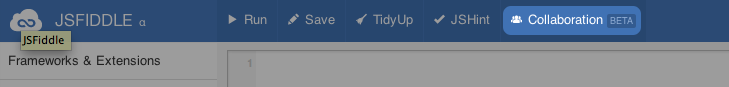
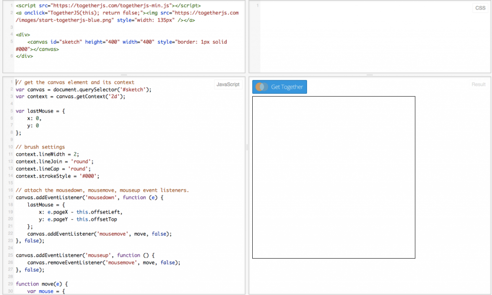

### 何謂 TogetherJS

本篇文章將介紹 [Mozilla Labs](https://mozillalabs.com/) 所提供的即時協作 (Real-time collaboration) 工具 ─ [TogetherJS](https://togetherjs.com/)。

將 TogetherJS 添增至現有網站之後，即可加入即時合作功能。若有 2 名以上的使用者正在瀏覽網站或 Web App，則可看到彼此的滑鼠游標位置與點擊動作，另可互相追蹤瀏覽行為、一同編輯表單或觀看影片，並透過音訊或 [WebRTC](https://developer.mozilla.org/en-US/docs/WebRTC) 的方式交談。

TogetherJS 的功能包含：

- 觀看他人的滑鼠游標與點擊動作

- 觀看捲動位置

- 觀看他人瀏覽的網頁

- 打字交談

- 以 WebRTC 進行語音對話

- 同步填寫表單 (寫入文字、勾選方塊等)

- 同步播放/暫停/追蹤影片

- 於單一網站上，可跨多個頁面保存工作階段 (Session)

### 整合方式

不需另外修改網站，即可發揮 TogetherJS 的多項功能。TogetherJS 將檢查文件物件模型 (Document Object Model，DOM) 而決定所應進行的作業 ─ 偵測表單欄位、偵測如 [CodeMirror](https://codemirror.net/) 與 [Ace](https://ace.c9.io/) 的編輯器，並將其工具列置入你的網頁中。

如果你想玩玩看 TogetherJS，只要將下列指令碼加入你的網頁即可：

					1

						

接著為使用者建立 1 組按鈕，即可開啟 TogetherJS：

<button id="collaborate" type="button">Collaborate</button>

					12345

						<button id="collaborate" type="button">Collaborate</button>

如果你想直接體驗 TogetherJS 的功能，則 [jsFiddle](https://jsfiddle.net/) 也已納入 TogetherJS 供你參考：

只要點選「Collaboration」就會啟動 TogetherJS。接著將說明應如何在自己的 Fiddle 中使用 TogetherJS。

### 擴充自己的 App

TogetherJS 在檢查過 DOM 之後，即可決定所該進行的作業，但無法同步你的 JavaScript App。舉例來說，如果你的 App 有 1 份項目清單必須透過 JavaScript 更新，則該清單不會在使用者之間自動同步。大家有時會以為清單能自動更新，但就算我們跨 2 個網頁同步了 DOM，也還是無法同步底層的 JavaScript 物件。相較於 [Firebase](https://www.firebase.com/) 或 [Google Drive Realtime API](https://developers.google.com/drive/realtime/) 等產品，TogetherJS 並不具備即時的永久儲存功能。你的儲存與網站功能都由你自己決定，我們只會同步瀏覽器本身的工作狀態。

因為如此，如果你的 App 必須執行很多 JavaScript，就必須再加進額外程式碼以保持工作狀態的同步。而我們現正努力簡化此過程！

我們以簡單的繪圖 App 為例，並將之發佈[作為 Fiddle 的完整範例](https://jsfiddle.net/ianbicking/5M57n/8/)隨你盡情把玩。

### 簡易的繪圖 App

我們先從簡單的繪圖 App 開始吧。先來個簡單的繪圖區 (canvas)：

<canvas id="sketch"
        style="height: 400px; width: 400px; border: 1px solid #000">
</canvas>

					123

						<canvas id="sketch"         style="height: 400px; width: 400px; border: 1px solid #000"></canvas>

接著完成某些設定：

// get the canvas element and its context
var canvas = document.querySelector('#sketch');
var context = canvas.getContext('2d');

// brush settings
context.lineWidth = 2;
context.lineJoin = 'round';
context.lineCap = 'round';
context.strokeStyle = '#000';

					123456789

						// get the canvas element and its contextvar canvas = document.querySelector('#sketch');var context = canvas.getContext('2d'); // brush settingscontext.lineWidth = 2;context.lineJoin = 'round';context.lineCap = 'round';context.strokeStyle = '#000';

我們在繪圖區上使用 mousedown 與 mouseup 事件，針對 mousemove 事件註冊我們的 move() 處理器：

var lastMouse = {
  x: 0,
  y: 0
};

// attach the mousedown, mousemove, mouseup event listeners.
canvas.addEventListener('mousedown', function (e) {
    lastMouse = {
        x: e.pageX - this.offsetLeft,
        y: e.pageY - this.offsetTop
    };
    canvas.addEventListener('mousemove', move, false);
}, false);

canvas.addEventListener('mouseup', function () {
    canvas.removeEventListener('mousemove', move, false);
}, false);

					1234567891011121314151617

						var lastMouse = {  x: 0,  y: 0}; // attach the mousedown, mousemove, mouseup event listeners.canvas.addEventListener('mousedown', function (e) {    lastMouse = {        x: e.pageX - this.offsetLeft,        y: e.pageY - this.offsetTop    };    canvas.addEventListener('mousemove', move, false);}, false); canvas.addEventListener('mouseup', function () {    canvas.removeEventListener('mousemove', move, false);}, false);

接著 move() 函式將判斷所要描繪的線條：

function move(e) {
    var mouse = {
        x: e.pageX - this.offsetLeft,
        y: e.pageY - this.offsetTop
    };
    draw(lastMouse, mouse);
    lastMouse = mouse;
}

					12345678

						function move(e) {    var mouse = {        x: e.pageX - this.offsetLeft,        y: e.pageY - this.offsetTop    };    draw(lastMouse, mouse);    lastMouse = mouse;}

最後就是描繪線條的函式：

function draw(start, end) {
    context.beginPath();
    context.moveTo(start.x, start.y);
    context.lineTo(end.x, end.y);
    context.closePath();
    context.stroke();
}

					1234567

						function draw(start, end) {    context.beginPath();    context.moveTo(start.x, start.y);    context.lineTo(end.x, end.y);    context.closePath();    context.stroke();}

上述這些程式碼就足以形成簡易的繪圖 App 了。此時只要在這個 App 上啟動 TogetherJS，就能看到其他人的滑鼠游標與點選動作，但還看不到別人的繪圖作品。

想知道怎麼修正這個問題嗎？可別錯過《[TogetherJS 介紹 (下)](https://blog.mozilla.com.tw/posts/4036/introducing-togetherjs-2)》。

原文連結：[https://hacks.mozilla.org/2013/10/introducing-togetherjs/](https://hacks.mozilla.org/2013/10/introducing-togetherjs/)
