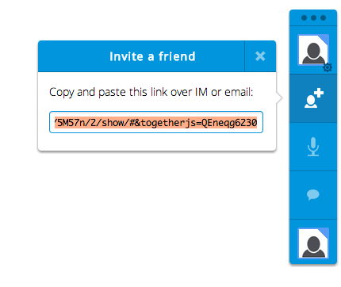
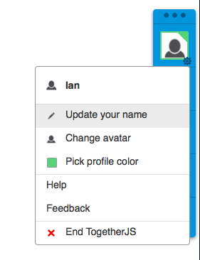
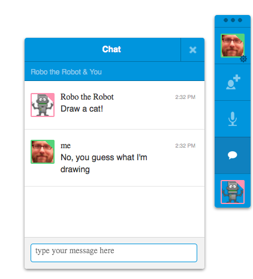

接著要大家解決《[TogetherJS 介紹 (上)](https://blog.mozilla.com.tw/posts/4025/introducing-togetherjs)》所遇到的問題。還沒看過上篇的人先去複習一下吧！

### 添增 TogetherJS

TogetherJS 亦具備「交換中心 (Hub)」，可在作業期間處理所有人之間的訊息。此交換中心不會解讀這些訊息，而是來回傳遞所有人的訊息，甚至可交換不同頁面上的訊息。TogetherJS 亦可讓 App 傳送自訂訊息，例如：

		
		

TogetherJS.send({
  type: "message-type", 
  ...any other attributes you want to send...
})
			
				
					
				
					1234
				
						TogetherJS.send({  type: "message-type",   ...any other attributes you want to send...})
					
				
			
		

可傳送訊息 (所有訊息均必備其 type) 並可監聽：

		
		

TogetherJS.hub.on("message-type", function (msg) {
  if (! msg.sameUrl) {
    // Usually you'll test for this to discard messages that came
    // from a user at a different page
    return;
  }
});
			
				
					
				
					1234567
				
						TogetherJS.hub.on("message-type", function (msg) {  if (! msg.sameUrl) {    // Usually you'll test for this to discard messages that came    // from a user at a different page    return;  }});
					
				
			
		

訊息的資料型態必須位於命名空間 (Namespace) 之內，如此 App 的訊息才不致於意外覆蓋 TogetherJS 的訊息。

為了同步所有人的繪圖作品，我們必須觀看所有描繪出來的線條，再將這些線條傳送給其他人：

		
		

function move(e) {
    var mouse = {
        x: e.pageX - this.offsetLeft,
        y: e.pageY - this.offsetTop
    };
    draw(lastMouse, mouse);
    if (TogetherJS.running) {
        TogetherJS.send({type: "draw", start: lastMouse end: mouse});
    }
    lastMouse = mouse;
}
			
				
					
				
					1234567891011
				
						function move(e) {    var mouse = {        x: e.pageX - this.offsetLeft,        y: e.pageY - this.offsetTop    };    draw(lastMouse, mouse);    if (TogetherJS.running) {        TogetherJS.send({type: "draw", start: lastMouse end: mouse});    }    lastMouse = mouse;}
					
				
			
		

傳送這些線條之前，先確認 TogetherJS 是否正實際運作 (TogetherJS.running)。而我們傳送的訊息應該具備完整資訊。

接著就監聽這些訊息：

		
		

TogetherJS.hub.on("draw", function (msg) {
    if (! msg.sameUrl) {
        return;
    }
    draw(msg.start, msg.end);
});
			
				
					
				
					123456
				
						TogetherJS.hub.on("draw", function (msg) {    if (! msg.sameUrl) {        return;    }    draw(msg.start, msg.end);});
					
				
			
		

由於 TogetherJS 只有在執行狀態才能呼叫 Listener，因此在註冊此 Listener 時，不需顧慮 TogetherJS 是否執行中。

這樣就能顯示大家的繪圖作品並共同合作了。不過目前還有個問題必須解決：如果在我開始畫圖之後，你才加入我的繪圖區，就會變成你只能看到我剛畫出來的線條，而看不到加入之前我已經畫過的線條。

要解決這個問題就必須監聽 togetherjs.hello 訊息。只要用戶端首次抵達新的頁面，就會送出此 togetherjs.hello 訊息。在我們看到該訊息之後，就接著將繪圖區的畫面傳送給其他人：

		
		

TogetherJS.hub.on("togetherjs.hello", function (msg) {
    if (! msg.sameUrl) {
        return;
    }
    var image = canvas.toDataURL("image/png");
    TogetherJS.send({
        type: "init",
        image: image
    });
});
			
				
					
				
					12345678910
				
						TogetherJS.hub.on("togetherjs.hello", function (msg) {    if (! msg.sameUrl) {        return;    }    var image = canvas.toDataURL("image/png");    TogetherJS.send({        type: "init",        image: image    });});
					
				
			
		

現在只要監聽此新的 init 訊息即可：

		
		

TogetherJS.hub.on("init", function (msg) {
    if (! msg.sameUrl) {
        return;
    }
    var image = new Image();
    image.src = msg.image;
    context.drawImage(image, 0, 0);
});
			
				
					
				
					12345678
				
						TogetherJS.hub.on("init", function (msg) {    if (! msg.sameUrl) {        return;    }    var image = new Image();    image.src = msg.image;    context.drawImage(image, 0, 0);});
					
				
			
		

只要有 TogetherJS 的幾行程式碼，就能設計出即時繪畫的 App。我們還是必須自行撰寫其中某些程式碼，但 TogetherJS 可幫我們處理下列事情：

- 提供 URL 以利使用者開始工作階段並相互分享 

- 建立 WebSocket 連線並連至我們的「[交換中心伺服器](https://github.com/mozilla/togetherjs/blob/develop/hub/server.js)」，以能在用戶端之間來回傳遞訊息

- 讓使用者設定自己的名稱與頭像，並能看到參與此工作階段的其他人 

- 時時追蹤是誰在線上、是誰已離線、是誰閒置離開

- 同樣提供簡易又必備的功能，如打字交談 

- TogetherJS 亦將處理工作階段的初始化與追蹤作業

此範例尚未達到的功能：

- 我們使用了固定尺寸的繪圖區，所以不需要考慮 2 個用戶端使用不同解析度的情況。一般情況下，TogetherJS 可處理不同的用戶端，且排版方式可適用不同的解析度，甚至可搭配適應性設計 (Responsive design)。要修正此問題的方法之一，就是使用固定的長寬比例，而所有繪圖定位均使用高度/寬度的百分比顯示方式。

- 現在的繪圖工具還不夠好玩！如果我正在畫 1 隻灰色兔子，你應該也要能畫 1 隻棕色獅子！繪圖的色彩功能尚待加強。

- 例如「清除繪圖區」的功能尚未同步。

- 我們並未儲存或載入任何現成圖片。一旦儲存並載入繪圖應用程式，你可能就必須深入思考所應該同步的功能。如果我完成了一幅圖畫、儲存完畢，再將圖畫轉入網站並加入你的工作階段，你的圖畫會不會覆蓋我的圖畫呢？若能將各幅圖畫置於專屬網址，就能清楚知道大家目前要一起編輯的圖畫。

### 想了解更多？

- 想進一步了解 TogetherJS 的架構嗎？可參閱[技術簡介](https://togetherjs.com/docs/#technology-overview)。

- [到 jsFiddle 上體驗 TogetherJS](https://jsfiddle.net/)

- 按下[此說明網頁中的「Get Live Help」按鈕](https://togetherjs.com/docs/)，即可和我們開始 TogetherJS 工作階段。

- 另可至 irc.mozilla.org，透過 #togetherjs 加入[我們的 IRC](https://togetherjs.com/docs/#getting-help)。

- 歡迎使用 [GitHub 上的程式碼](https://github.com/mozilla/togetherjs)。如果有任何問題或功能需求，均請[踴躍回報](https://github.com/mozilla/togetherjs/issues/new)，千萬別害羞。Mozilla 隨時留意多樣的回饋意見：任何想法、可能的使用情形 (或在這些使用情況下形成的挑戰)、說明頁面所無法回答的問題 (也代表說明文件未考量到的部份)，甚至告訴我們你想到深具潛力的協作 App。

- 加入我們的 Twitter：[@togetherjs](https://twitter.com/togetherjs)。

你想到任何適用 TogetherJS 的網站嗎？快提供意見給我們！

原文連結：[https://hacks.mozilla.org/2013/10/introducing-togetherjs/](https://hacks.mozilla.org/2013/10/introducing-togetherjs/)
