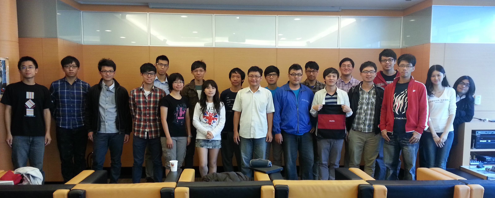

窗外溫暖的陽光灑進台北的 Mozilla Space，大使們利用這愜意的午後時光輪番上陣與大家分享自訂的各式主題。

高第的建築物為什麼沒有直線、學習日語可以如何開始、製作一份簡報該注意什麼……台上大使賣力地分享，台下大使們也專心地聆聽。而除了上半場的分享會，下半場也請到開發出著名的 Firefox 附加元件 (add-on)「QCLean: Facebook 廣告、推薦專頁與建議貼文移除器」 的 QCL 為大家帶來「快速打造 APP 經驗談」。對於非資訊科系背景的大使來說，開發相關的技術、方式或名詞都相對陌生，透過 QCL 的詳細說明，大家對於如何打造 APP 也有了初步的認識。活動就在頒發當天最佳分享者的火熱氣氛下結束，而 11 月份的分享會除了一樣由大使帶來自訂主題，也將為大家介紹如何參與 L10n 在地化專案，敬請期待！

大使們不藏私的分享與 QCL 詳細的介紹與解答，使得平凡的周六下午讓每個人都帶著滿滿的收穫回家。

「狐狐工作坊」由 Mozilla Taiwan 規劃，每月推出各式不同主題，內容涵蓋行銷推廣、演講技巧、程式開發、網頁製作、活動執行…. 等，教學與互動相長，提供給歷屆曾任 Firefox 校園大使的學生參與，也歡迎青年學子一同加入，在互動中與我們一同成長。
