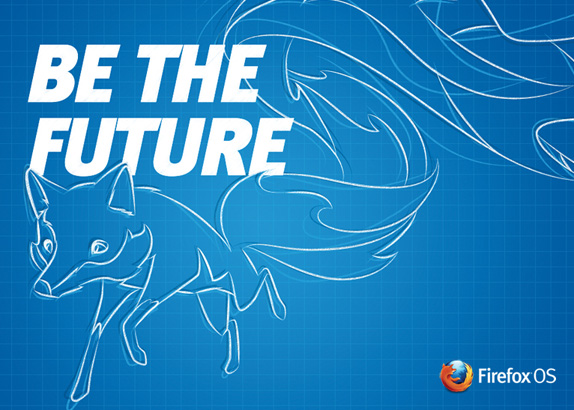

【美商謀智訊息稿】Mozilla 是全球性的非營利組織，以推動網路的平等、自由、開放為宗旨。很高興宣佈其合作夥伴 Telefónica 本週陸續於祕魯、墨西哥、烏拉圭發售 Firefox OS 智慧型手機。墨西哥即日起將開始銷售 ZTE Open 與 ALCATEL ONE TOUCH Fire 共二款手機；祕魯和烏拉圭則分別會發售 ZTE Open 及 ALCATEL ONE TOUCH Fire。包含 Telefónica 上週才在[巴西國內發表的新款 Firefox OS 裝置 ─ LG Fireweb](https://blog.mozilla.com.tw/posts/4005/)。目前全球已有九個國家正式販售 Firefox OS 手機，後續也將有更多市場加入。

Firefox OS 智慧型手機是首款完全以 Web 技術打造的裝置，帶給你美觀、簡潔、直覺、簡單易用的絕妙體驗，並同時兼顧效能、價格、個人化等所有考量。Firefox OS 除了具備智慧型手機的基本功能之外，另內建 Facebook 與 Twitter 社交功能、可離線使用的 Nokia HERE 地圖，當然也少不了高人氣的 Firefox 瀏覽器、Firefox Marketplace 以及更多特色，可滿足消費者的多樣需求。

Firefox OS 對智慧型手機作出全新詮釋 ─ 隨使用者情境調適的 App 搜尋功能就是要跟著你轉變而隨時滿足你的需求。只要輸入感興趣的關鍵字，即可獲得全新的自訂手機體驗。你可選擇一次性使用或永久下載的 App，讓你隨時擁有所需內容並客製自己的使用經驗。

使用者也可到 Firefox Marketplace 尋找更多 App。Marketplace 現提供全球熱門的 App，如 Badoo、Box、Facebook、KAYAK、SoundCloud、The Weather Channel、TimeOut、TMZ、Tuenti、Twitter，及美商藝電 (EA) 的《Poppit》遊戲等。

新款 Firefox OS 手機將搭載最新的 [Firefox OS 1.1](https://blog.mozilla.com.tw/posts/3932/)版本，除了提升多項功能之外，更具備如多媒體簡訊 (MMS)、強化聯絡人資料管理… 等新功能。現在已是 Firefox OS 的使用者，也很快就能將手上的裝置升級為最新版本。

更多資訊：

- [Telefónica Vivo 於巴西推出 Firefox OS 智慧型手機](https://blog.mozilla.com.tw/posts/4005/telefonica-vivo-launches-firefox-os-smartphones-in-brazil)

- [Mozilla 與合作夥伴將展開第二波 Firefox OS 全球市場上市計畫](https://blog.mozilla.com.tw/posts/3925/)

原文連結：[https://blog.mozilla.org/blog/2013/10/31/telefonica-launches-firefox-os-smartphones-in-mexico-peru-and-uruguay/](https://blog.mozilla.org/blog/2013/10/31/telefonica-launches-firefox-os-smartphones-in-mexico-peru-and-uruguay/)
