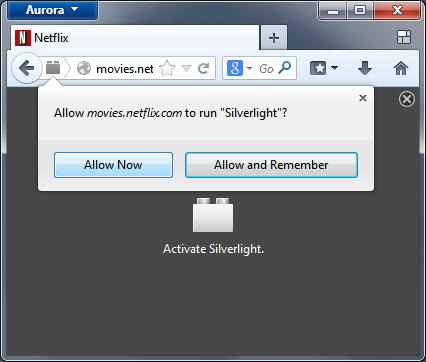

### 外掛程式不預設啓動 讓瀏覽更安全

目前適用於 Windows、Mac、Linux 系統的 Firefox 桌面瀏覽器 Beta 版現已供下載與測試。新的 Firefox Beta 新增 「Click to Play (外掛執行許可)」 安全功能，以及開發者適用的 Firefox OS 應用程式管理員 (Firefox OS App Manager)。

Firefox Beta 的新功能：

- [Click to Play](https://blog.mozilla.com.tw/posts/1899)：Firefox 將不再預設啟用大多數的外掛程式 (plugins)。當某個網站試圖使用某個外掛程式時，Firefox 將讓使用者自行決定是否要在該網站上啟用外掛程式。老舊未更新的外掛程式往往成為網路安全的漏洞，而此功能將確保網路瀏覽的安全性，並讓 Firefox 執行更順暢。但 Firefox 仍預設啟用 Flash 外掛程式。

- [Firefox OS 應用程式管理員 (Firefox OS App Manager)](https://blog.mozilla.com.tw/posts/3965)：Firefox Beta 的新工具「應用程式管理員」具備多項強大功能，可協助開發者搭配 Firefox OS 手機與 Firefox OS 模擬器(Firefox OS Simulator) 中的 HTML5 Web App，直接在 Firefox 瀏覽器中對 Apps 進行測試、佈署、除錯作業。

更多相關資訊：

- [下載](https://mozilla.com.tw/firefox/channel/#beta) Windows、Mac、Linux 版 Firefox Beta

- Firefox Beta [版本說明](https://www.mozilla.org/en-US/firefox/26.0beta/releasenotes/)

- 關於此版本的更多[開發者工具說明](https://blog.mozilla.com.tw/posts/3898)

原文連結：[https://blog.mozilla.org/futurereleases/2013/10/31/click-to-play-plugins-ready-to-test-in-firefox-beta/](https://blog.mozilla.org/futurereleases/2013/10/31/click-to-play-plugins-ready-to-test-in-firefox-beta/)
