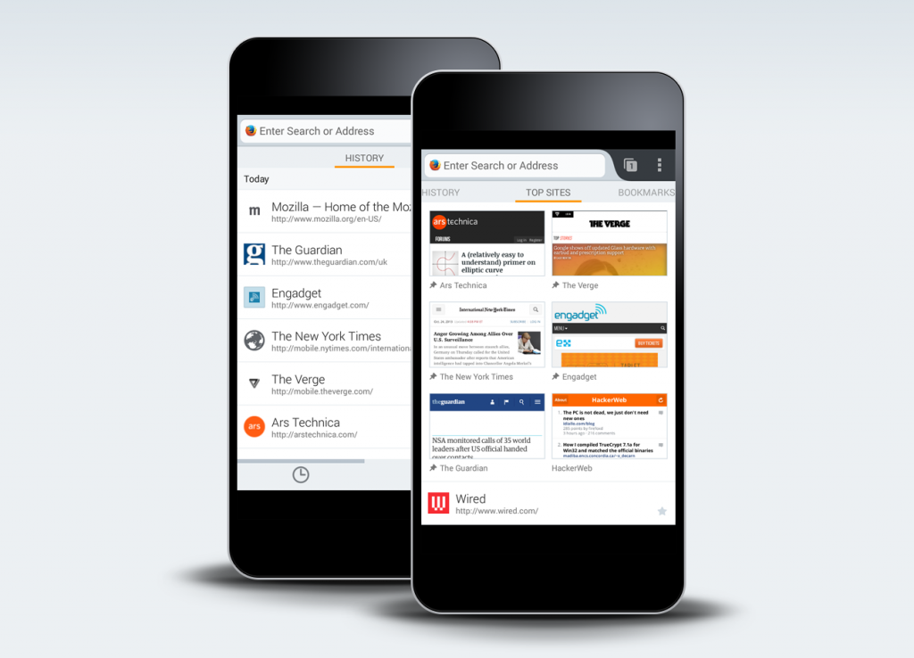

Firefox for Android 行動瀏覽器 Beta 測試版提供全新開始頁設計

Mozilla 重新設計了 Firefox for Android 的開始頁，將協助使用者迅速在 Web 中找到所需的網站。新的開始頁 (即所謂的首頁) 可讓使用者輕鬆取得自己的瀏覽資料，包含「書籤 (Bookmark)」、「歷史記錄 (History)」、「閱讀清單 (Reading List)」、「最常瀏覽 (Top Sites)」，以及強大的搜尋功能。首頁將顯示數個可切換的簡易面板，提供更順暢的 Web 瀏覽方式。只要開始新的瀏覽作業、開啟新分頁，或點擊網址列，都會看到新的首頁。

Firefox for Android Beta 現針對美國、法國、加拿大地區，另提供 Bing 與 Yahoo! 搜尋引擎，讓使用者擁有更多樣的搜尋選擇與瀏覽經驗。你也可根據自己的喜好，於「搜尋設定 (Search settings)」選單中更改所需的搜尋服務。

更多相關資訊：

- [下載](https://play.google.com/store/apps/details?id=org.mozilla.firefox_beta&hl=en) Firefox for Android Beta

- Firefox for Android Beta [版本說明](https://www.mozilla.org/en-US/mobile/26.0beta/releasenotes/)

原文連結：[https://blog.mozilla.org/futurereleases/2013/10/31/new-home-design-in-firefox-for-android-beta/](https://blog.mozilla.org/futurereleases/2013/10/31/new-home-design-in-firefox-for-android-beta/)
