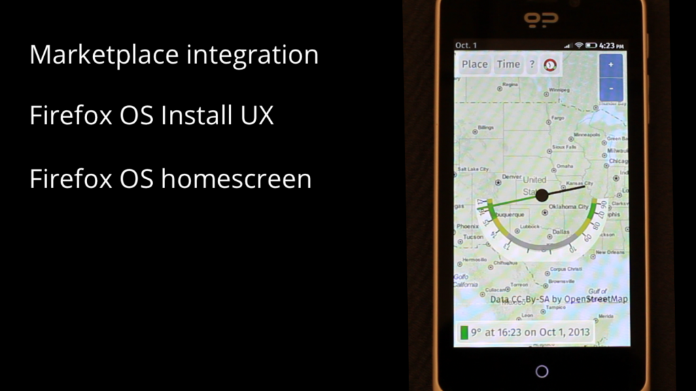
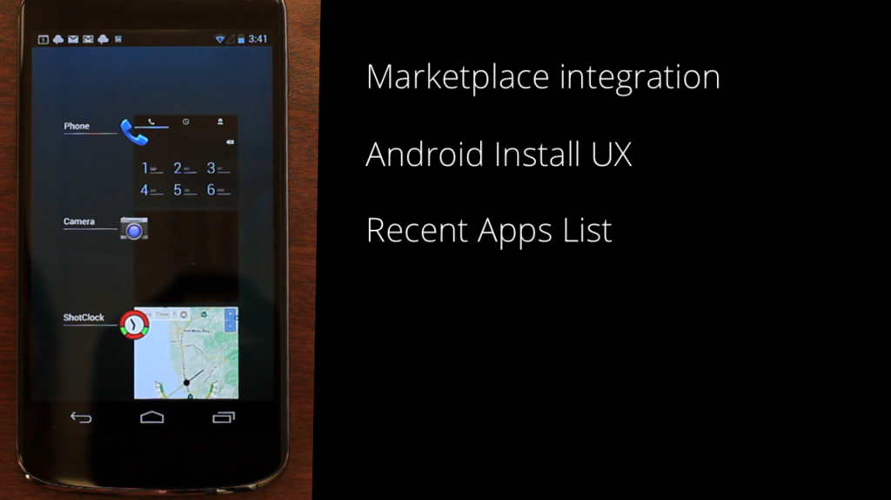
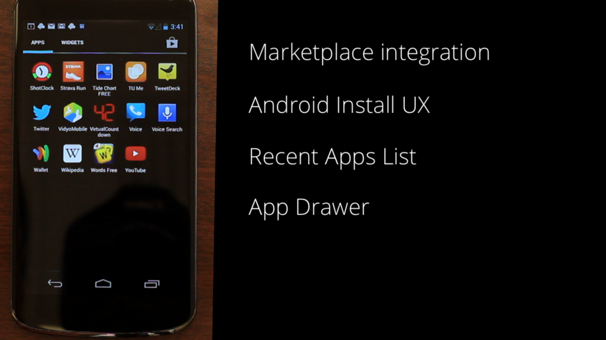
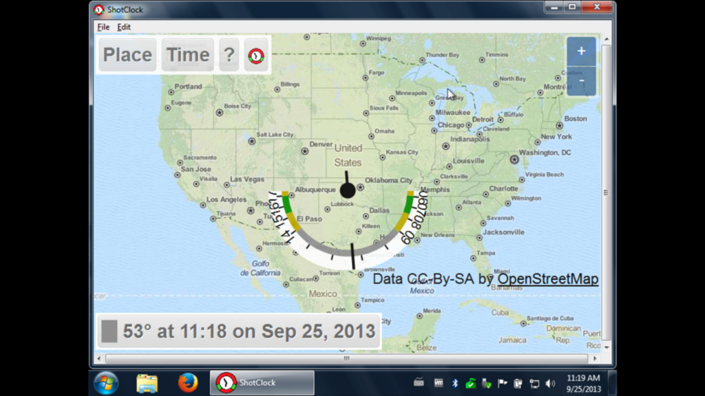
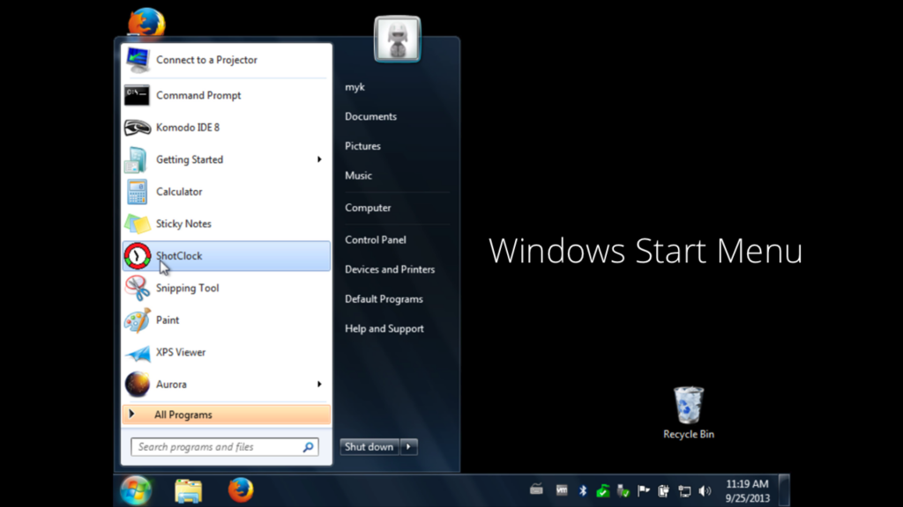
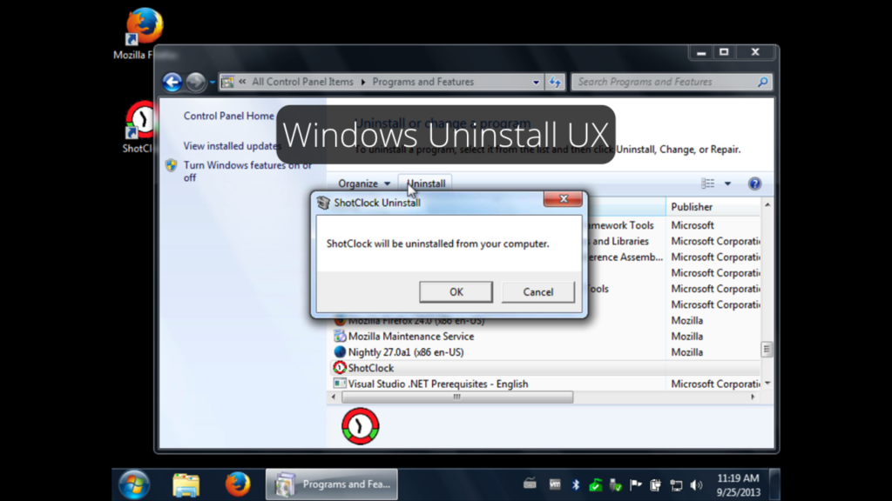
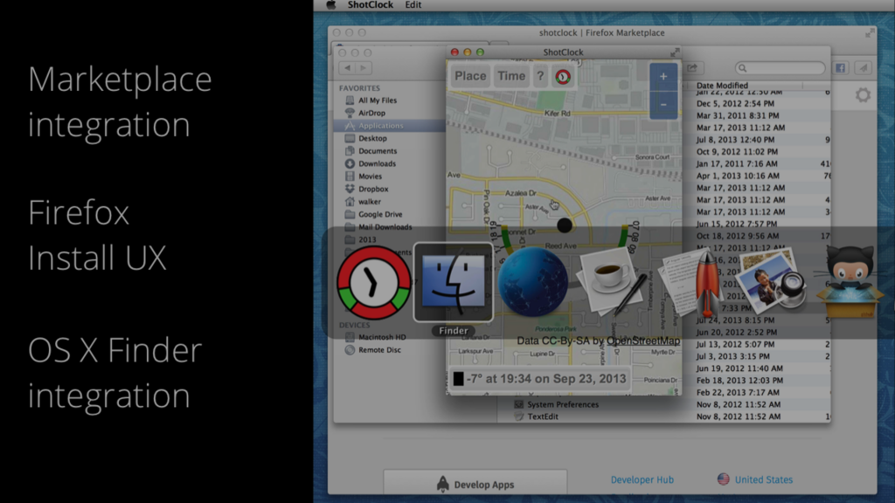
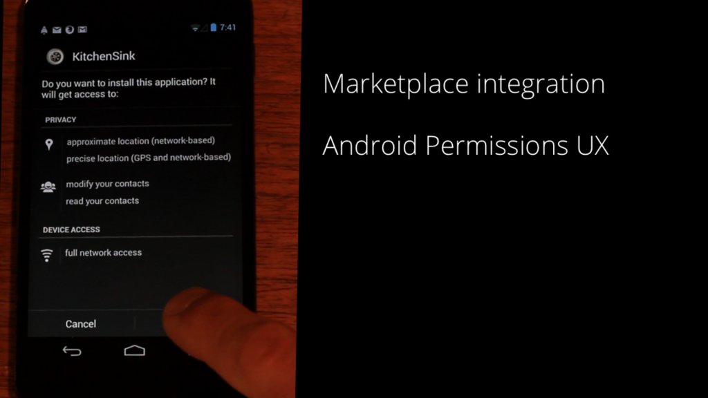
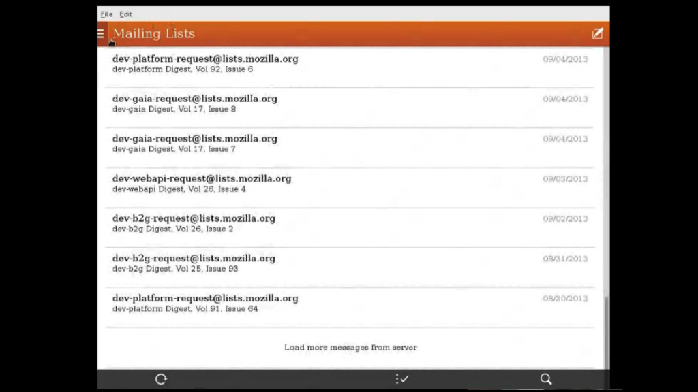

在 Mozilla Hacks 開發者部落格中，我們已有多篇[以 HTML、JS、CSS 撰寫 Firefox OS 的 App](https://hacks.mozilla.org/category/apps/) 相關文章。現在就來看看這些 App 是否也能在 Android、Windows、Mac OS X、Linux 等裝置上執行。如果你的 App 能正確因應 CPU、螢幕尺寸、裝置功能等條件，就能透過 Open Web App 讓自己的 App 在各個平台上進行安裝、執行、退出、解除安裝等作業；就如同原生 App 一樣。

只要是可執行 Gecko 的平台，也同樣能執行 Firefox OS 的 [Open Web App](https://developer.mozilla.org/en/Apps)。下方短片將說明 App 的執行方式。

Firefox OS 就是 Open Web App 的基準平台。在 Firefox OS 上，使用者可到 Firefox Marketplace 中發掘自己喜歡的App，並直接安裝到手機的主畫面中。以我的 Shotclock App 為例 (此 Open Web App 可為戶外攝影師運算出太陽角度)，來試試看若安裝於其他平台上會有什麼樣的結果。

### Android

Android 使用者可透過 Firefox for Android 瀏覽器，到 Firefox Marketplace 中尋找 App。Firefox Marketplace 已經審查通過了 Shotclock for Android，所以我們只要按下「Install」鈕即可；跟Firefox OS 上的程序完全相同。Firefox for Android 將重新封裝 Open Web App，使其使用行為與 Android 的原生 App 完全相同，讓使用者擁有 Open Web App的原生 App 經驗。

因為是透過 Android 的 APK 安裝此 App，所以我們也能從最近的清單中管理此 App。我們可到 App Drawer 中找到Shotclock App；就與其他 App 一樣。

### Windows

Windows 使用者可透過 Firefox 桌面版，進入 Firefox Marketplace 中尋找 App。Firefox Marketplace 也已經通過了 Shotclock for Windows 的審查，所以點選 Marketplace 的「Install」按鈕即可。同樣的，此處也會自動將 Open Web App 重新封裝，讓其使用行為就如同 Windows 的原生 App。

Shotclock 就如同真正的 App 在 Windows 上執行。而這裡所謂的「重新封裝」，代表使用者可透過 Windows 的「開始」選單啟動 Open Web App，也同樣從「檔案」選單關閉 App。當然，使用者同樣能進入「控制台」中解除安裝 App。

### Mac OS X

Mac OS X 也是以 Firefox 桌面版進入 Firefox Marketplace。這裡同樣會將 Open Web App 自動重新封裝為 Mac OS X 的原生 App。在使用者點選「Install」按鈕之後，Shotclock 就會安裝到 Mac OS X 的「Applications」資料夾內。

現在不論是啟動或執行 Shotclock，都與真正的 App 無異。這裡所謂的原生封裝，代表使用者只要按下「Cmd-Tab」即可切換原生 App 或 Open Web App；同樣透過該 App 的主選單離開 App。而開發者是否需要重寫程式碼？完全不用。

### Privileged App

上面提到的 App 都屬於無權限 (Unprivileged) 的 App。當然，上述所有平台同樣支援 Privileged App。接著我們利用「Kitchen Sink」App (用以測試 Firefox OS 的 Privileged API)，看看安裝在 Android 上會發生何事？

Privileged App 的尋找與安裝過程，均如同 Android 既有的「於安裝期間為使用者呈現權限清單」程序。這些權限均從 Open Web App 的 manifest 檔案所複製。在完成安裝程序之後，App 即可存取手機硬體以供使用。

### Linux 桌上型電腦

Firefox OS 所提供的電子郵件 App，就是以 Privileged App 搭配 Socket API 進行網路連線。我們的 Open Web App 實習工程師 Marco Castelluccio，就在自己的 Linux 電腦上執行該 App。

Marco 從 Gaia 複製了 App 封裝，並稍微修改了 App 的 manifest 檔案。因此，如果你比較喜歡 Firefox OS 手機上的App 並想在其他裝置上執行，則跨平台的 Open Web App 就能滿足你的需要。

### iOS

我們也想為 iOS 裝置上支援 Open Web App，但 iOS 現並無法支援。目前需選擇安裝 Gecko 核心的 Web 瀏覽器，才能進一步支援 Open Web App。

註：我們正與 Cordova 社群密切合作。除了要能不修改 Cordova 的 App 就能在 Firefox OS 上執行之外，也要讓Cordova 所封裝的 Open Web App 能於 iOS 上執行。若需要更多資訊，可參閱 [Cordova Firefox OS 專案頁面](https://wiki.mozilla.org/CordovaFirefoxOS)與[Cordova Firefox OS 的 GitHub Repo](https://github.com/apache/cordova-firefoxos)。

### 後續時程

桌上型電腦 — 桌上型與筆記型電腦只要執行 Firefox 16 或更高版本，即可安裝無權限 (Unprivileged) 的托管式(Hosted) App。而二個月後的 Firefox 每夜更新版 (Nightly) 即將支援 Privileged App。

Android — 可透過 Firefox for Android 的曙光版 (Aurora) 安裝 App，但尚無法提供原生 App 的使用經驗。在今年 12月的Firefox for Android 每夜更新版 (Nightly) 即將提供原生 App 使用經驗。

原文連結：[https://hacks.mozilla.org/2013/10/progress-report-on-cross-platform-open-web-apps/](https://hacks.mozilla.org/2013/10/progress-report-on-cross-platform-open-web-apps/)
