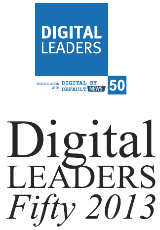

Mozilla 在 11 月 11 日晚間獲頒由英國評選的 The Digital Leaders 50 Awards 二項獎項，分別是：

- Digital leader from industry (產業數位領袖獎) 第一名

該奬項主要突顯業界致力於提倡數位轉型、研發創新、並提供數位服務的企業。

- Digital leader (數位領袖獎) 第四名

該獎項主要表彰在數位轉型中作為先鋒和支柱的領袖和企業。獲奬者將展現其在利用數位科技與網路做為訊息、關鍵服務和社交提供者上的領導力。

被提名者包括在英國和全球最有影響力的領袖，利用數位科技做出極大的貢獻，展現新時代數位政府所提供透明、效率、以民為本的服務。

詳細名單請參考：http://www.digitalbydefaultnews.co.uk/2013/11/12/digital-leaders-50-winners-announced-at-house-of-lords-awards-ceremony/

恭喜 Mozilla 的貢獻榮獲肯定！
