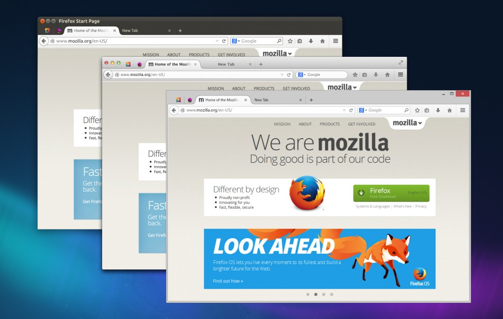

我們在 Firefox 瀏覽器身上所灌注的心力，比對自己的愛車還要多。其中更有人甚至犧牲部分的睡眠時間，只為了讓大家能享受更好的設計、更漂亮的外觀、更符合自己工作習慣的Firefox 瀏覽器。

在接下來的幾天裡，我們將為 Firefox 外觀進行一系列的變化。Mozilla 內部將這次的翻新稱為「Australis」，並可能成為地球上最仔細、最謹慎設計過的瀏覽器介面。即使在簡化之後，Firefox 仍保有功能最強大的介面。讓人驚豔的速度亦將加快使用者的瀏覽過程。你也許能一眼看出其中某些變化，剩下就等你享受自行發掘的樂趣。

除了視覺設計方面的變化，我們也讓使用者自訂的系統更前衛。除了附加元件可正常運作之外，嶄新的自訂系統亦能輕鬆改變 Firefox 的外觀與整體呈現效果。

我們的設計團隊特別撰寫《[「Australis」已於 Firefox Nightly 中登場](https://blog.mozilla.com.tw/posts/4232/australis-is-landing-in-firefox-nightly/)》一文以詳細說明相關成果。Mozilla 很高興能為你帶來全新的 Firefox，希望你會喜歡。

Johnathan Nightingale

Firefox 工程副總

原文連結：[Evolution](https://blog.mozilla.org/futurereleases/2013/11/18/evolution/)
