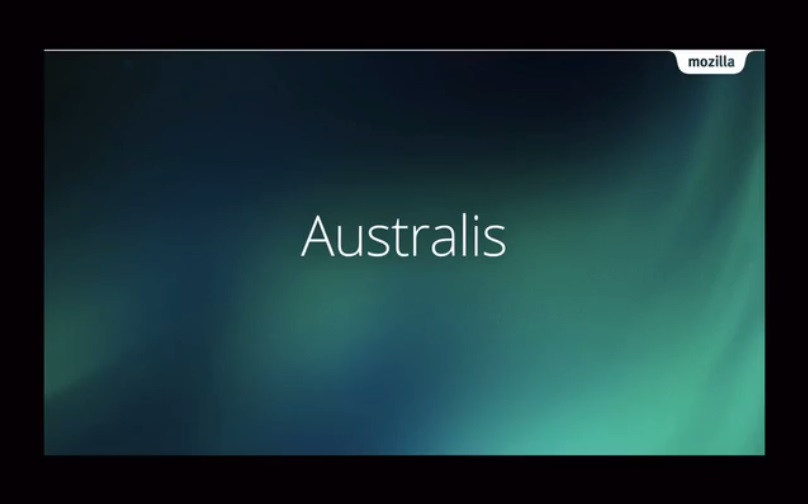
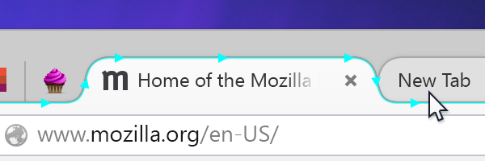
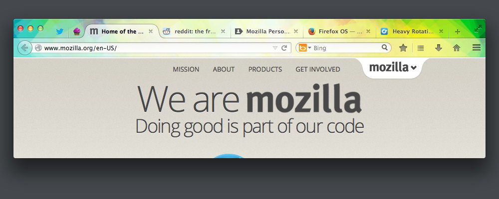
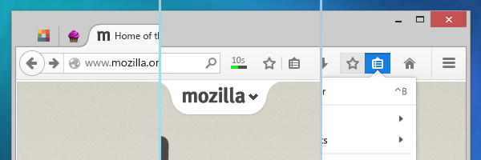
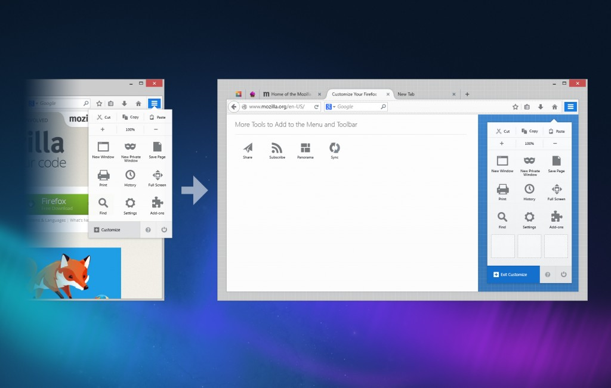

Australis 在 Linux、Mac、Windows 版 Firefox 中的外觀

翻新後的 Firefox 介面已進入 [Firefox 每夜更新版 (Nightly)](https://nightly.mozilla.org/) 釋放頻道。Mozilla 將本次介面改造稱為「Australis」專案，是新一代的 Firefox 使用者介面，目前整體介面尚未完成且仍需更多的雕琢，也因此我們覺得需要即早將新的設計呈現給廣大的社群成員。

接著來談談 Australis 專案。

- 承襲歷代 Firefox 所重視的前衛、簡潔、舒適等視覺效果，Australis 可說是目前最美觀、最重視細節的介面。

- 根據基本要求而設計出更簡潔的預設介面，以切合目前大眾的瀏覽器使用習慣。

- 最後，我們仍保留了 Firefox 的所有特色，同樣讓使用者能自訂喜愛的瀏覽器。

還有許多附加效益：更好、更靈活的介面模型，將整合後續添加的功能。更易於呈現的附加元件，就如同瀏覽器內建的功能。眾人熟悉的外觀與質感將跨越 Mozilla 所有平台，讓 [Firefox 的感覺無所不在](https://people.mozilla.org/~shorlander/blog-images/australis-landing-on-nightly/firefox-everywhere.png)。我們另將在未來的文章中詳述相關資訊。

想迅速了解上述特點嗎？可先觀看此二分鐘簡介影片：

 由 [Madhava Enros](https://vimeo.com/user672164) 在 [Vimeo](https://vimeo.com/) 頻道上帶來的 [Australis 介紹](https://vimeo.com/79509500)

讓我們先透過以下三項要點逐一介紹設計初衷。

### 細膩美觀

Australis 是目前 Firefox 介面長期以來最重大的更新。從整體配置的外觀到細微的圖示設計，幾乎涵蓋了所有視覺要素。

最明顯的改變之一就是 Firefox 的分頁外觀。讓它更 Firefox 化了 ─ 更流暢、更友善、更有組織 ─ 確實符合 Firefox 既有的感覺。

新的曲線型分頁外觀。還有處於滑鼠游標移動狀態下的背景分頁。

另外值得一提的，就是前景與背景分頁的區隔更明顯了。我們在視覺上弱化了背景分頁，可讓使用者更快、更清楚辨別出目前觀看中的分頁。用滑鼠移過分頁上方時，也能更輕鬆看出所將切換的分頁。

更井然有序的分頁列，也讓[簡單的瀏覽器佈景主題](https://addons.mozilla.org/en-US/firefox/themes/?sort=popular)看起來更漂亮。

安裝了 [Glowbug](https://addons.mozilla.org/en-US/firefox/addon/glowbug/) 佈景主題的 Firefox

### 簡化單純

Firefox 與 Web 一同成長，期間更不斷提供新的工具與特色 ─ 如分頁瀏覽、下載作業管理、單次點擊即加入書籤等。但我們不能只顧著添加新功能、找出大家愛用或不常用的功能，最後將低使用率的功能移除而已。我們必須在某些時間點暫停一下，設法做出其他變化。Firefox 就像其他所有軟體一樣，也會隨著時間背負越來越大的包袱；但使用者就如同背包客，能隨著季節變化而精簡或添加行李。

何處能看到簡化的痕跡呢？使用者將發現 Firefox 分頁在標題列中的位置更高了，可為網頁留下更多顯示空間。

你可以發現預設工具列經過精心設計，再省下許多可用空間。其實在較早版本已經具備了某些特色，例如現在「前進下一頁 (Forward)」按鈕只會在真正有下一個網頁時才會出現；下載進度指示器僅針對相關作業才會顯示，否則均自動隱藏。而 Nightly 版本新加入更顯眼的書籤按鈕，讓你輕點一次即可將網站加入書籤。

由左至右：「前進下一頁」按鈕、下載進度指示器、書籤清單

上述大家常用的功能都置於最顯眼的位置。而眾人所熟知、使用頻率較低的控制功能，均集中到最右側的新選單 (而且對觸控裝置的介面更友善！) 中，以利大家尋找並使用。最後還有 2% 的少數使用情況，則可透過新的簡易自訂功能而順利使用。

### 輕鬆自訂

Firefox 的簡化過程不能單是移除某些東西，保持 Firefox 原來的樣子就好 ─ 每個人的喜好各有不同。Firefox 之所以能受到使用者的青睞 (包含高階使用者)，就是因為 Firefox 能提供大家想要的，甚至讓他們自行打造相關功能。請參閱 [Firefox 設計價值 (PDF)](https://people.mozilla.org/~madhava/FDV/FirefoxDesignValuesBooklet.pdf) 中的〈You Help Make It〉。

因此，為了打造更簡單的預設介面，我們認為 Australis 正是讓瀏覽器的基本自訂功能更簡單易用的好時機。使用者可根據自己的特殊需要，配置所需的按鈕並置於最順手的位置；而剛接觸 Firefox 的初階使用者也能輕鬆入門，找到最適合自己的起跑點。

最後，我們設計出嶄新、易用、充滿樂趣的自訂模式，並使其在介面中特別明顯。Mozilla 更期待此一模式能協助更多使用者迅速上手，讓 Firefox 更切合所有人的需要。不論是既有的預設功能，或是使用者透過附加元件添增的功能，新的介面都能運作無虞。未來將透過更多 Firefox 使用者經驗 (User Experience，縮寫為 UX) 文章，進一步詳述自訂模式。

進入並使用自訂 (Customization) 模式。

目前 Nightly 版本新功能已可滿足大家的日常使用經驗，協助我們讓 Australis 更臻完美。我們將[透過此互動式虛擬介面揭露更多特色](https://people.mozilla.org/~shorlander/mockups-interactive/australis-interactive-mockups/windows8.html)，請隨時注意相關資訊！

─ Firefox UX 團隊的 [Madhava Enros](https://twitter.com/madhava) 與 [Stephen Horlander](https://twitter.com/shorlander)

原文連結：[Australis is landing in Firefox Nightly](https://blog.mozilla.org/ux/2013/11/australis-is-landing-in-firefox-nightly/)
