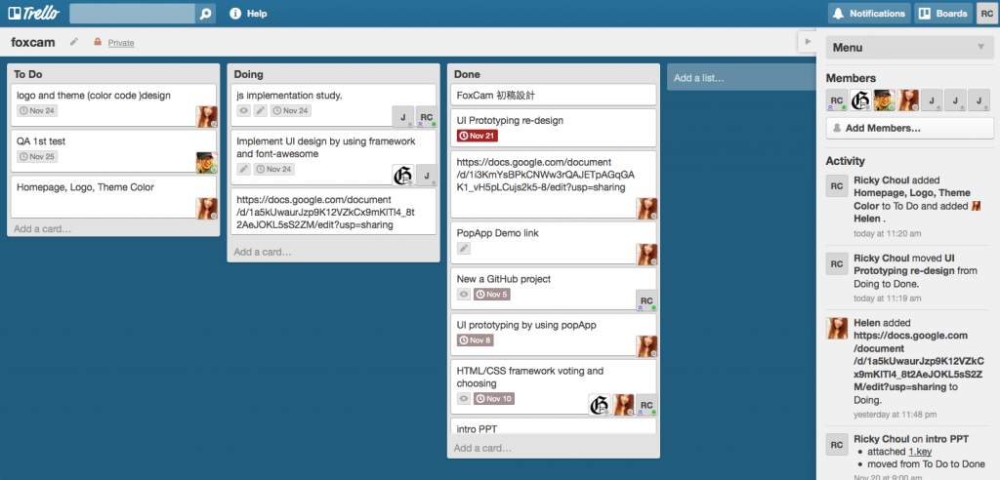

地圖不可用

	活動時間

	日期 2013/12/21

13:00:00 - 16:00:00

	地點

	

十二月的狐狐工作坊 Firefox 校園大使們將為大家帶來 Firefox OS APP 校園創意競賽成果展示 LIVE Show！

經過幾個月的企劃、籌備與程式撰寫，Firefox 校園大使們將為大家介紹四款由大使們開發的 Firefox OS APP，分別為：

- Wake up!!! 這款鬧鐘將提供英文／數學／國文／其他類型的問題，讓使用者思考問題同時達到醒腦效果，也不用擔心問題沒答出來又沉沉睡去，在清醒的回答出正確答案前，「Wake up!!!」是不會停止唱歌的。

- 每日一籤 手機是現代人幾乎都會使用的裝置，大使們預計設計出一款每天可以抽籤的軟體，從告知的好運，鼓勵大家度過美好的一天。

- FoxCam FoxCam 開源修圖 APP 計畫，除了自身提供夠優秀的基本濾鏡 (filter)、貼圖 (sticker) 及邊框……外，最大特色在於開放的設計讓任何人都可以貢獻相機素材(包含濾鏡貼圖邊框等等)。

- 照相筆記(Shotnote) 照相筆記(Shotnote)為一可以讓使用者使用手機紀錄下日常生活中周遭事物的 APP，當使用者有任何需要記錄的事務時，可以利用此 APP 的照相功能 (圖像化方式) 將看到覺得實用的佳句、故事、點子等從書籍、雜誌擷取下來，透過此 APP 進一步整理 (如：標籤、時間及註記等)，讓使用者除了紀錄，更容易管理這些資訊。而使用者也可以透過 APP 將這些寶貴資訊跟他人分享，達到社交分享的效果。

「FoxCam 」開源修圖 APP 專案管理圖

活動當天亦將會頒發自 12 月 5 日開放網路投票以來獲得最高票 APP 的「網路票選最佳人氣獎」以及由 Mozilla 工程師擔任評審所選出的「工程師之榮耀最佳 APP 獎」等獎項，歡迎喜愛 Firefox OS 或想要了解 Firefox OS 的朋友報名參加！

搶先預覽 Firefox OS APP 校園創意競賽之[參賽作品成果展示](https://firefox.club.tw/events/attack-on-web/demo/)。

Firefox OS 完全以 HTML5 技術打造，以 JavaScript、CSS 等技術搭配全新 WebAPI，讓 HTML5 的 應用程式擁有更多可能性。

 完整的 Firefox OS 介紹請造訪：[http://mozilla.com.tw/firefox/os/](https://mozilla.com.tw/firefox/os/)

狐狐工作坊

時間：12/21 (六) 14:00-15:30

地點：Mozilla Space

對象：現任或曾任 Firefox 校園大使，或校園大使之同學、朋友皆歡迎參與

想認識 Firefox 校園大使? 歡迎來信至 fxca.tw@gmail.com，我們將主動與你聯絡！
