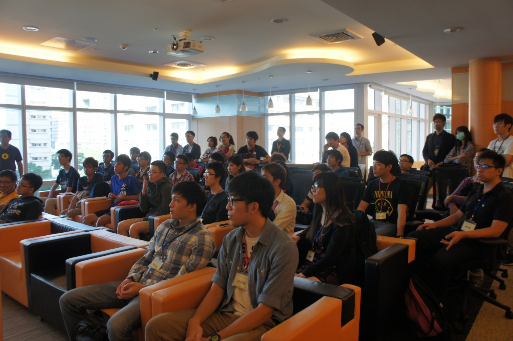
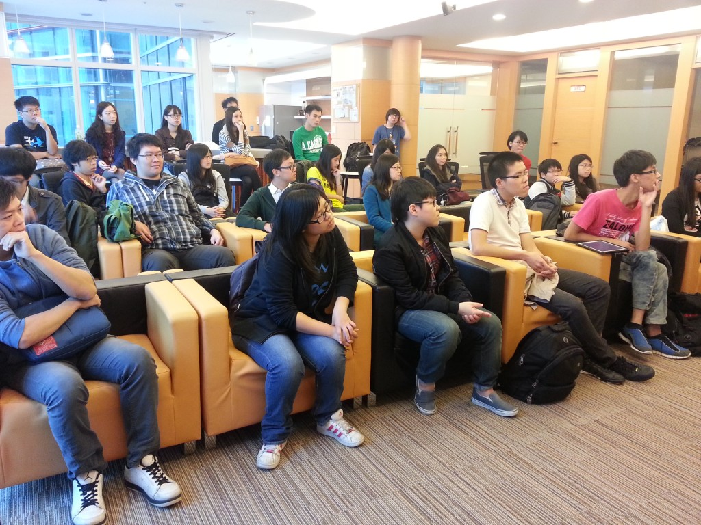

Mozilla 是全球性的非營利組織，以推動網路的平等、自由、開放為宗旨。11 月的兩個週五午後，Mozilla Taiwan 很榮幸地分別接待了來自由政治大學邀請而至的各校同學及中原大學的同學們來到辦公室進行企業參訪。

首先，讓同學們認識 Mozilla 及 open source 的文化是本次參訪最重要的目的之一，接著則請畢業於政治大學及中原大學的 Mozilla 學長們為同學進行經驗分享，隨後是大家最期待的辦公室參觀。從各樓層分別規劃了哪些單位、會議室的命名由來到下午茶提供些什麼點心，參觀過程中我們一一為好奇的同學們介紹說明。

隨著熱絡交流時間，也進入了本次參訪的重頭戲 – Q&A 時間。學生們的踴躍發問與互動，讓參訪的氣氛達到了最高峰。最後在同學們帶著滿滿的收穫及愉快的笑容下，結束了此次的企業參訪。

熱愛 Mozilla 的你，如果對 Mozilla Taiwan 辦公室充滿好奇，Mozilla Taiwan 之旅將實現你的夢想！請透過官網上的「線上報名」讓我們聽到你的聲音。

[http://mozilla.com.tw/about/contact/](https://mozilla.com.tw/about/contact/)

政治大學企業參訪團

中原大學企業參訪團
