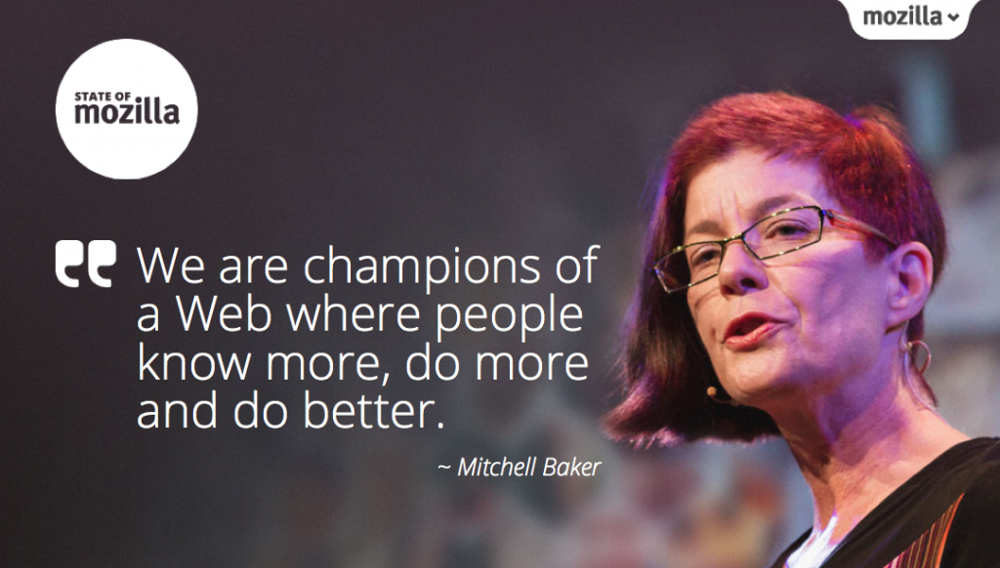

我們今天發表 State of Mozilla 年度報告。你可到[報告網站](https://www.mozilla.org/zh-TW/foundation/annualreport/2012/)觀看細節，網站內亦提供剛於今年 10月結束的 Mozilla Summit 精采演講。下列引言即擷取自基金會主席 [Mitchell Baker 為 Mozilla 定位做出的精采詮釋](https://youtu.be/Xrh2FN1y8CY)：

「我們是擁有共通目標的全球性社群：要建立符合世界需要的網際網路。

為了達到此理想，我們打造產品、強化並賦予社群力量、傳授所知也學習新知、並且塑造整體環境。這些任務彼此交織在一起成為單一的目標，而我們也努力做到最好。因為再沒有其他人像我們一樣擁有此願景與將之付諸實現的機會。

我們促使網際網路更為人所瞭解、彼此可共同協作，並能確實掌握在自己手裡。我們讓大家能在 Web 上獲得更多知識、完成更多大事，而且每天都讓自己的生活越來越好。這就是我們。這就是 Mozilla。」

原文連結：[State of Mozilla and 2012 Financial Statements](https://blog.mozilla.org/blog/2013/11/21/state-of-mozilla-and-2012-financial-statements/)
