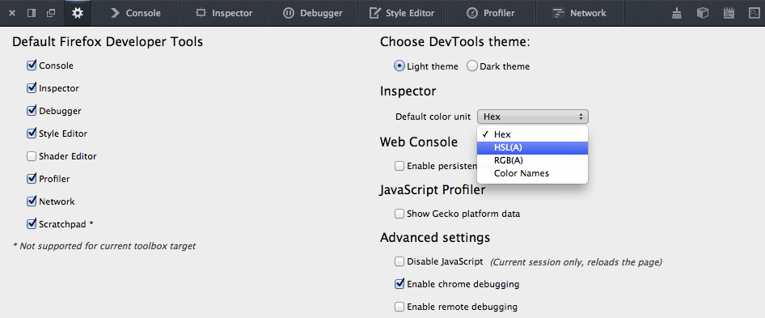
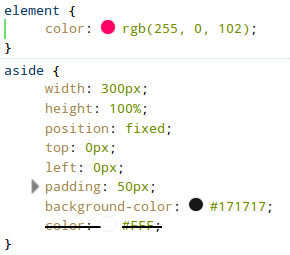
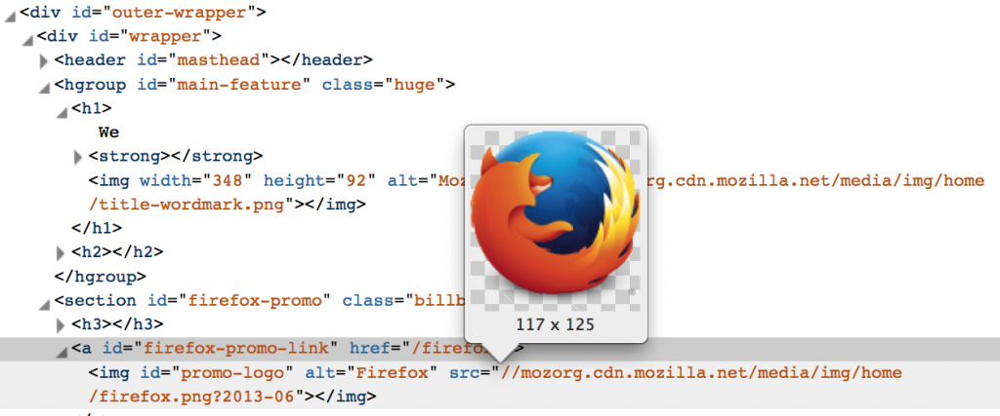
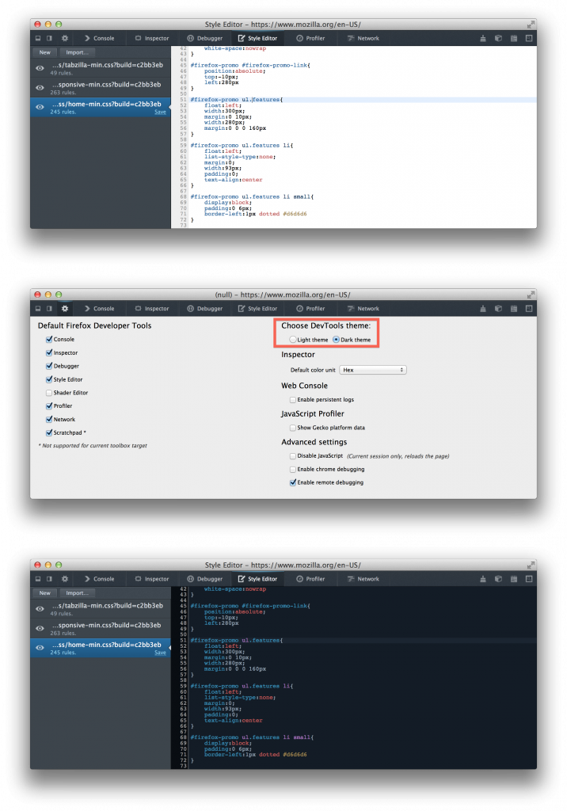
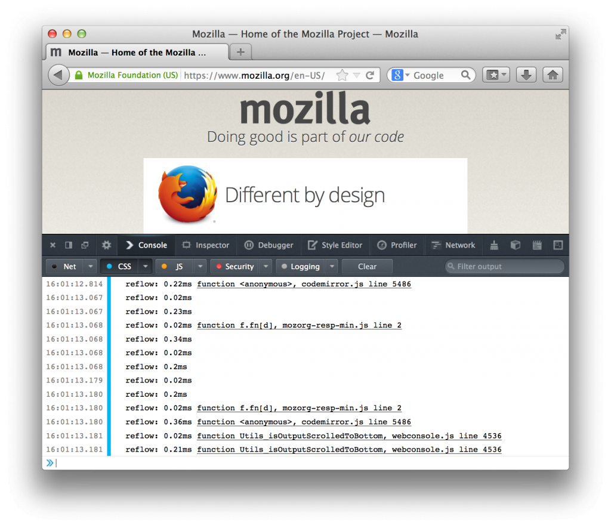

### 以 HTML 編輯 (Edit as HTML)、Codemirror，還有更多

Firefox 27 現已進入[曙光版 (Firefox Aurora) 釋出頻道](https://www.mozilla.org/en-US/firefox/aurora/)，又該來談談 Firefox 開發者工具新功能的時候了。接著簡單介紹幾項新功能。你也可參閱[此版本針對開發者工具所解決的問題](https://mzl.la/HbV06a)。

### JavaScript 除錯器 (JavaScript Debugger)：DOM 事件中斷點

現在不需手動設定中斷點，即可在不同的 DOM 事件上自動暫停。只要點選除錯器面板右上方的「展開窗格 (Expand Panes)」按鈕 (即位於搜尋框的右方)，接著找到「Events」分頁並勾選事件名稱。下次只要該事件再度發生，就會自動暫停。此處所顯示的事件，僅限目前於程式中受監聽的事件。如果你勾選其中一個標頭 (如「Mouse」或「Keyboard」)，則將連帶勾選所有的相關事件。

### 檢測器 (Inspector) 強化

Mozilla 聽到 Web 開發者所回饋的意見，針對檢測器進行多項強化：

以 HTML 編輯 (Edit as HTML)

目前在檢測器中，只要對某一元素按下滑鼠右鍵即可開啟編輯器，即可針對此元素而設定 outerHTML。

選擇預設的色彩格式

現在可於「工具箱選項 (Option)」面板中選擇「預設色彩單位 (Default color unit，暫譯)」：

色彩樣本預覽模式

開發者工具如今也提供色彩樣本預覽模式，並顯示於「規則 (Rule)」分頁中：

針對背景圖相網址的圖像預覽功能

在經過多人強烈建議之後，針對背景圖像的網址，我們提供了圖像預覽的功能：

除了上述幾項功能強化之外，檢測器現在亦能強調變動過 (Mutated) 的 DOM 元素。

請密切注意後續更多的[工具使用秘訣](https://groups.google.com/forum/#%21topic/mozilla.dev.developer-tools/de0xBvHmN4s)。我們也隨時歡迎你提出任何建議！

### Codemirror

[Codemirror](https://codemirror.net/) 是 [HTML5](https://developer.mozilla.org/en/html/html5) 架構的程式碼編輯器元件，並常用於網站中。開發者除了可自訂相關選項之外，亦可選用自己喜愛的主題。而 Firefox 開發者工具現亦使用了 CodeMirror，包含除錯器、檢測器 (以 HTML 編輯)、樣式編輯器、程式碼速記本等均具備。

同樣在「工具箱選項」中，開發者可選擇使用「亮主題 (Light theme)」或「暗主題 (Dark theme)」。

### 主控台 (WebConsole)：記錄「重新排版」

一旦版面配置 (Layout) 轉為無效 ─ 即 CSS 或 DOM 改變，則 Gecko 就必須重新運算某些節點的位置。這種重新運算作業並不會立刻進行，而是依據不同的情況才開始。舉例來說，如果開發者進行了「node.clientTop」，則 Gecko 此時就必須重新運算 ─ 即所謂的「重新排版 (Reflow)」。由於重新排版將佔用較多運算資源，因此若要提升回應速度，就應儘量避免重新排版作業。

若要啟動重新排版的記錄功能，則可到「主控台 (Console)」分頁，勾選「CSS」功能表中的「記錄 (Log)」選項。以後只要是因 JavaScript 所觸發的重新排版作業，均將以此 JavaScript 函式為名稱而輸出記錄。

本篇文章先談到這裡了。希望你喜歡新的強化功能！

原文連結：[Firefox Developer Tools: Episode 27 – Edit as HTML, Codemirror & more](https://hacks.mozilla.org/2013/11/firefox-developer-tools-episode-27-edit-as-html-codemirror-more/)
