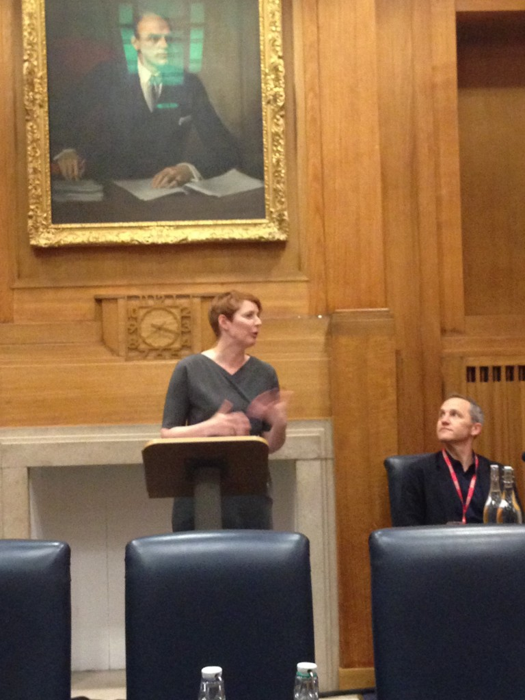

Mozilla 很高興在今天宣佈正式開始與英國廣播公司 (BBC) 的合作關係。我們將支援免費且開放的網際網路技術。

BBC 與 Mozilla 在數位技術上的合作關係已持續一段時間 ─ 如 BBC 所屬的 Connected Studios 定期在倫敦 Mozilla Space 舉辦工作坊活動，另外還有[開放徽章 (Open Badges)](https://www.openbadges.org/) 與 [Webmaker](https://www.webmaker.org/) 專案等的多項數位學習計畫。而今天則是 Mozilla 與 BBC 首次正式宣佈了合作關係備忘錄。

Paula Le Dieu 在與 BBC 的合作備忘錄簽訂現場。

Mozilla 將加入其他三個組織：開放資料研究所 (Open Data Institute，ODI)、開放知識基金會 (Open Knowledge Foundation)、歐洲數位圖書館基金會 (Europeana Foundation)，一同支援免費且開放的網際網路技術。Mozilla 並繼續與 BBC 攜手促進如網路文學、教育專案、開放技術標準，以及更多共享計畫。BBC 將於 2015 年跨全英國啟動「網路與數位創造力 (Web and Digital Creativity)」計畫，屆時此一年期的備忘錄亦隨之生效，即由 Mozilla 支援相關活動與程式設計作業。

另可至 [BBC 官網](https://www.bbc.co.uk/mediacentre/latestnews/2013/memorandums-of-understanding.html)進一步了解備忘錄的內容。

原文連結：[The BBC and Mozilla formalize partnership for web skills in the UK](https://blog.mozilla.org/blog/2013/11/24/the-bbc-and-mozilla-formalize-partnership-for-web-skills-in-the-uk/)
